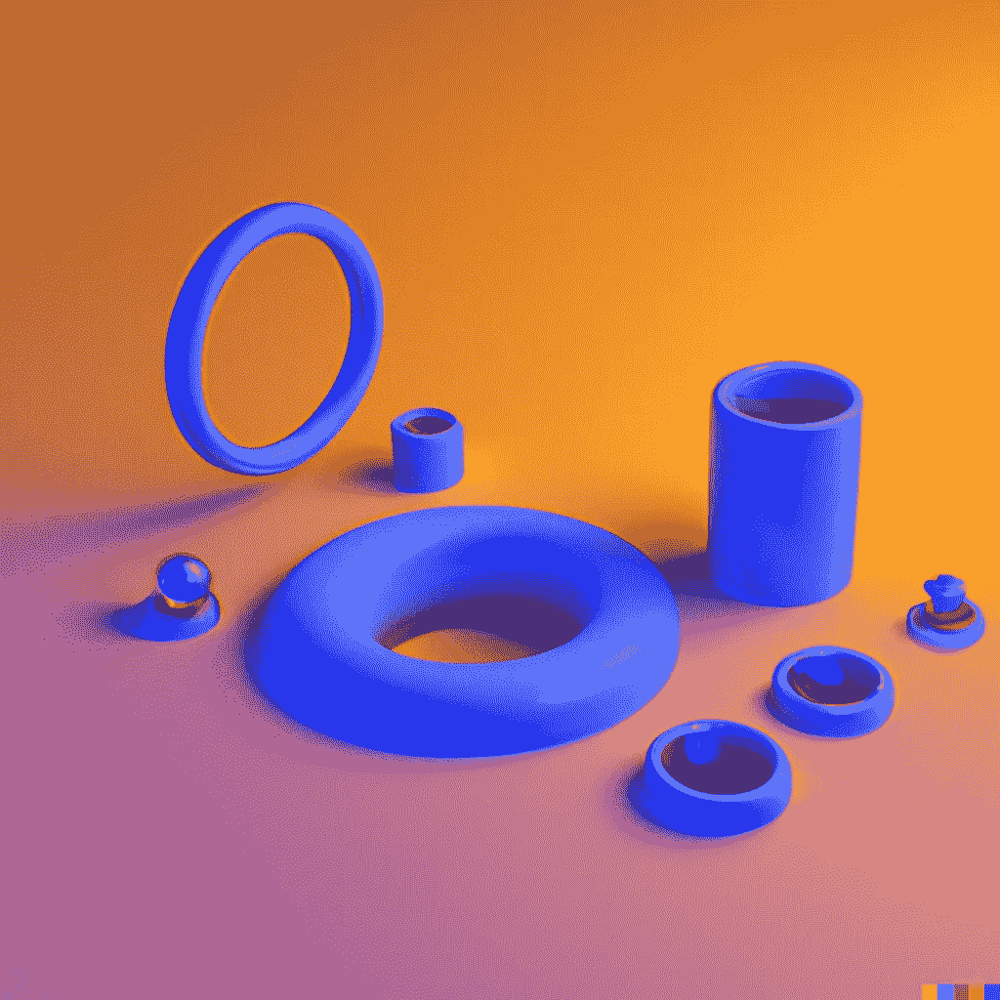

# 如何创建三维物体的幻觉

> 原文：<https://medium.com/mlearning-ai/how-to-create-an-illusion-of-a-3d-object-47008e74846d?source=collection_archive---------5----------------------->

## [将您的图形转换成三维模型](https://mlearning.substack.com/p/how-does-ai-turn-your-drawing-into?r=z7zu8&s=w&utm_campaign=post&utm_medium=web)

## [交互式 VR-AI 系统中的实时](/mlearning-ai/generate-photo-realistic-ai-videos-in-real-time-512f8dc554d9) 3D 双胞胎

[Can you sculpt in VR?](https://skfb.ly/6ZxXT)

[**虚拟现实(VR)**](https://skfb.ly/6ZxXT) 的目标是在不损失质量的情况下引入大量现实世界中的物体。不幸的是，现有的虚拟现实应用程序通常会将对象转换成带有网格或点云的显式三维模型，这使得快速…