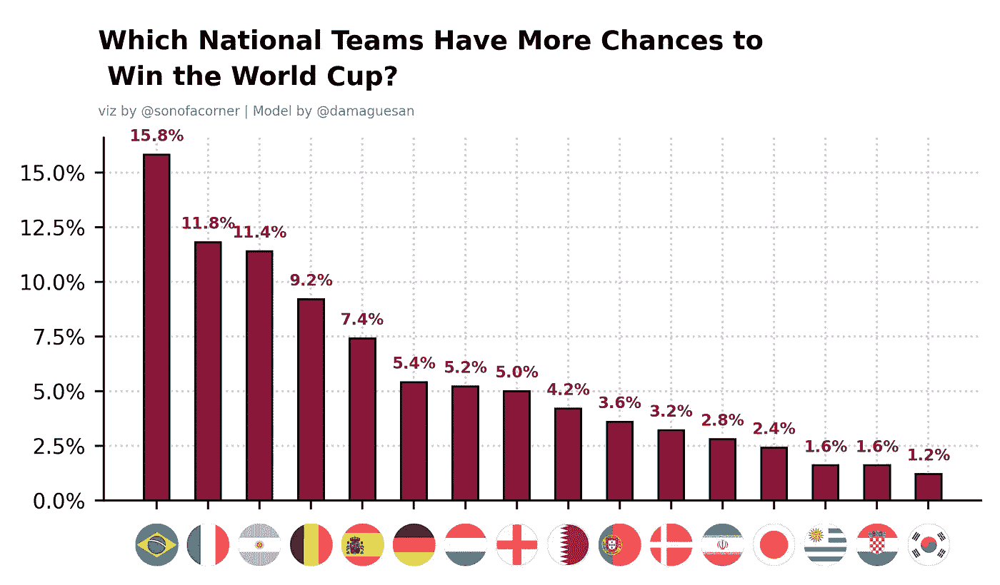
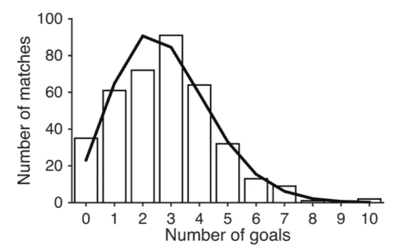

# 如何用 python 创建国际足球比赛预测模型？

> 原文：<https://medium.com/mlearning-ai/how-to-create-an-international-soccer-match-prediction-model-8245538e1a3a?source=collection_archive---------2----------------------->



离卡塔尔世界杯还有不到一个月的时间，球迷们已经在讨论谁会是下一届世界冠军。在本帖中，我们将创建一个预测模型来确定哪支球队最有可能赢得足球比赛并最终赢得世界杯。

历史上，足球比赛是由两个队的进球来模拟的，这些进球遵循一种称为泊松分布的概率分布。该分布接收一个名为 lambda 的参数，并返回从 0 到无穷大的每个整数的概率。在下图中，我们可以看到使用平均目标数作为预测值时目标分布的拟合程度。



Image from [Soccermatics](https://soccermatics.readthedocs.io/en/latest/lesson5/DealingRandomness.html)

正如你所看到的，进球数平均值并不是一个很好的进球数预测值，因为在某些情况下，进球数线与进球数条的实际值相差甚远。为了改善这种情况，我们将尝试使用球队的 elo 得分(我们在以前的帖子中计算过)和球队的移动平均进球数来预测球队在一场比赛中的进球数。我们将使用的数据将是在 [Kaggle](https://www.kaggle.com/datasets/martj42/international-football-results-from-1872-to-2017) 中可用的历史数据。

在训练模型之前，我们需要先做一些数据处理。所有的代码都可以在这个帖子的 [GitHub 库中找到。](https://github.com/danielguerreros/WC-Model)

比赛被过滤，只考虑自 1990 年以来的重要比赛和友谊赛。主队或客队进球超过 6 个的比赛被忽略，因为它们是异常值。

```
matches=matches[(pd.to_datetime(matches['date'])>dt.datetime(1989,12,31))&(matches['tournament'].isin(tournaments))]matches =matches[['date','home_team','away_team','home_score','away_score','neutral','Elo_a_before','Elo_h_before']]matches = matches[(matches['home_score']<6)&(matches['away_score']<6)].reset_index(drop=True)
```

注意我会用各队的 Elo 分数。我在[之前的帖子](/mlearning-ai/how-to-calculate-elo-score-for-international-teams-using-python-66c136f01048)中解释了如何计算。

由于我们将使用泊松分布预测每支球队的进球数，因此我们需要拆分每场比赛的数据，以便每支球队有一行。为此，我们为主场和客场分别创建一组数据，然后将这两组数据连接起来。

```
home=matches[["date","home_team","home_score","neutral","Elo_a_before","Elo_h_before"]].rename(columns={'home_team':"Team","home_score":"Goals_for","Elo_a_before":"Elo rival","Elo_h_before":"Elo"})away=matches[["date","away_team","away_score","Elo_a_before","Elo_h_before"]].rename(columns={'away_team':"Team","away_score":"Goals_for","Elo_a_before":"Elo","Elo_h_before":"Elo rival"}).assign(neutral=0).assign(local=0)df=pd.concat([home,away],ignore_index=True).sort_values("date").reset_index(drop=True)
```

现在我们将计算移动平均线作为预测值。为了计算它，我们将使用滚动(3)。mean()函数将前 3 个数据放入一行，并计算这些数据的平均值。我们对每场比赛使用 shift()函数来获得之前的数据，但不包括那场比赛中的进球。

在这些计算之后，我们将有一个数据帧，每场比赛有两行，一行是主场数据，另一行是客场数据。有了这些数据，我们可以继续训练我们的模型。

为了训练模型，我们将使用带有泊松分布参数的 statsmodel 包。在这种情况下，我们要预测的变量将是进球，如果有主场优势和进球的移动平均值，预测器将是净胜球。

```
model = smf.glm(formula="Goals_for ~ local + Moving_goals_for + Elo_difference", data=df,family=sm.families.Poisson()).fit()
```

现在，我们已经将模型训练好并存储在一个变量中。但是现在我们如何预测呢？

需要注意的是，模型给我们的是球队的平均进球数。所以我们需要知道每个队进一球、两球等的概率，才能知道赢一场比赛的概率。

假设我们想预测巴西和阿根廷之间的比赛。巴西的 Elo 为 1763，平均进球数为 1，而阿根廷的 Elo 为 1733，平均进球数为 2。

为了找到每个目标的概率，我们使用下面的代码

```
argentina_elo=1733.03
brazil_elo=1763.62argentina_data = pd.DataFrame(data={'local':0,'Moving_goals_for':2.0,'Elo_difference':argentina_elo-brazil_elo},index=[1])brazil_data = pd.DataFrame(data={'local':0,'Moving_goals_for':1.0,'Elo_difference':brazil_elo-argentina_elo},index=[1])# Get avg goals predicted by model
argentina_avg_goals = model.predict(argentina_data).values[0]
brazil_avg_goals = model.predict(brazil_data).values[0]# Get probability of score 1 to 5 goals for each teamteam_pred = [[poisson.pmf(i, team_avg) for i in range(0, 5)] for team_avg in [argentina_avg_goals, brazil_avg_goals]]
```

有了每个队进 x 个球的概率，我们现在需要可能的组合，这可以用 NumPy 的外部函数}}来完成

```
np.outer(np.array(team_pred[0]), np.array(team_pred[1]))
```

这样，我们就有了一个数组，其中位置 i-j 是阿根廷进球“I”和巴西进球“j”的概率。有了这个矩阵，我们就可以计算出阿根廷赢、巴西赢或平局的概率。

平局的概率将是对角线的和，因为它将是所有结果的概率的和，其中两个得分相同。

阿根廷的概率将是矩阵的下三角之和，巴西的概率将是上三角之和。

在这种情况下，概率如下:

**阿根廷:31.3%平局:31.3%巴西:37.4%**

所以现在我们有了预测足球比赛的模型。如果你想知道每组谁更有可能通过以及其他根据这个模型的有趣统计，请关注我，我发布新帖时会通知你。

[](/mlearning-ai/mlearning-ai-submission-suggestions-b51e2b130bfb) [## Mlearning.ai 提交建议

### 如何成为 Mlearning.ai 上的作家

medium.com](/mlearning-ai/mlearning-ai-submission-suggestions-b51e2b130bfb)