# 如何创建动画条形图

> 原文：<https://medium.com/mlearning-ai/how-to-create-animated-bar-chart-c8c7b4c961b9?source=collection_archive---------3----------------------->

## 一步一步教程条形图比赛与蓬勃发展

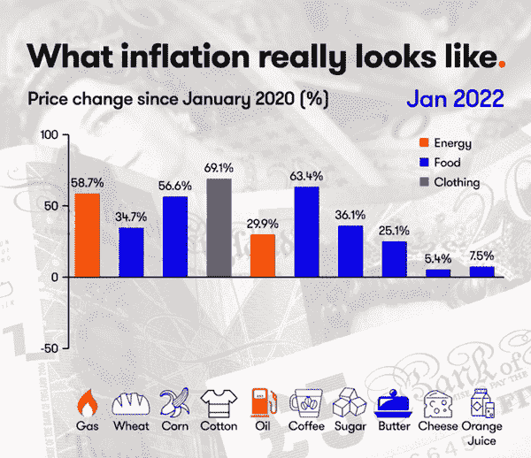

Source: [Reddit](https://www.reddit.com/r/dataisbeautiful/comments/vhciop/oc_inflation_and_the_cost_of_every_day_items/?utm_content=body&utm_medium=post_embed&utm_name=266a9e77a2b74d73a7e557b6f612db47&utm_source=embedly&utm_term=vhciop)

我相信你们中的许多人已经看过这个柱状图展示了通货膨胀的样子。**条形图竞赛**是显示数字随时间变化的一种很好的方式，动画组件可以全面展示**时间序列**数据。

在本文中，我将向您展示从获取数据到完成可视化的一步一步的过程。

最终产品的潜在优势:

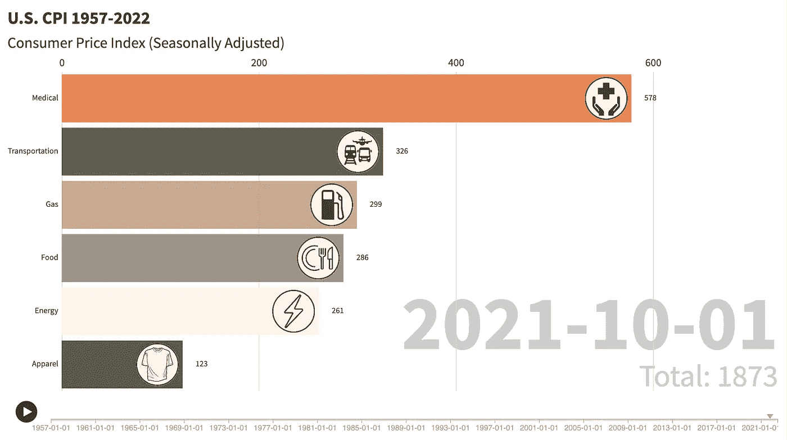

Image by Author

# 数据源

由于条形图竞赛需要时间序列数据，我选择了 1957 年至 2022 年的美国消费者价格指数数据(来源: [BLS 测试实验室](https://www.bls.gov/cpi/))，这完全符合需要。你可以在这个网站上找到许多类别，但在这次演示中，我将它们限制在**医疗、运输、食品、能源、天然气、**和**服装**。

请记住，每个类别都来自一个. csv 文件，所以我们需要将所有的数据帧合并在一起。如果您想查看详细的数据清理过程，请访问美国 CPI 预测:

 [## GitHub-m3 redithw/美国-CPI-预测

### 2022 年 9 月，美国的通货膨胀率达到近 40 年来的最高水平，因为新冠肺炎疫情造成了…

github.com](https://github.com/m3redithw/United-States-CPI-Prediction) 

# 创建图表

## 第一步

我们将使用 fluore 创建图表，这将在不编写任何代码的情况下为我们生成图表。它还允许我们完全定制外观(例如颜色、标签、图像等。).

请点击下面的链接，如果你还没有的话，请注册一个免费的账户。

 [## 蓬勃发展|数据可视化和讲故事

### 漂亮、简单的数据可视化和故事讲述

兴旺工作室](https://flourish.studio/) 

## 第二步

现在您已经创建了您的帐户，登录并点击**条形图比赛**模板，它看起来类似于:

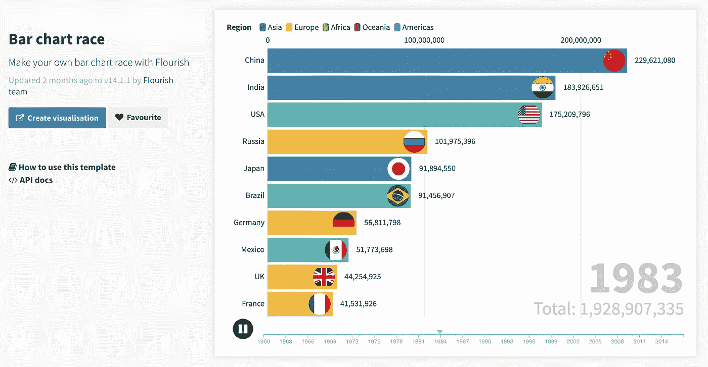

Bar chart race on Flourish — Image by Author

如果您很难找到链接，您也可以单击此处直接转到此模板:

 [## 条形图竞赛—蓬勃发展

### 显示模板 API 文档本节记录了特定于该模板的 API 用法，因此对于介绍，我们…

app . floride . studio](https://app.flourish.studio/@flourish/bar-chart-race/14) 

## 第三步

现在，单击蓝色按钮“**创建可视化**”，它将带您进入默认数据集页面。

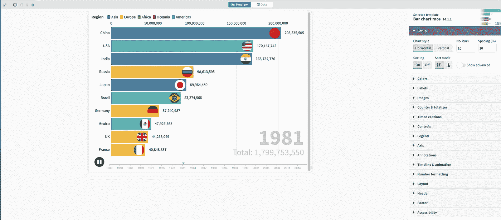

Bar chart race on Flourish — Image by Author

请注意，页面中央有两个选项卡:“预览”和“数据”。请记住，如果您进行了任何调整，您可以切换到“预览”页面来查看更改。

现在，让我们导航到“数据”页面，如下所示:

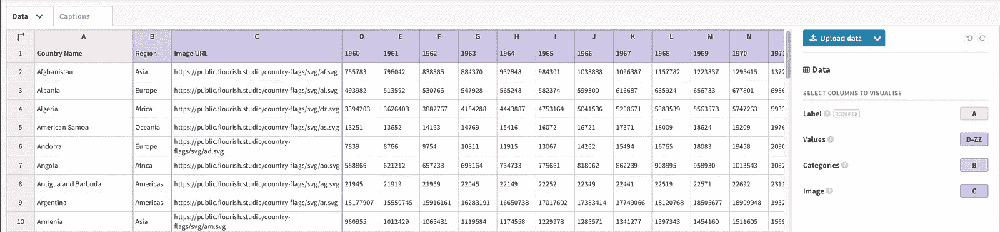

Bar chart race on Flourish — Image by Author

注意右上角的蓝色底部，这允许我们上传自己的数据。我们将从这里上传 CPI 数据。

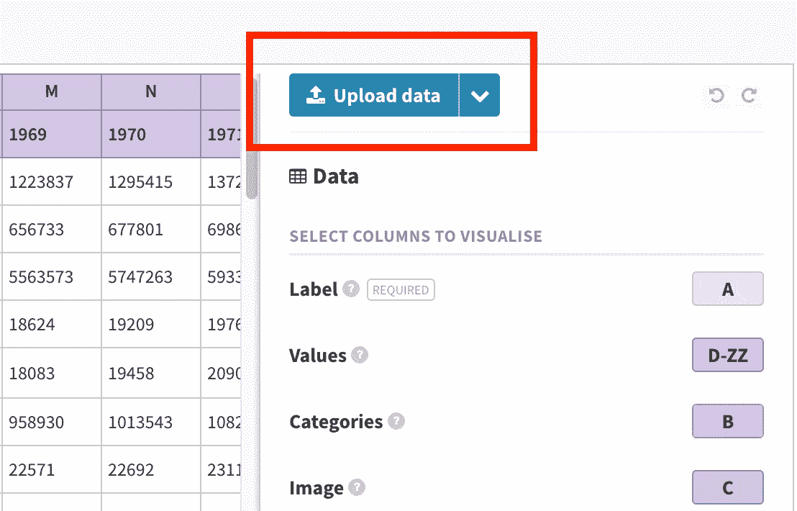

Upload data on Flourish — Image by Author

## 第四步

现在我们已经上传了数据，我们需要告诉 fluorescent 哪个列将在 x 轴上(**标签**')以及哪些量化值将被馈送到栏(**值**')。

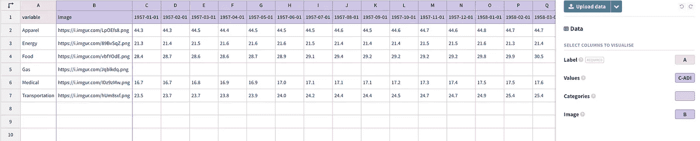

CPI data — Image by Author

除了必需的'**标签**和'**值**外，'**类别**和'**图像**是可选的。

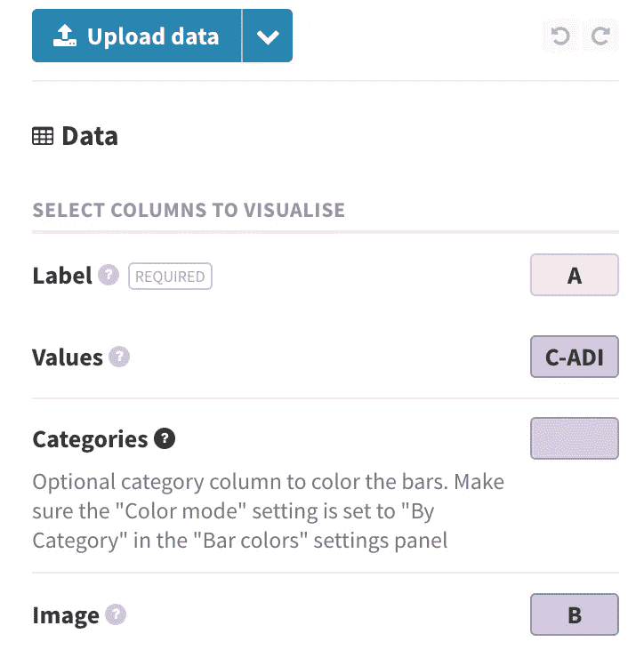

在这个例子中，我把 A 列(类别)作为“标签”；列 C-ADI，它们都是带有时间戳的列；B 列显示的是将显示在该栏旁边的图像 URL。

## 第五步

现在，如果您进入“预览”页面，条形图竞赛应该已经开始并运行了！为了让图表看起来更漂亮，这里有一些你可以随意摆弄的东西。

*   **颜色**

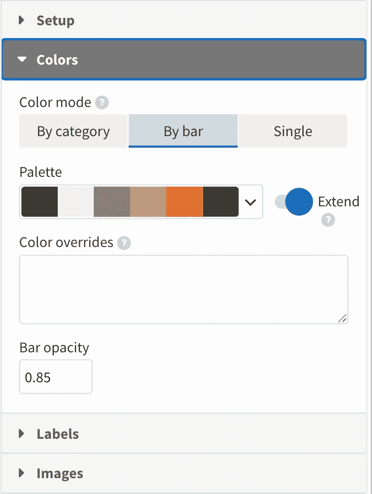

Colors on Flourish — Image by Author

“丰富”让我们可以完全控制颜色的显示。有一些内置的调色板，你也可以自定义你想要的调色板。

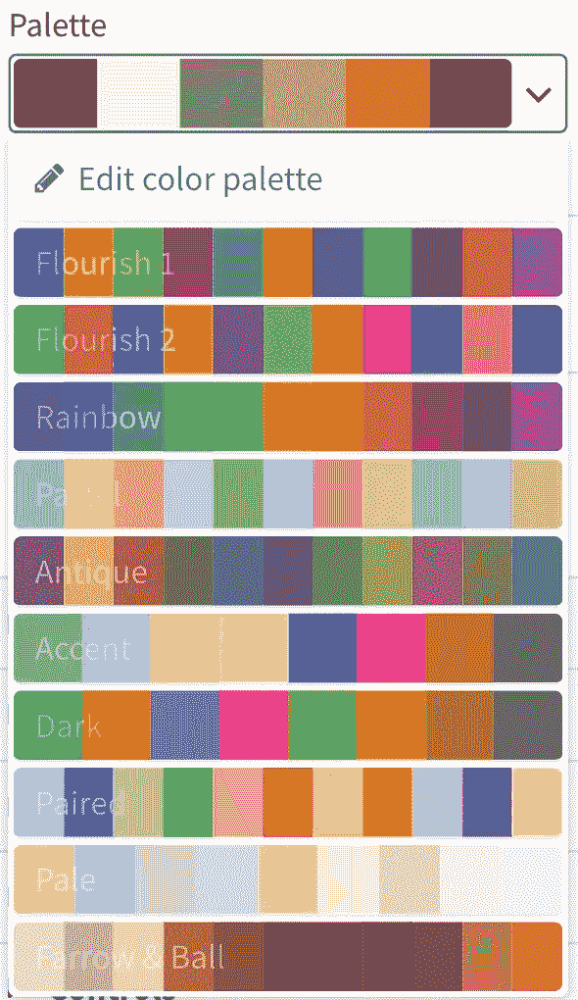

Color palettes on Flourish — Image by Author

在这里，我用我自己的 6 色中性色调色板。

*   **标签**

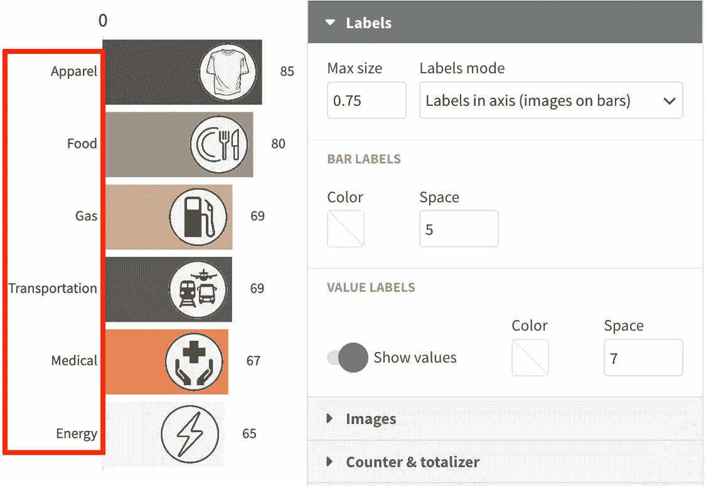

Labels on Flourish — Image by Author

我们可以改变标签的大小和显示设置。我缩小了尺寸，这样所有的单词都能在屏幕上正常显示，不会被截断。

*   **图像**

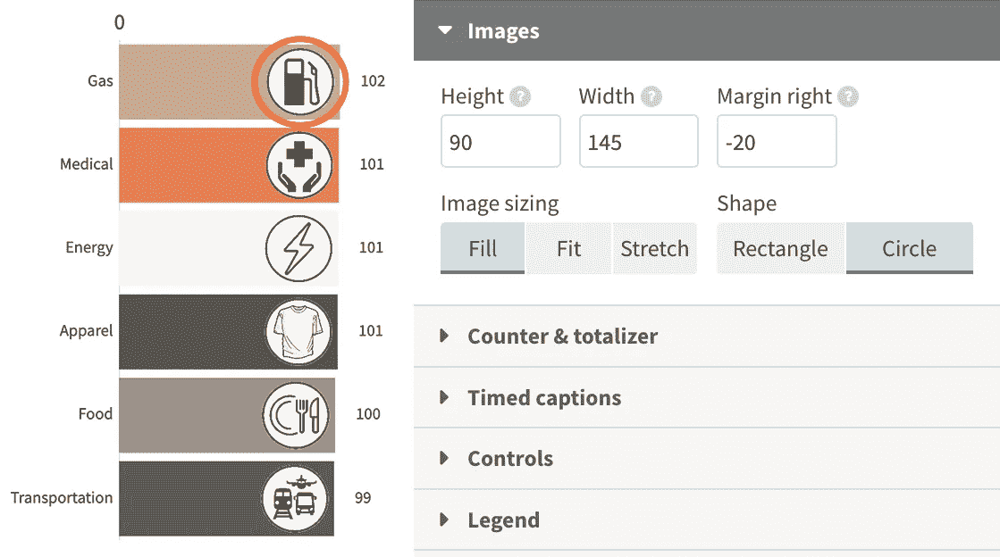

Images on Flourish — Image by Author

在此设置中，我们可以调整条形上图像的大小和适合度。我在 Canva 中创建了图形，也有很多其他选项(例如 Adobe illustrator、谷歌图像、[icons8.com](https://icons8.com/)等)。)

*   **标题**

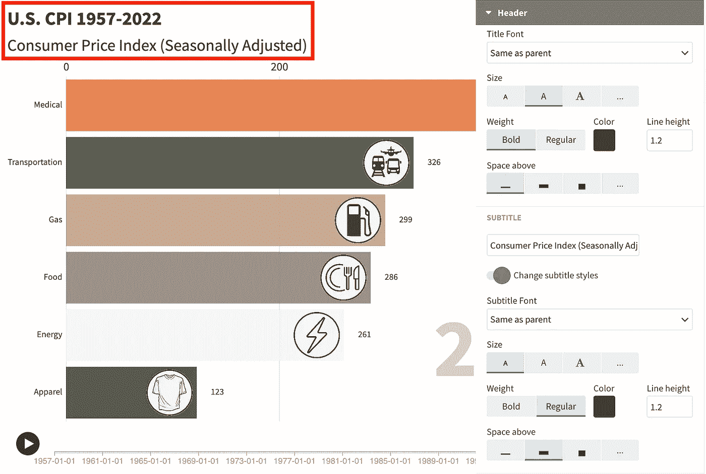

Title on Flourish — Image by Author

不要忘记给图表添加标题。我们可以在“标题”部分自定义标题和副标题的大小和显示设置。

# 结果

除了我提到的东西，还有一些其他设置可以用来定制图表。

下面是使用上述步骤的条形图竞赛:

U.S. CPI 1957–2022, Image by Author

我希望这篇教程足够简单，让你能够理解，并且能够生成一些很酷的动画条形图。蓬勃发展是一个伟大的可视化工具，但与其他流行的工具相比，它并不经常被提及。如果你知道任何其他工具，请在下面留下评论。

一如既往，我欢迎任何问题和反馈。欢迎直接通过电子邮件联系我，或在 [**LinkedIn**](https://www.linkedin.com/in/m3redithw/) 上与我联系。稍后再聊。

 [## Mlearning.ai 提交建议

### 如何成为 Mlearning.ai 上的作家

medium.com](/mlearning-ai/mlearning-ai-submission-suggestions-b51e2b130bfb)