# 如何在 Tableau 中创建飞行路径图？例子

> 原文：<https://medium.com/mlearning-ai/how-to-create-flight-path-maps-in-tableau-example-6311acfc75e3?source=collection_archive---------0----------------------->

如果你的任务是绘制一张飞行路线图，展示新冠肺炎对空中交通的影响，或者展示你公司的运输链——做好准备，这是一个棘手的任务！

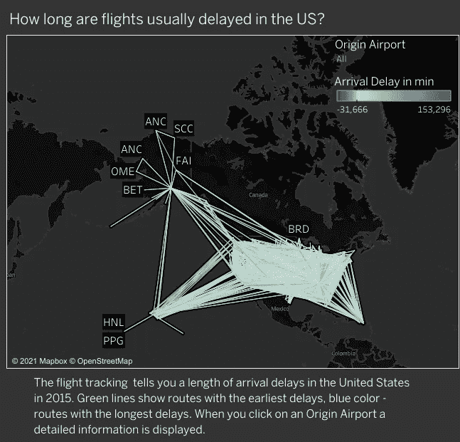

[https://public.tableau.com/shared/HWDM496P8?:display_count=y&:origin=viz_share_link](https://public.tableau.com/shared/HWDM496P8?:display_count=y&:origin=viz_share_link)

也许你面临的最大挑战不是 Tableau 语法，而是围绕数据的杂务——数据清理、数据联合、寻找缺失值和数据连接。

让我告诉你过程。

> 第一步。准备数据。要创建飞行路径图，数据库中需要以下信息:

> (1)开始和结束位置(例如，出发和目的地机场)，
> 
> (2)机场坐标(到达和离开的纬度和经度)，
> 
> (3)和趋势信息，例如到达延迟。

令人惊讶的是，互联网上有很多数据库没有包含足够的维度。

在这个例子中，我们将使用[2015 年穿越美国的飞行路线的历史数据](https://www.kaggle.com/usdot/flight-delays?select=flights.csv)，仅仅是因为这个数据库包含了所有必要的信息。你需要下载所有三个。csv 文件— flights.csv、airports.csv、airlines.csv。

在大多数情况下，信息表示在单独的表中(例如，航空公司、机场、航班)，您需要使用 union 和 join 函数。

可视化要有意义，要回答用户的问题，对吧？这项由美国运输局提供的免费数据追踪了大型航空公司运营的国内航班的表现。希望我们可以显示到达延迟，向最终用户显示该位置的平均到达延迟。

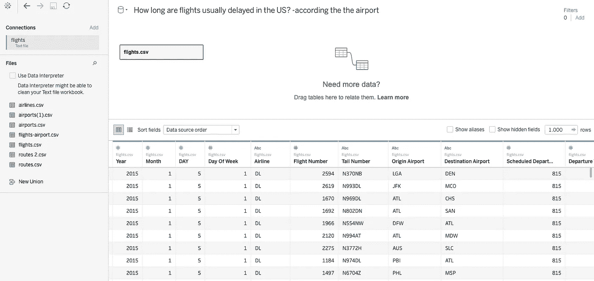

How long are flights usually delayed in the US — by the airport

> 第二步。非常重要的一步:创造一个自我联盟。
> 记住:为了画两条线，Tableau 需要一个起点和一个终点。

所以，当你上传数据的时候，是时候建立一个联盟了。为什么？通常，一个表在数据集中只包含一条记录。Tableau 只能用两条记录创建一条路线。您需要复制您的初始表以使其工作。联接处理列，而联合处理行。

*2.1。创建自联合*

*   *将 flight.csv 文件拖到第一个 flight.csv '将表拖到 union '下*

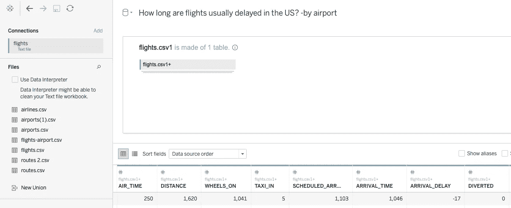

您可以看到以下变化:

> (1)名称更改为 routes.csv+，
> 
> (2)当你点击箭头时，功能‘编辑联合’打开，确保里面有两个表

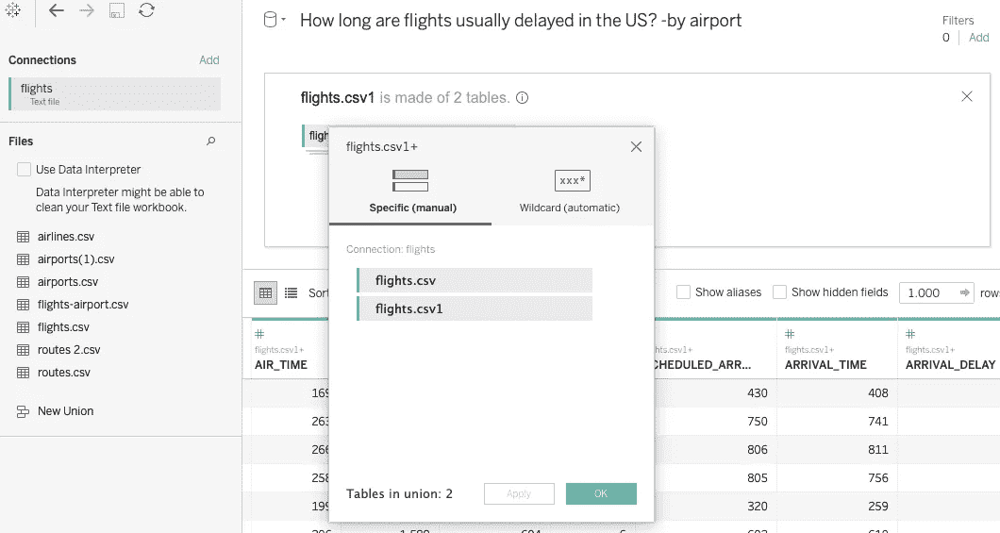

Edit Union Flights.csv

> (3)您的表中出现了一个名为“表名”的新字段

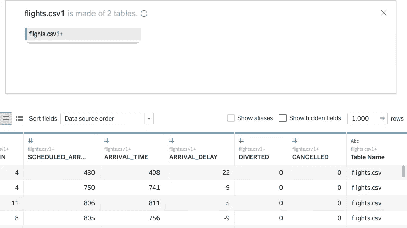

A new row — Table Name

> *第三步。创建一个根/路径*

3.1 创建路线标识符

*   *转到“始发地机场”列—点击“创建计算字段”*

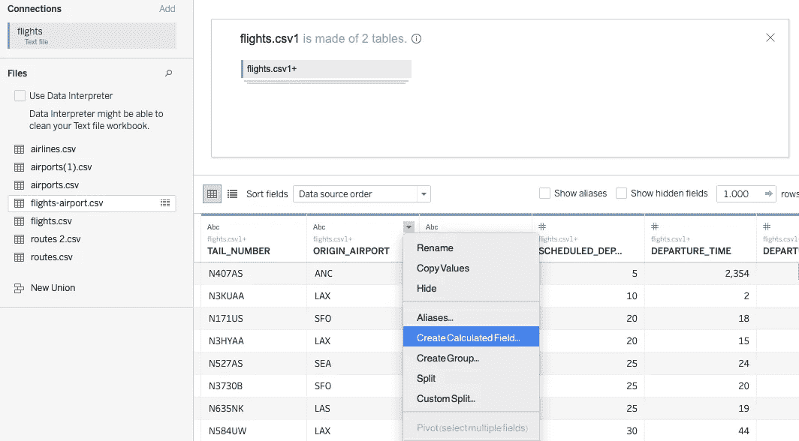

Create Calculated Field from Original Airport column

*   *使用函数[始发地机场]+" _ "+[目的地机场]创建航线标识符*

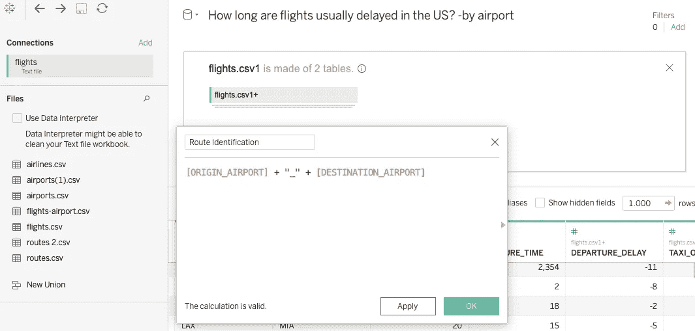

Route Identification function

您可以看到一个新列“路线标识”，带有起点和终点。比如 ANC _ 法律之海 _PBI。

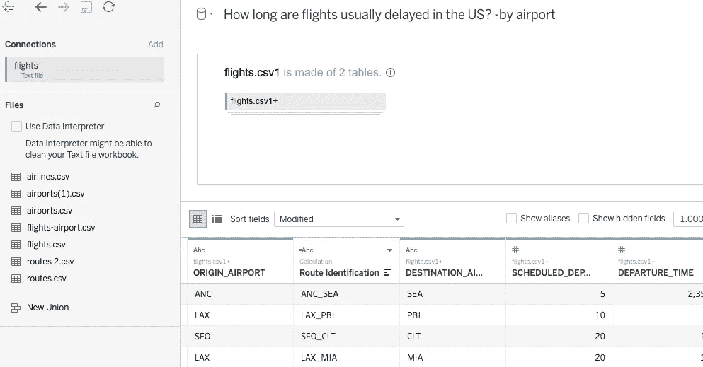

Route Identification: from the origin airport to the destination airport

3.2.创建路线订单

Tableau 需要知道位置之间的路径顺序，以便下一步创建路径顺序。

*   *转到“表名”列—单击“创建计算字段”*
*   *如果[表格名称] = 'flights.csv '则使用以下函数' 1 '否则' 2 '结束*

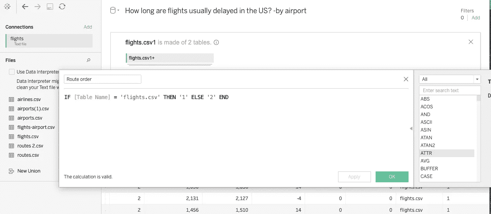

3.3.创建路线位置

我们应用与 2.2 中相同的逻辑。段，我们需要创建一个路线位置。

*   *转到“表名”列—单击“创建计算字段”*
*   *如果[表格名称] = 'flights.csv '然后是'始发地机场'否则'目的地机场'结束*，则使用以下函数

> 第四步。在表之间创建联接

*   *将 airports.csv 拖到您的面板上*

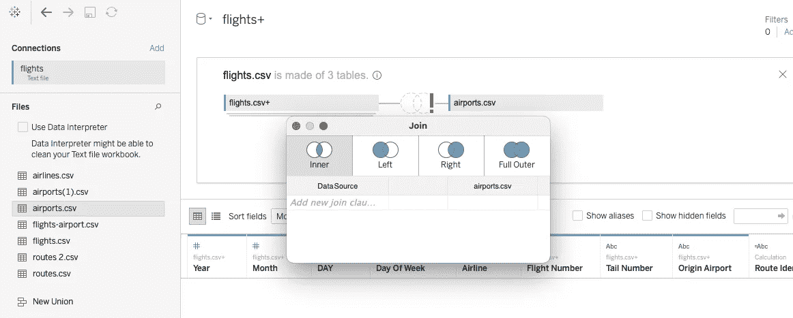

Creation of JOIN using a calculated field

*   *单击下拉菜单中的“计算字段”选择数据源。*
*   *如果[表格名称] = 'flights.csv '然后是'始发地机场'否则'目的地机场'结束，则使用以下功能。*
*   *从 Airports.csv 端选择 Iata 代码作为维度。国际航空运输协会编码航空业中使用的三个字母的特殊代码，用来标记机场、航空公司和飞机类型。你也可以用“Airport”代替“Iata Code”。*

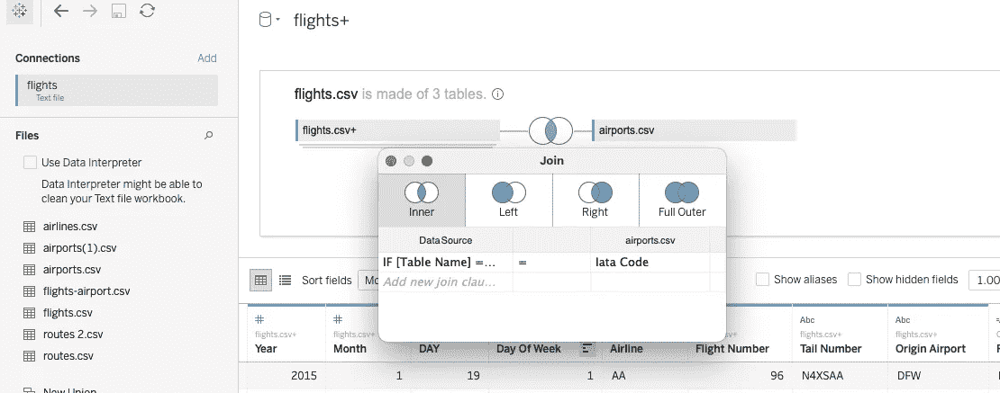

JOIN function in Tableau using Calculated field

这样，JOIN 就创建好了。我们已经讨论了飞行路径地图创建中最耗时和最具挑战性的部分。

我不打算深入研究数据可视化的问题——这很简单。简而言之，你创建一个地图，然后拖动“路线标识符”到细节和“路线位置”在路径标记。这就是全部，然后您可以根据目标随意使用这些功能——如果您希望显示路线位置，或特定路线，或按州/航空公司过滤，等等。

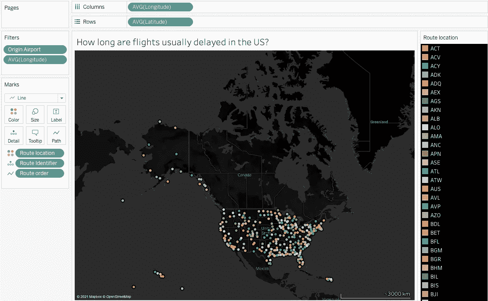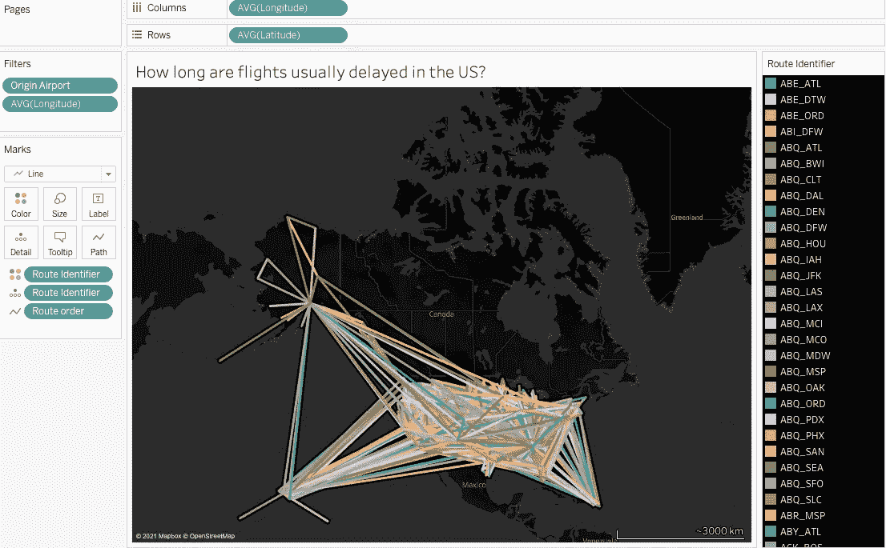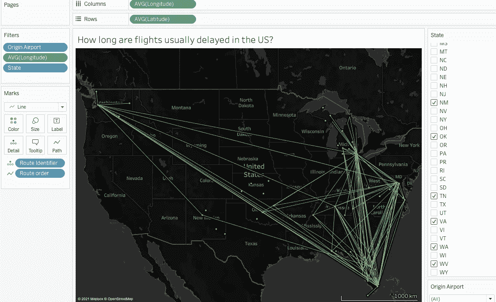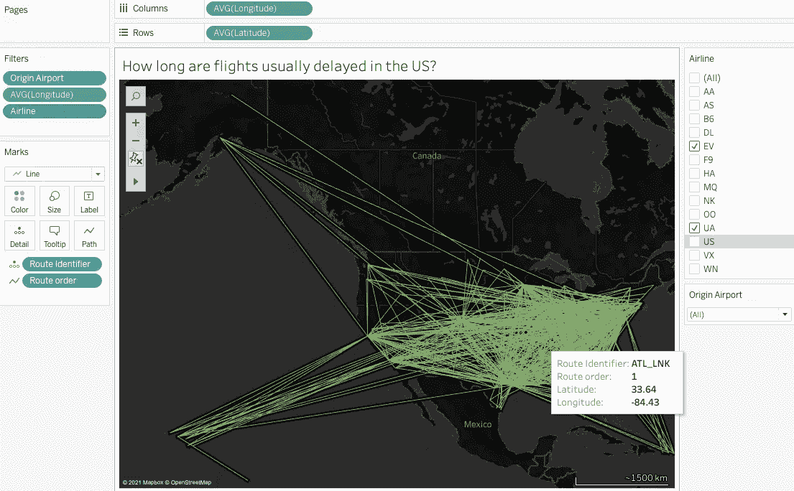