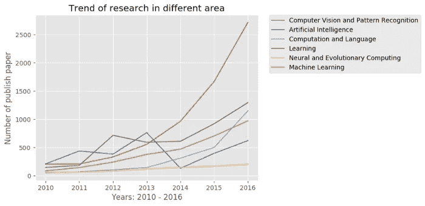
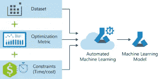

# 如何创建伟大的机器学习解决方案

> 原文：<https://medium.com/mlearning-ai/how-to-create-great-machine-learning-solutions-b193c066fce?source=collection_archive---------5----------------------->

## 复杂的旅程分成简单的步骤

机器学习允许人们创造伟大的产品。它允许我们获取大量复杂的数据，并从中提取见解。然而，设计伟大的 ML 工具可能非常复杂。旅程中有许多令人感动的部分。在本文中，我将分解这个过程，从找到正确的想法到最终的部署。

# 发现你的利基

这第一部分绝对重要。这也是大多数人忽略的。大多数**有效的机器学习**在其应用的不同领域都非常相似。基本就够好了。事实上他们非常好。但是他们并不伟大。

如果你想设计更高层次的解决方案，你将需要很多特定领域的知识。用于计算机视觉的数据扩充与自然语言处理中的数据扩充非常不同。星际争霸 2 中强化学习的细节不同于拳击中的强化学习。在这一步，你只需要发现你最感兴趣的问题。

找到你的兴趣取决于你自己。你可以通过书籍、旅游、爱好、个人环境等获得它。

***这一步绝对至关重要。你将不得不投入大量的工作来创造伟大的产品。如果你是朝着一个你感兴趣的主题去做，你将能够投入并真正看到项目进行到底。***

# 学习基础知识

当你在探索人工智能/机器学习发挥作用的不同应用时，花些精力学习基础知识。学习基础知识有很多好处。

1.  大多数 ML 是基础的沉重和创造性的实现。查看[关于机器学习工作的 5 个不性感的真相](/mlearning-ai/5-unsexy-truths-about-working-in-machine-learning-d44369e1e088)了解更多细节。
2.  学习基础知识可以让你在不同的领域/实现之间转换。**他们是 80%的流程。研究和学习剩下的 20%变得相对容易。**
3.  学习基础知识可以让你向专家学习并与之交流。Naval Ravikant 将此描述为“能够阅读和理解图书馆中的任何一本书。”

基础知识的一个重要支柱是数学知识。我制作了视频，详细介绍了你需要了解哪些主题，你将需要多少，以及每个主题将如何帮助你。看看下面的视频。一定要看完，以了解主题是如何联系在一起的。

Make sure to hit the like button

# 研究

一旦你知道了基础知识，是时候建立你的领域知识了。与癌症检测相比，不同的网络架构最适合深度伪造检测。这里唯一的前进方式是深入你所从事的特定领域的研究。

那么，你该怎么做呢？如果你没有时间或兴趣去挖掘你所在领域/利基的最新动态，那就跟随创造者吧。跟随像我这样的人，Yannich Kilcher，两分钟论文，亨利 AI 实验室等。追随多个创作者的好处是，它会让你接触到许多想法和实现，超越你固定的领域。例如，两分钟论文有一个很棒的关于教机器人走路的强化学习的系列。这让我了解了一个我并不涉足的领域，并将其中的一些知识运用到我自己的工作中。

如果你想了解更多关于如何与研究互动以成为机器学习小众领域的领域专家，请查看“[如何成为机器学习专家”](/geekculture/an-overlooked-tool-for-becoming-a-machine-learning-expert-edfef1556135)。它更详细地介绍了培养你的能力和成为专家的过程。

# 反复试验

接下来是这个过程中不性感的部分。你需要做大量的尝试和错误。你会发现最奇怪的事情。以著名的图书馆熊猫图为例。它用于 EDA(探索性数据分析)。您知道吗，当它创建完报告后，就会关闭所有的 python UI。这不是任何人都知道背后的原因。我怎么知道这个？我在用 Sweetviz 做工具时注意到了这一点。你可以在这里看到我提出的问题[，如果你想解决它的话。](https://github.com/fbdesignpro/sweetviz/issues/56)

试错法还会让您对代码和流程有一个大致的了解，让您能够构建和扩展您的解决方案，对细节进行微调。

# 部署

一旦您有了一个功能齐全的解决方案，研究部署就很重要了。这可能非常容易，也可能非常烦人，这取决于您的需求。对于很多人来说，工作代码就足够了。其他时候，您需要构建一个具有功能 UI 的 web 应用程序。或者设计基于云的服务。也许把它作为一个 API/包来推。

部署的细节将取决于涉众。与该领域的不同发展/趋势保持联系将有助于您权衡各种方法的利弊。Computerphile 是了解各种实践的好资源。

遵循这些步骤将允许您构建和完善伟大的机器学习解决方案。

如果你喜欢这篇文章，看看我的其他内容。我定期在 Medium、YouTube、Twitter 和 Substack 上发帖。我专注于人工智能、机器学习、技术和软件开发。

# 向我伸出手

如果那篇文章让你对联系我感兴趣，那么这一部分就是为你准备的。你可以在任何平台上联系我，或者查看我的其他内容。如果你想讨论家教，发短信给我。如果你想支持我的工作，请使用我的免费 Robinhood 推荐链接。我们都有免费的股票，对你没有风险。所以不使用它就等于失去了免费的钱。

查看我在 Medium 上的其他文章。:【https://rb.gy/zn1aiu 

我的 YouTube:【https://rb.gy/88iwdd 

在 LinkedIn 上联系我。我们来连线:[https://rb.gy/m5ok2y](https://rb.gy/f7ltuj)

我的 insta gram:[https://rb.gy/gmvuy9](https://rb.gy/gmvuy9)

我的推特:[https://twitter.com/Machine01776819](https://twitter.com/Machine01776819)

如果你正在准备编码/技术面试:[https://codinginterviewsmadesimple.substack.com/](https://codinginterviewsmadesimple.substack.com/)

获得罗宾汉的免费股票:[https://join.robinhood.com/fnud75](https://www.youtube.com/redirect?redir_token=QUFFLUhqa0xDdC1jTW9nSU91WXlCSFhEVkJ0emJvN1FaUXxBQ3Jtc0ttWkRObUdfem1DZzIyZElfcXVZNGlVNE1xSUc4aVhSVkxBVGtHMWpmei1lWWVKNzlDUXVJR24ydHBtWG1PSXNaMlBMWDQycnlIVXNMYjJZWjdXcHNZQWNnaFBnQUhCV2dNVERQajFLTTVNMV9NVnA3UQ%3D%3D&q=https%3A%2F%2Fjoin.robinhood.com%2Ffnud75&v=WAYRtSj0ces&event=video_description)

 [## Mlearning.ai 提交建议

### 如何成为 Mlearning.ai 上的作家

medium.com](/mlearning-ai/mlearning-ai-submission-suggestions-b51e2b130bfb)