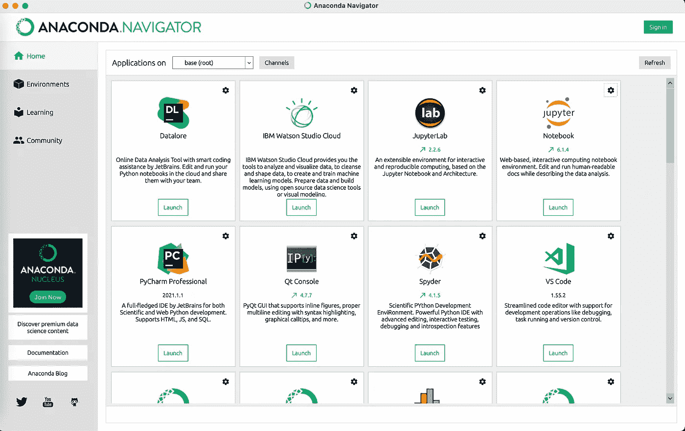
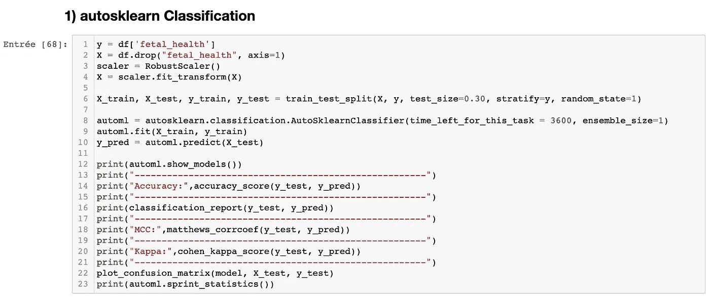
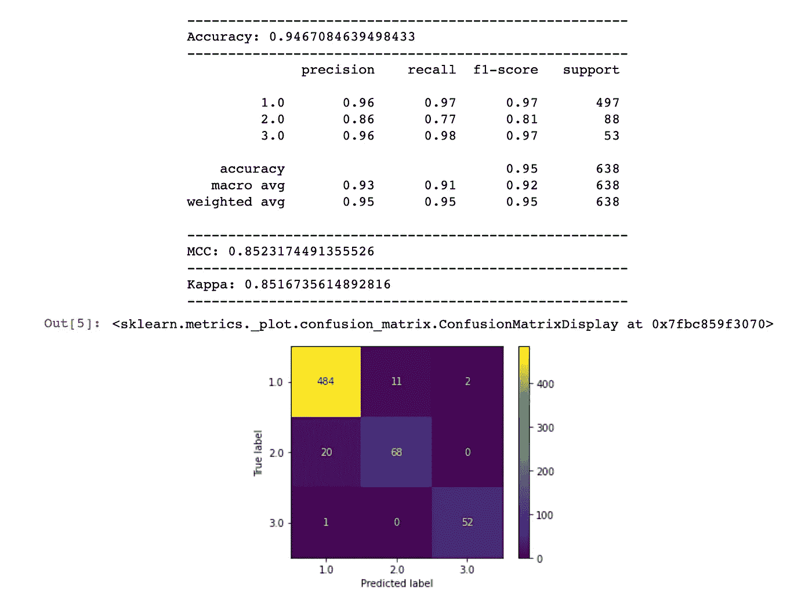
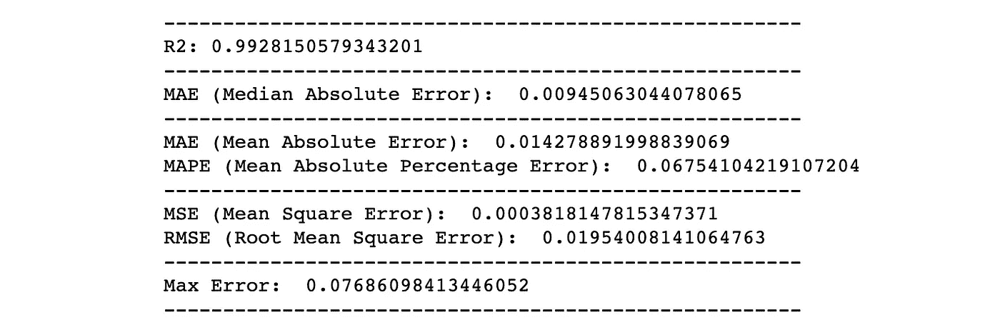
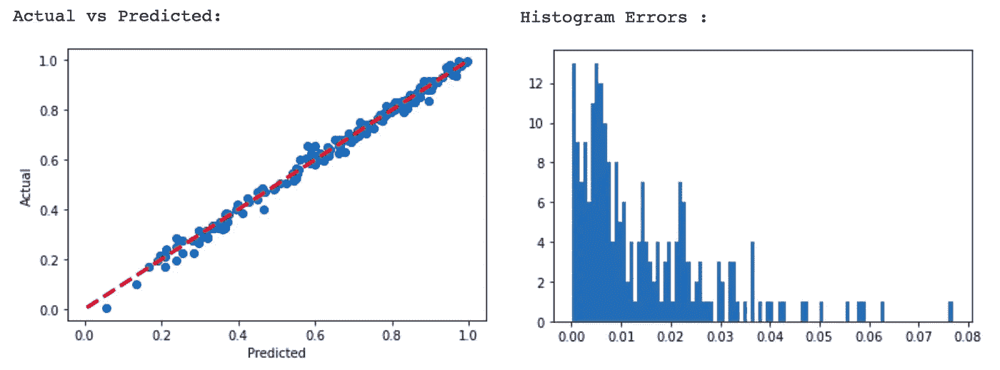

# 如何在 5 秒内创建机器学习模型？

> 原文：<https://medium.com/mlearning-ai/how-to-create-machine-learning-models-in-5-seconds-f7570bb189e2?source=collection_archive---------2----------------------->

## 快速生成模型的终极 Jupyter 笔记本


Machine Learning just easy as a vending machine ? [Aleksandar Pasaric](https://www.pexels.com/fr-fr/@apasaric) from Pexels

当我决定在数据科学领域走一条新的职业道路时，我在咨询公司实习的第一份工作是评估数据集以创建用例。由于这项任务有点重复，我的第一个想法是创建一个能够**快速生成机器学习模型并使用重要的相关指标**评估它们的笔记本。

感谢像 [Scikit-learn](https://scikit-learn.org/stable/) 这样的库，只需要一点点编码知识，你就可以用几行代码创建机器学习模型！

当然，数据科学家日常工作的现实是不同的——我将在本文结尾解释原因！

好吧！让我们开始创建我们的模型:

我的建议是使用分发平台， [Anaconda](https://www.anaconda.com/) 。它真的很容易安装在 Windows 或 Mac 上，它将为您提供创建机器学习模型所需的一切。一旦安装了 Anaconda，您就可以启动“JupyterLab”，或者基于网络的版本“Notebook”。如果你想要一个不需要安装的替代解决方案，你可以使用 [Google Colab](https://colab.research.google.com/) 。



[Anaconda, The World’s Most Popular Data Science Platform](https://www.anaconda.com/)

然后，你可以访问我的 [Github](https://github.com/DavidTa12/Jupyter) 库并下载这两个笔记本。分类和回归:

# 1.分类

我的第一个笔记本[将允许你创建分类模型。
第一步是运行“Imports”单元格，以便加载我在笔记本中使用的所有库:](https://github.com/DavidTa12/Jupyter/blob/main/1%20Classifications%20-%20The%20Ultimate%20Notebook.ipynb)

如果您缺少库，只需使用:

```
conda install + the name of the missing libraryor :pip install + the name of the missing library
```

现在我们可以创建我们的第一个模型。您必须导入数据集，它可以是. csv 或。xlsx(如果使用 Excel 文件，请使用`pd.read_xcel`)。
将`multiclass.csv`替换为您的. csv 文件的名称。如果文件在另一个文件夹中，请使用文件的完整路径。如果你的。csv 使用“；”作为分离器，只需更换`sep=”;”`。

**A)使用 auto-sklearn 进行分类**

auto-sklearn 是一个自动化的机器学习工具，通过使用最佳算法、超参数和一些数据预处理，在创建模型方面非常强大。



A powerful auto machine learning tool

在使用 auto-sklearn 之前，您必须定义一些重要参数:

**time_left_for_this_task** :默认定义为 3600 秒——这意味着你让 auto-sklearn 工作一个小时寻找最佳模型。(如果您很急，请降低该值；如果您想花更多时间找到可能的最佳模型，请增加该值)
**ensemble_size** :如果您只想在模型中使用一种算法，请定义为 1；如果您想使用多种算法(集成模型)，请保留为 50(默认值)。
**指标**:这允许您定义模型应该关注哪个指标的改进。要查看所有可用指标，[请点击此处](https://automl.github.io/auto-sklearn/master/api.html#built-in-metrics)。

要使用 auto-sklearn，您必须定义您的目标:
`y = df[‘fetal_health’]`，并用您自己数据集的目标替换`“fetal_heath”`。
对 X 来说也一样，你得把目标:
`X = df.drop(“fetal_health”, axis=1)`。

**B)分类算法**

如果您没有很多时间，或者不想使用 auto-sklearn，您可以使用下面的单元格，这些单元格可以使用**逻辑回归、K-NN、随机 Forrest 或梯度推进**算法来创建模型。我的笔记本的目标是用分类中的重要指标快速评估模型:**准确度、精确度、召回率、F1、MCC、Kappa 和混淆矩阵**。



# 2.回归

我的第二个回归笔记本的工作方式与分类相同。唯一的区别是你有分布图:一个**实际与预测的描述，以及一个误差直方图**。
使用的重要回归指标有: **R、MAE、MAPE、MSE、RMSE 和最大误差**。



## 我用这两个笔记本做什么？

我用它们来测试我客户的数据集:根据结果，**我立即知道我是否需要进行重要的预处理和数据工程工作**。

感谢自动机器学习工具，我们不再需要花时间优化超参数。
今天，**数据科学家的工作主要是关于预处理和数据工程**以便获得更好的模型(敬请期待——我很快会写一篇关于它的文章！)


Understanding the data you are working on is crucial !

如今，越来越多的公司使用数据科学平台让他们的员工在没有任何编码知识的情况下生成机器学习模型。许多人在日常工作中操纵数据，但并不是所有人都使用机器学习来简化工作过程。这就是我加入[我的数据模型](https://www.mydatamodels.com/)的原因:尝试并推广可以帮助人们更快更有效地创造价值的 ML 工具。

请随意评论本文，并向我询问任何关于数据科学的问题——您也可以通过[领英](https://www.linkedin.com/in/davidta12/)与我联系！许多其他有用的文章正在向你袭来:请继续关注🚀