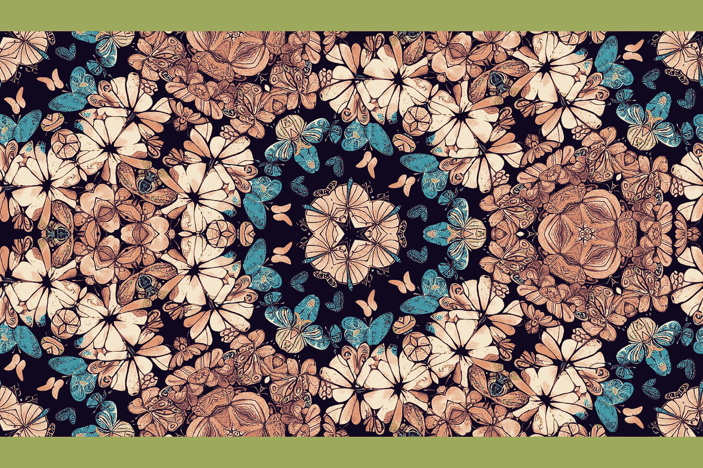

# 如何使用 Midjourney 创建无缝瓷砖

> 原文：<https://medium.com/mlearning-ai/how-to-create-seamless-tiles-with-midjourney-ffeb368c1c50?source=collection_archive---------0----------------------->

Midjourney 引入了一个新功能，允许您创建无缝模式。您可以在自己的按需印刷商店中使用它们，或者将图案包出售给其他设计师。请继续阅读，了解这是如何工作的。

Image by [Stella Sky](/@StellaSky)

**关联披露**

*五星设计师(Stella Sky)是许多在线工具、服务和产品的附属机构。该网站上的链接可能是* …