# 如何使用 Azure DevOps 创建简单的 CI/CD 管道

> 原文：<https://medium.com/mlearning-ai/how-to-create-simple-ci-cd-pipeline-using-azure-devops-67a6cc7bd21a?source=collection_archive---------3----------------------->

在这篇文章中，我将向你展示如何使用 Azure DevOps 创建和设置一个简单的 CI/CD 管道。

[持续集成和持续部署](https://www.simplilearn.com/tutorials/devops-tutorial/continuous-delivery-and-continuous-deployment)又称 CI/CD，是一个缩短开发和部署应用程序之间的时间间隔的概念。

Image by [vectorjuice](https://www.freepik.com/free-vector/devops-team-abstract-concept-vector-illustration-software-development-team-member-agile-workflow-devops-team-model-it-teamwork-project-management-integrated-practice-abstract-metaphor_11668829.htm#query=devops&from_query=ci%20cd&position=0&from_view=search") on Freepik

通常，当开发人员向应用程序代码库推出新功能时，代码会通过一系列检查，以测试代码的质量。一旦测试通过，代码就被手动编译并部署在服务器或部署环境所在的任何地方。

这是一个手动且耗时的过程，CI/CD 管道旨在自动化该过程，并减少每次提交/代码推送后花费的时间和手动工作。

在本帖中，我们将部署在本帖中创建的简单 Flask API，并在其上设置 CI/CD 管道。该管道将监控代码库中的任何更改，并将在 Azure Web Apps 上编译和部署 API。

完成本教程后，您将了解:

*   设置 Azure DevOps 帐户和存储库
*   创建 Azure 管道
*   使用管道设置 Azure 容器注册表
*   运行管道

我们开始吧！

# 1.设置 Azure DevOps 帐户

去 [Azure DevOps](https://azure.microsoft.com/en-in/services/devops/) 点击免费星。使用您的电子邮件帐户登录，创建并遵循所有步骤。系统将提示您创建一个组织。为您的组织取一个唯一的名称。

注册完成后，您将被重定向到 DevOps 主页，如下图所示。

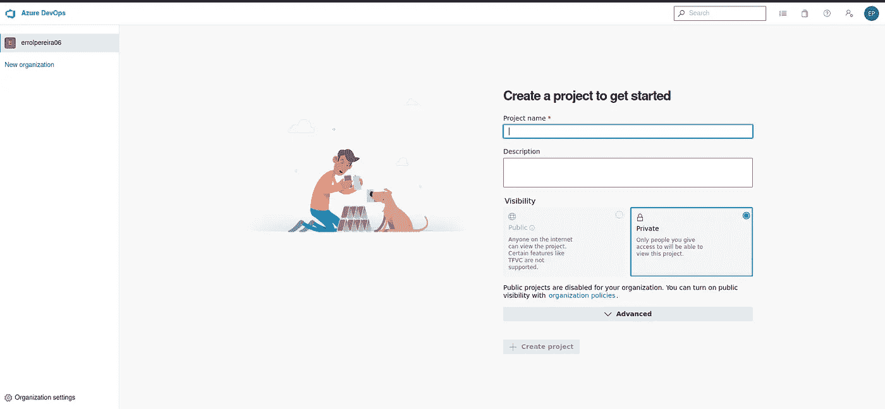

现在，让我们在您刚刚创建的组织中创建一个存储库/项目。创建一个名为 Simple Flask API 的项目，并将可见性保持为私有。点击创建项目按钮。这将创建一个名为 Simple Flask API 的项目。

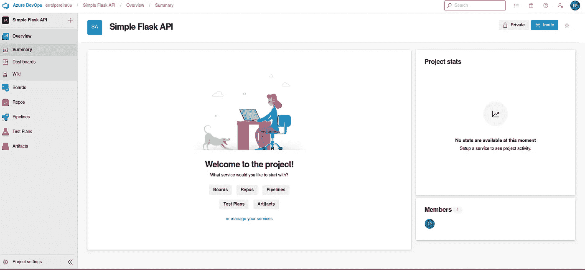

一旦你进入左边的项目视图，你会看到**回复**。点击 Repos，它会告诉你如何导入或添加代码或文件到你的仓库。界面就像 GitHub 一样。让我们添加我们在这篇[文章](https://errolpereira.github.io/deploy_flask_api_using_docker_container/)中创建的简单 Flask API 代码。使用此[链接](https://github.com/errolPereira/blog_resources/tree/main/Flask%20API)下载代码文件。

一旦你在你的 azure 仓库中添加了代码，你将会看到类似下面的输出

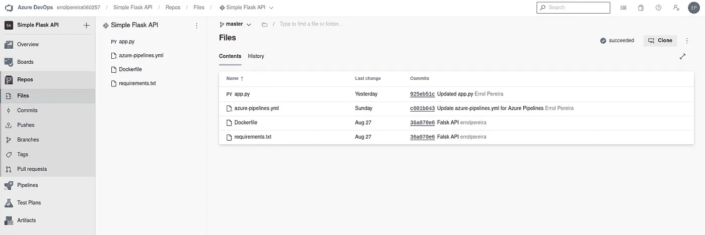

# 2.创建 Azure 管道

现在，我们将创建管道，该管道将创建代码的 docker 映像，并将该映像推送到 [Azure 容器注册表](https://azure.microsoft.com/en-us/services/container-registry/)。

为此，我们需要有一个 Azure 容器注册创建 Azure 帐户。您只需提供您的信用卡/借记卡信息，就可以注册 30 天的免费试用期。不要担心，他们不会向你收取任何费用，即使在试用期结束后，因为它是你去支付。

按照这个教程，使用这个[链接](https://azure.microsoft.com/en-in/free/)注册一个免费帐户，并创建一个 [Azure 容器注册表](https://docs.microsoft.com/en-us/azure/container-registry/container-registry-get-started-portal?tabs=azure-cli)。

**注意:使用您创建 Azure DevOps 帐户时使用的电子邮件地址。**

一旦你的帐户设置完毕，回到 azure devops，点击左边的管道选项。你将会看到一个类似如下的页面。

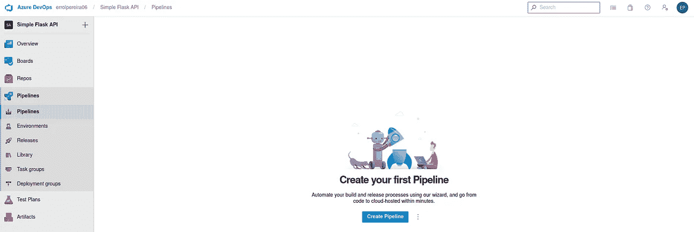

单击创建管道按钮。它会询问您的代码库。选择 Azure Repos Git。然后它会向您显示 azure git 中的存储库列表。因为我们只创建了一个名为 Simple Flask API 的存储库，所以我们将只看到这一个选项。选择要为其创建管道的存储库名称。在我们的例子中是简单的 Flask API。

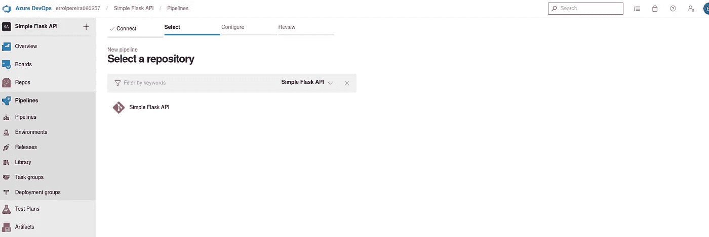

现在它会问你想用这个管道做什么。我们希望为我们的应用程序构建一个 docker 映像，并将其推送到 Azure 容器注册中心。我们将选择“Docker —构建并向 Azure 容器注册表推送图像”选项。

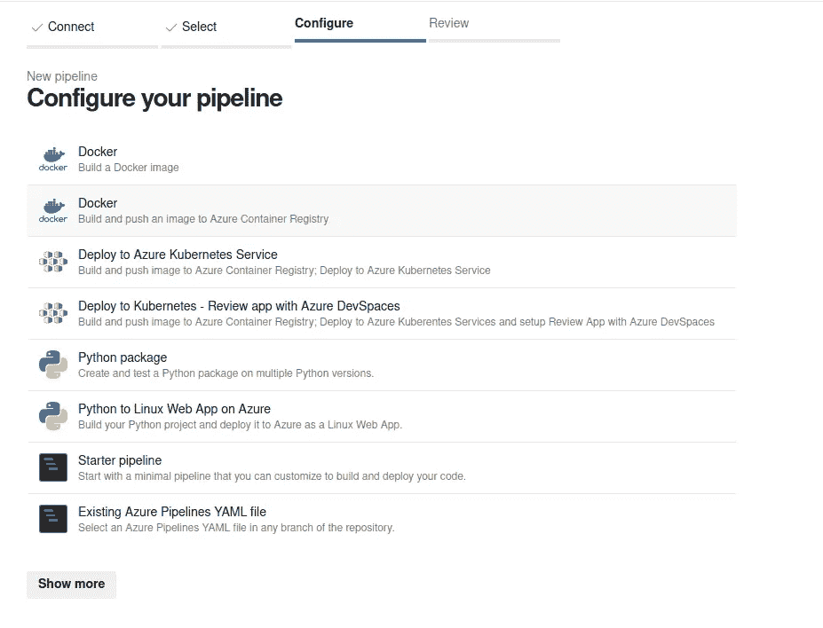

现在，它将继续验证您的 azure 帐户，并输入您创建的容器注册表名称。选择免费试用订阅选项，然后单击继续。

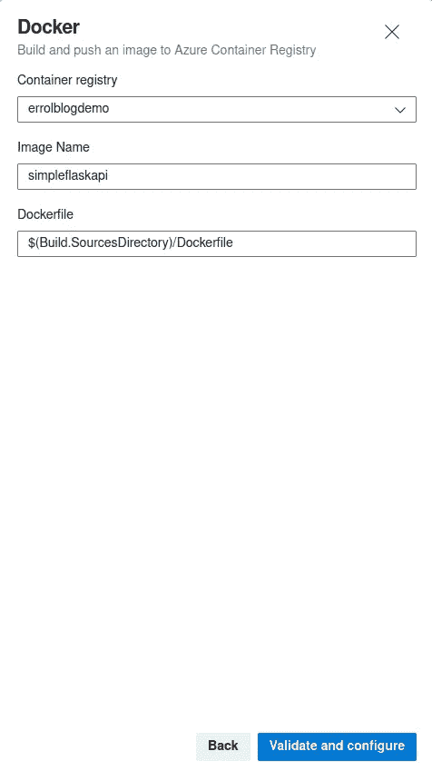

现在选择您之前创建的容器注册表名称。给你想放入注册表的 docker 图片起一个名字。一旦你是好的点击验证和配置按钮。

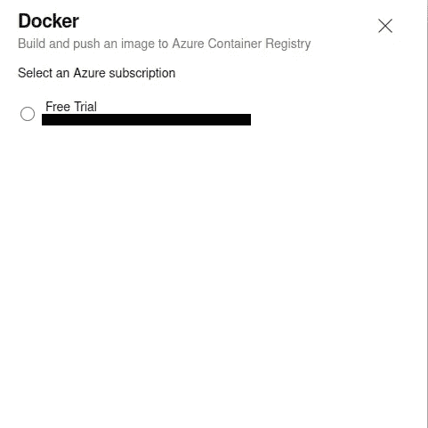

如果一切都配置正确，您将看到一个 YAML 文件，其中包含为您完成的所有配置。该文件将类似于下图

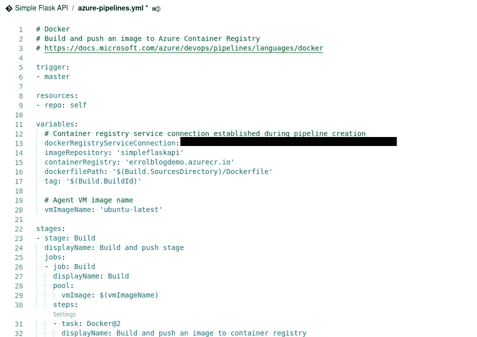

# 3.运行 Azure 管道

现在一切都设置好了，继续点击保存并运行按钮。这将触发管道。它会把你的 Flask API 编译成一个 docker 镜像，并把这个镜像放到你的 Azure 容器注册表中。

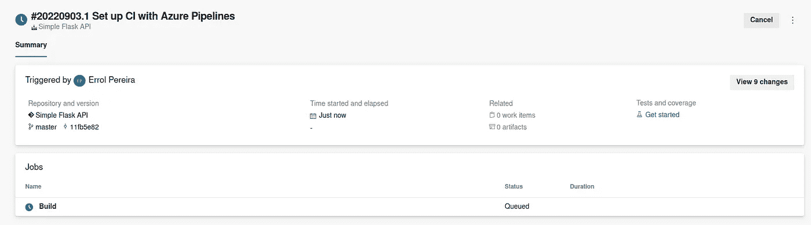

一旦管道运行完成，你可以在 [azure 门户](https://errolpereira.github.io/how_to_create_CI_CD_pipeline_using_azure_devops/portal.azure.com/)中检查你的容器注册表，你会看到在注册表中推送的图像。

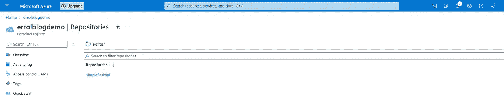

# 4.CI/CD 自动化

现在，您一定想知道我们创建的这个管道中的 CI/CD 部分在哪里。如果我们每次在应用程序中进行任何更改时都必须手动触发管道，那么这实际上并不能解决任何问题。但幸运的是，每当代码库发生任何变化时，我们创建的管道都会自动触发。

继续在 **app.py** 文件中添加一个注释，或者对任何文件做一个小的更改，然后提交您的更改并将其推送到存储库。如果您导航到“pipelines”菜单，您将看到我们创建的管道被自动触发，它正在使用我们推送的最新更改编译和构建映像。

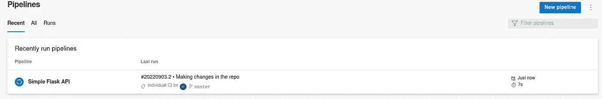

好了，我们创建了一个管道，负责将我们的应用程序编译成 docker 映像，并将其推入 ACR。

**参考文献:**

*   [蔚蓝 DevOps](https://docs.microsoft.com/en-us/azure/devops/?view=azure-devops&viewFallbackFrom=vsts)
*   [Azure 容器注册表](https://docs.microsoft.com/en-us/azure/container-registry/)
*   [CI/CD 管道](https://docs.microsoft.com/en-us/azure/devops/pipelines/apps/cd/azure/cicd-data-overview?view=azure-devops)

*原载于 2022 年 8 月 24 日*[*https://errolpereira . github . io*](https://errolpereira.github.io/how_to_create_CI_CD_pipeline_using_azure_devops/)*。*

 [## Mlearning.ai 提交建议

### 如何成为 Mlearning.ai 上的作家

medium.com](/mlearning-ai/mlearning-ai-submission-suggestions-b51e2b130bfb)