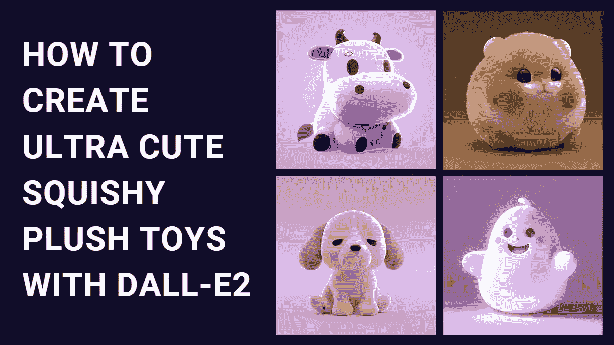

# 如何用 Dall-E2 制作这些超可爱的毛绒玩具

> 原文：<https://medium.com/mlearning-ai/how-to-create-these-ultra-cute-squishy-plush-toys-with-dall-e2-db70810e55ef?source=collection_archive---------0----------------------->

Image by [Jim Clyde Monge](https://medium.com/u/819323b399ac?source=post_page-----db70810e55ef--------------------------------)

如果你喜欢那些可爱的毛绒玩具，你也会喜欢这个小教程。与其花几个小时浏览玩具店或在网上寻找完美的玩具，为什么不自己创造呢？

没错，人工智能领域的最新进展现在允许你创建基本的 3D 渲染…