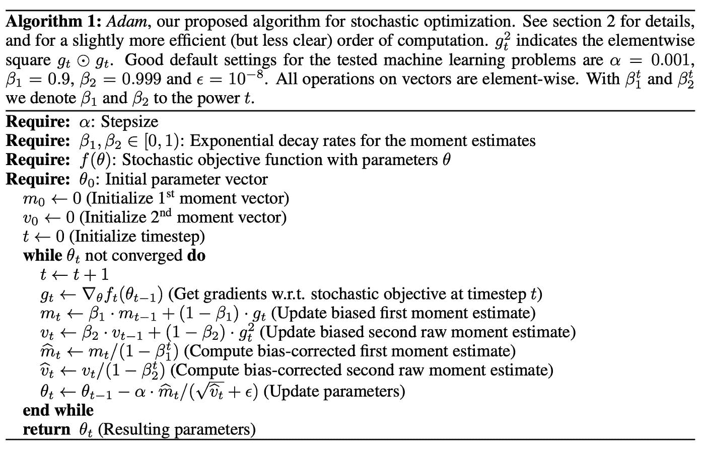
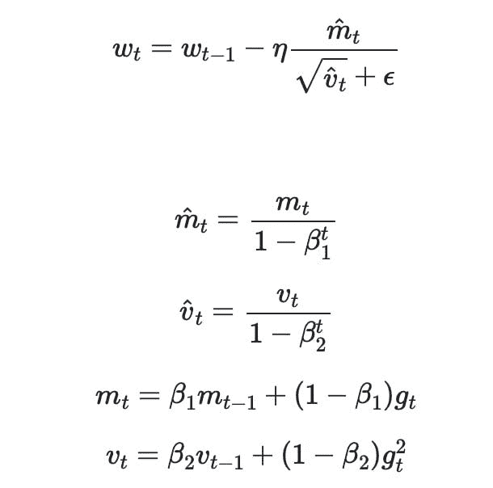
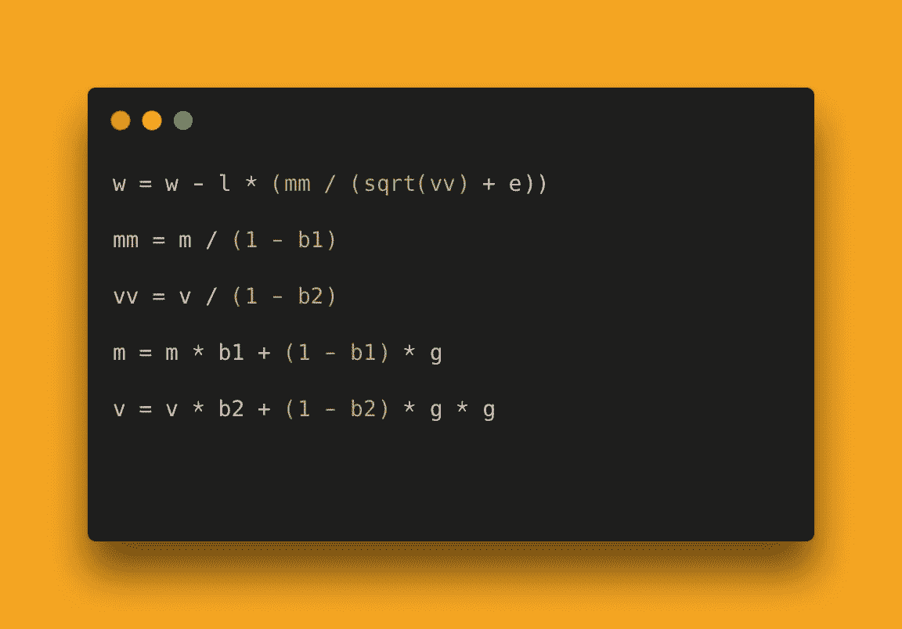

# 如何解构机器学习论文来实现它们:

> 原文：<https://medium.com/mlearning-ai/how-to-deconstruct-machine-learning-papers-to-implement-them-1d8b9f2e6adf?source=collection_archive---------2----------------------->

读 ML 论文对你作为从业者的成长真的很重要。事实上，我已经[制作了一个视频](https://youtu.be/8BlcQEJEdq8)来解释你如何有效地阅读这些论文。但是，真正重要的是知道如何在需要的时候将这些文件映射成代码。这可能是因为你被分配了一篇论文作为家庭作业来完成，也可能是因为你的工作项目需要它，或者你真的对学习完成它感到兴奋。

不管是什么原因，这里有一个有效的策略，当我需要执行文件时，它一次又一次地为我工作。

# 第一步:逐步总结论文

为了实现一篇论文并验证它的声明，你需要知道 TL；论文博士。具体来说，阅读论文，并逐步用自己的话进行总结。在这一步结束时，您希望手头有以下信息:

*   **的主要主张**——*“我们取得 X 项成果”、“我们在 Y 项前期工作的基础上有所改进”等等。*
*   有哪些新的**提案** — *“我们提出 ABC 架构”“我们用 C 代替 D”等等*
*   什么是**超参数** *—“我们使用 Adam 优化器，学习率为…”，“我们使用批量大小…”等。*
*   什么是**硬件**需求*——“我们用 1000 个 GPU 和 500 个 TPU”*😂
*   什么是**目标任务**和**数据集** — *“我们在 DEF 数据集上评估我们的方法”等等*

首先确定这些将有助于你建立一个预期的心理景观，与你以前实施的东西有什么不同，并帮助你决定是否可以照原样重新实施论文。有时，您需要实现的模型的大小，或者硬件需求可能会阻止您复制工作。在这种情况下，如果你没有运行算法所需的计算能力，你就需要缩小这个方法的规模或者完全放弃追踪。

这一步将帮助你避免很多浪费的努力，并为实际的编码部分做好心理准备！

# 步骤 2:确定论文中的核心算法

下一步是在论文中找到你需要实现的内容。新从业者在阅读这些论文时面临的许多挑战之一是，有许多数学**与他们实现论文所需要的**没有直接关系。

这既会使实践者困惑，又会阻碍他们实现这些论文。这种数学的大部分通常是作为方法的理论证明的东西，或者一些真正理解论文基础所需的相邻理论。

允许自己跳过这些等式！求你了。这会让你省去很多痛苦。

这是你需要的——流程图或大多数论文的主要方法。我们举个例子。下图来自提出 [Adam 优化器](https://arxiv.org/abs/1412.6980v9)的论文(现在不需要实现这个算法)。

本文中的表格总结了您自己实现 Adam 所需的一切:

The Adam Optimizer in Pseudocode

除此之外，论文中还有很多数学，如果你沉迷于阅读和理解(这不是一件坏事，但没有必要实现)，你将永远不会实现它。

如果你正在读的论文没有这个，试着找出核心方程，自己写下这样的流程图。通常，你可以在论文的方法部分找到“主要”方程。从文章中提取出来将会减少你实现它的来回奔波。这也是一个很好的练习，为将来建立你的公式到代码的肌肉。

# 步骤 3:审核和简化

虽然马上开始编码可能很诱人，但是要避免这种诱惑，下一步再做。一行一行地检查你已经创建或确定的流程图，并审核你需要实现的所有东西。这里的审计意味着发现您是否需要自己用代码写一些东西，或者是否可以借用现有的实现。

您需要编写的大部分代码通常已经作为您最喜欢的库(Pytorch、Tensorflow 等)中的函数提供了。)或者归结为高中数学。说真的。

让我们以上面的例子为例。下面是没有流程图的方程式:

这可能看起来很可怕。因此，将这些奇特的[曲线](https://www.artofsaience.com/my-crusade-against-weapons-of-mass-confusion/)替换成英文字母，如下所示:

A simplified view of the Adam Optimizer

这看起来没那么危险。本质上，你需要做一些加法、减法、乘法和除法。这里面最复杂的就是求平方根！你可能会问我，“那么下标中的 ***t*** 和 ***t-1*** 呢？”。这只是表示迭代。您只需要在一个循环中执行这些步骤，并相应地覆盖这些变量中的值。

虽然会有更复杂方程的论文，但原理是一样的。请记住，这些等式只是用来简洁地表达想法。他们总是归结为高中数学。

现在，您已经准备好编码并测试论文的声明了。

我希望你在下一篇论文中尝试这种方法。让我知道它如何为你工作。

# 🤖💪想要更多的想法成为一个多产的 ML 从业者？

每周，我都会发送一份时事通讯，提供实用的技巧和资源，以提升自己作为机器学习从业者的水平。 [**免费加入这里→**](https://www.newsletter.artofsaience.com)

 [## Mlearning.ai 提交建议

### 如何成为 Mlearning.ai 上的作家

medium.com](/mlearning-ai/mlearning-ai-submission-suggestions-b51e2b130bfb)