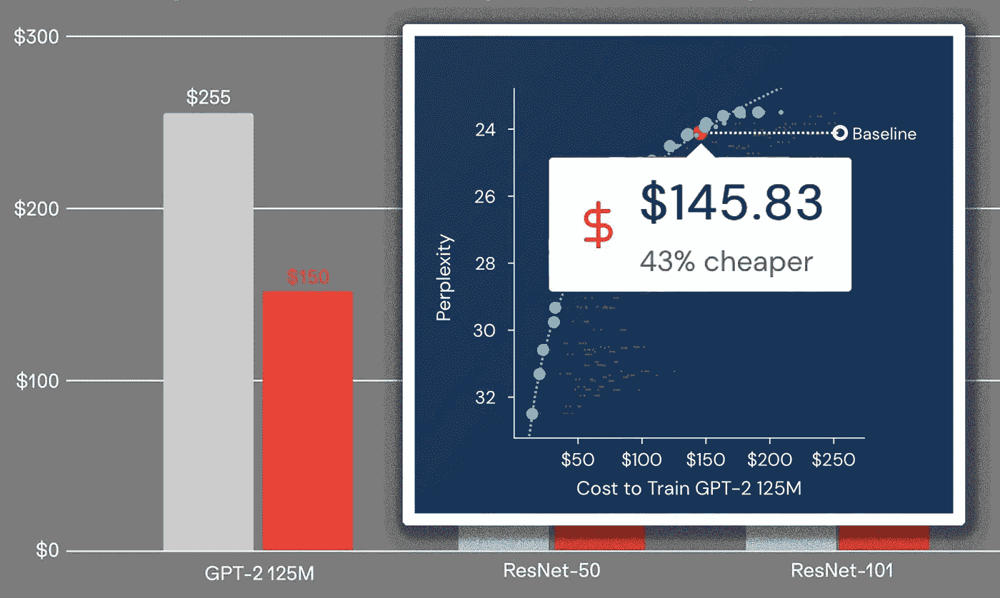

# 如何降低机器学习的成本

> 原文：<https://medium.com/mlearning-ai/how-to-decrease-the-cost-of-machine-learning-7985bbf69d98?source=collection_archive---------1----------------------->

## [机器学习艺术](https://mlearning.substack.com)

## 3 易于使用的降低成本工具

[https://mlearning.substack.com](https://mlearning.substack.com)

如果人们可以让训练 **NLP** 模型**的效率提高 10 倍**而没有任何后果，会发生什么？更重要的是，我们能有这样做的简单说明吗？
集体**成本、时间和能源节约**还有哪些？
这个问题没有单一的解决方案…