# 如何将机器学习模型部署到云中

> 原文：<https://medium.com/mlearning-ai/how-to-deploy-a-machine-learning-model-to-the-cloud-1c9ca637897c?source=collection_archive---------0----------------------->

使用 FastAPI、Docker 和 AWS EC2 部署 ML 模型，使其可用于最终用户\生产环境。


Photo by [Jelleke Vanooteghem](https://unsplash.com/@ilumire?utm_source=medium&utm_medium=referral) on [Unsplash](https://unsplash.com?utm_source=medium&utm_medium=referral)

经过大量的研究和数小时的编码，你开发了一个 ML 模型！太好了，但是工作并没有就此结束。仍然有必要询问如何使用这个模型，这是部署阶段的切入点。

当你不需要立即的结果时，比如在一个周期性的工作中，最好的部署解决方案可能是**批量预测**。这可以通过简单地调用 predict 函数或使用类似 Airflow 的调度工具来完成。

然而，在许多情况下，我们需要一个**按需**服务和**接近实时的预测**。例如，我们可以提到推荐系统、欺诈检测、搜索工具、医疗诊断等。在本文中，我们将介绍如何创建一个用于预测的 web 服务来解决这类问题。

为此，我们将经历三个步骤:

*   用 FastAPI web 框架创建一个 REST API。
*   构建 Docker 映像，通过容器运行服务器。
*   在 AWS EC2 实例中托管 Docker 容器。

# 模型

这篇文章的目的不是教你如何建立一个 ML 模型。因此，我们将使用已经开发的 XGBoost 模型，该模型能够预测产品的运输成本。

您可能会发现看一看这个模型是如何构建的很有趣，因为在它的开发过程中，我接触了一系列重要的主题，例如:数据处理、特征工程、度量定义、超参数调整、模型选择、模型评估等等。您可以在下面的资源库中找到所有步骤(以及本文中使用的源代码)。

[](https://github.com/FelipeMezzarana/shipping_price_estimate) [## GitHub-feli pemezzarana/shipping _ price _ estimate:ML 模型来估计一个…

### 基于一个电子商务数据集+部署 FastAPI、Docker 和…的 ML 模型来估计订单的运输价格

github.com](https://github.com/FelipeMezzarana/shipping_price_estimate) 

但是，如果您只对部署感兴趣，那么您真正需要知道的是，在构建您的模型之后，您需要将它转储到一个文件中，这可以通过 pickle 包轻松完成:

# 第一步:创建 REST API

现在我们有了一个模型，在云中部署它的第一步是创建 REST API。在这一点上，许多人选择使用 Flask framework，主要是因为它是一个较老的工具，人们只是习惯了它。

然而，尽管 FastAPI 是一个年轻的框架，但它比 Flask 有许多优势，例如更高的性能、**本地并发支持、内置数据验证和自动文档系统**。由于这些原因，我更喜欢 FastAPI 而不是 Flask。

首先，创建一个. py 文件，我的文件将被命名为“server.py”。然后，我们可以创建 FastAPI 对象并加载之前保存的模型。请确保所有内容都保存在同一个路径中。

> 提示:在这个例子中，模型将在每次请求后被加载，您可能希望定义一个函数来将模型作为全局变量只加载一次。这是一种权衡，你获得了速度，但需要分配更多的内存。

如前所述，FastAPI 支持内置数据验证，因此我们需要定义哪种数据将作为预测的输入，以及哪些数据将被输出。为此，我们将使用 BaseModel 为所有输入变量定义一个类，并为输出变量定义另一个类。这比听起来容易:

请注意，“价格”、“产品 _ 重量 _ 克”、“产品 _ 高度 _ 厘米”、“交货 _ 距离 _ 公里”和“产品 _ 体积 _ 立方厘米”都是预测运输价格所需的输入。

现在我们只需要定义我们的 **API 端点！**在我们的例子中，我们将只有两个端点，一个在主页面中检查服务器是否工作，另一个进行预测。方法是这样的:

这里发生了一些重要的事情。

*   在定义端点时，您需要说明它将使用“get”还是“post”方法。对于预测，我们需要用户输入，所以使用“post”方法很重要。
*   我们需要定义输入和输出数据类型，如图所示。默认值是 string，这就是为什么我们不需要在 home_page()中声明输出
*   我们使用“异步定义”来定义函数，这使得我们的函数能够并行运行

最终的 server.py 文件应该如下所示:

您可以使用 uvicorn 在本地测试服务器。安装软件包后，只需运行命令行:

`uvicorn server:app --host 0.0.0.0 --port 80`

您应该会看到类似这样的内容:

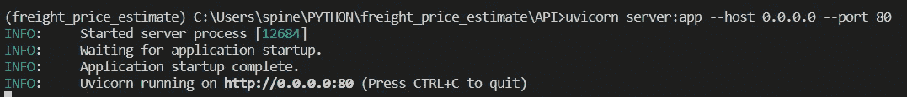

现在，我们可以直接向' [http://localhost:80'](http://localhost:80') 发出请求，因此可以在 jupyter 笔记本中执行如下测试:


# 第二步:建立一个 Docker 形象

Docker 来解决程序员人生中最老的问题！

*“但它在我的机器上能用…”*

有了 Docker，就有可能创建一个“位置”(容器)，里面有你的应用程序运行所需的一切，就像你开发它的方式一样，因此可以保证**应用程序可以在任何机器上运行！**

在云中部署 ML 模型也很方便，我们可以将模型工作所需的一切放在 docker 映像中，在本地测试它，如果一切正常，就将映像上传到云中！

要做到这一点，第一步是创建一个 Python 虚拟环境(这不完全是一个强制步骤，但它使我们的生活变得容易得多)。在本指南中，我不会介绍如何创建一个虚拟环境，互联网上有数百个教程供你使用。

准备好虚拟环境后，确保只安装应用程序运行所需的库。现在，我们将生成一个包含这个 virtaul env 的所有依赖项的文件。这个文件在创建我们的 Docker 图像时会非常有用。

在命令行上，激活您刚刚创建的虚拟 env。您可以使用第一个命令检查 env 路径，并使用第二个命令激活它:

```
conda info --env
conda activate  your_env_path
```

现在，要生成该文件，只需输入:

```
cd path_for_your_file
pip list --format=freeze > requirements.txt
```

这个命令将在您定义的路径中创建一个 requirements.txt 文件。该文件应该如下所示:

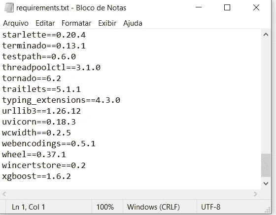

requirements.txt example

我们已经准备好创建 docker 文件了！**docker file 只是一个包含构建指令的文本文件。**

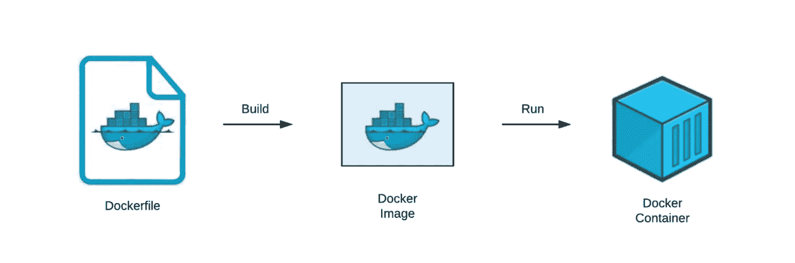

Dockerfile 文件没有扩展名。如果您在 windows 上使用 docker，使用[记事本++](https://notepad-plus-plus.org/downloads/v8.4.6/) 编写指令，保存时选择“所有类型”并将文件名保存为“Dockerfile”。用 Linux 的话，用“vim Dockerfile”就可以了。

我们的 docker 文件必须包含以下命令:

```
*# FROM defines the "starting point" of your image*
FROM python:3.9.13 *# We need to copy all the files that will be used in our container 
# Note, /deploy/ is a created folder, it could have any name*
COPY ./requirements.txt /deploy/
COPY ./server.py /deploy/
COPY ./shipping_estimate_model.pkl /deploy/ *# Define where instructions perform their tasks*
WORKDIR /deploy/ *# Remember the file created earlier? 
# Here we install all the libs listed in it*
RUN pip install -r requirements.txt*# execute the command only when we create the container*
CMD ["uvicorn","server:app","--host", "0.0.0.0", "--port", "80"]
```

现在我们有了建立码头工人形象所需的一切！确保将文件“shipping_estimate_model.pkl”、“requirements.txt”、“server.py”和“Dockerfile”放在同一个目录中。然后，为了最终创建我们的 docker 映像(我的映像将被命名为“app-shipping”)，在命令行中输入:

```
cd files_path
docker image build -t app-shipping .
```

> 提示:最后一个参数。，指示 dockerfile 文件的路径。我们使用点号来表示我们已经在正确的目录中(通过 cd 命令访问)

这将执行 Docker 文件中定义的所有命令，创建名为“app-shipping”的 Docker 映像！现在我们只需要运行映像来创建容器并启动本地服务器。在命令行上输入:

```
docker run -p 80:80 app-shipping
```

您应该会看到以下输出:

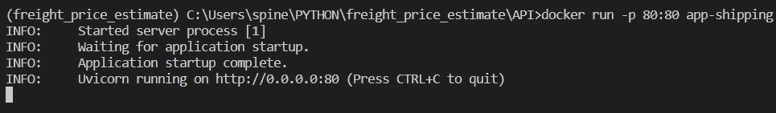

它的外观和工作方式就像本指南第一步中创建的本地服务器一样。为了进行确认，您可以从 jupyter 笔记本或网页再次向' [http://localhost:80'](http://localhost:80') 发出请求(仅 get 方法)

唯一的(也是非常重要的)区别是，现在**应用程序完全独立于您的机器运行，**这在我们指南的第三和最后一步将非常有用。

# 3 步:在 AWS EC2 实例中托管 Docker 容器

我们终于做好了向世界其他地方发布我们的模型的一切准备！

首先，您需要创建一个 AWS 帐户。这个过程非常简单，但是你需要输入一个有效的信用卡。不过不要担心，在第一年，您将可以访问 AWS 免费层，它允许您免费访问许多 AWS 服务，包括完成本指南所需的一切。

现在您已经有了一个 AWS 帐户，**我们将创建一个在 AWS 云上运行的虚拟机。**在搜索栏中，输入“ec2 ”,进入“Dashboard”。在新页面上，单击“启动实例”

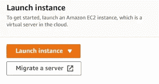

您需要选择虚拟机系统和规格。我们将使用一个**亚马逊 Linux** 系统，你可以选择任何带有“自由层资格”印章的虚拟机。

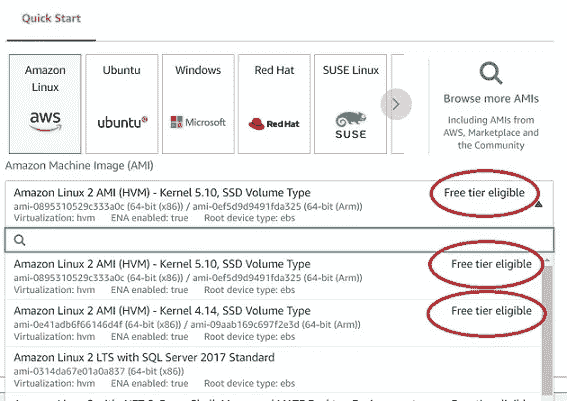

要访问虚拟机，**你需要一把钥匙**。这个密钥是一个文件，无论何时您想要访问 VM，您都需要将密钥文件路径作为一个参数来传递。您可以选择不使用密钥继续，但不要选择此选项！毕竟，没有密钥任何人都可以访问你的虚拟机，这似乎不是一个好主意，不是吗？

因此，如果您没有密钥，您将需要生成一个。这里没有秘密，只需点击*“创建新的密钥对”*为密钥选择一个名称，点击*“创建密钥对”*就会下载一个文件*“choosed _ name . PEM”*。把它放在安全的地方。

最后一个必要的配置在“*网络设置”*选项卡中。检查所有选项非常重要，因为这将允许我们的 API 连接到互联网。

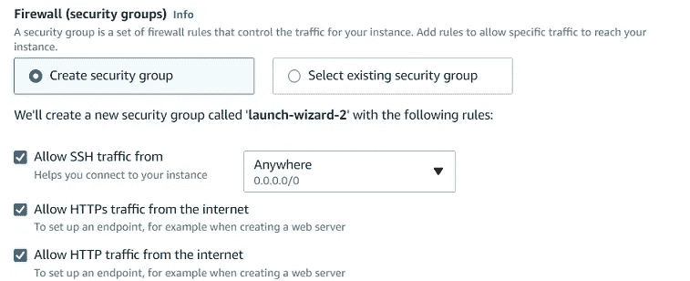

> 提示:有了这个配置，任何 ip 都可以向您的 API 发出请求。在生产环境中，限制这种访问可能很有意思，可以在这个阶段完成。

我们已经解决了一切！点击 start an instance，在显示实例已创建的消息后，转到“ *instance 选项卡”。您应该能够看到您的实例正在运行。趁机复制虚拟机 IP。*

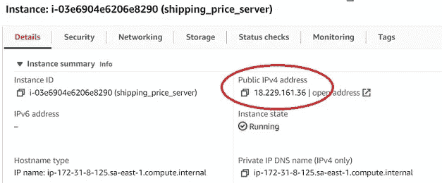

现在是时候使用 [SSH 协议](https://www.ssh.com/academy/ssh/protocol)连接到我们刚刚创建的虚拟机了，在命令行上输入:

```
ssh -i pem_file_path ec2-user@virtual_machine_ip
```

如果一切按预期进行，您现在已经连接到您的 Amazon Linux 虚拟机了！

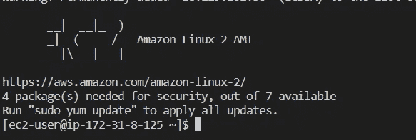

虚拟机是空的，因此我们将开始安装 docker，启动它，授予用户使用 Docker 的权限，最后退出虚拟机(接下来的步骤将从您的机器上执行)。

```
# Installing Docker on VM
sudo amazon-linux-extras install docker# Starting Docker
sudo service docker start# Giving permission to the default user
sudo usermod -a -G docker ec2-user# Returning to local machine
exit
```

现在我们将使用 [SCP 协议](https://www.ibm.com/docs/en/flashsystem-v7000u/1.6.2?topic=system-using-scp)将所需文件复制到虚拟机。

```
# Copying 4 files to /home/ec2-user (linux default directory)
scp -i pem_file_path ^
path\dockerfile ^
path\requirements.txt ^
path\server.py ^
path\shipping_estimate_model.pkl ^
ec2user@ip_maquinavirtual:/home/ec2-user
```

全部抄袭！是时候重新连接虚拟机了，最后**构建我们的 Docker 映像**和**运行容器，**输入 **:**

```
# Connect to VM
ssh -i pem_file_path ec2-user@virtual_machine_ip# Build Docker image
docker image build -t app-shipping .# Run container
docker run -p 80:80 app-shipping 
```

## 祝贺你，你成功地创建了一个 web 服务！！

现在全世界都可以使用您的 API 来发出请求。要获取 API 地址，请返回 AWS 网站上的实例面板，搜索 **Public IPv4 DNS。**

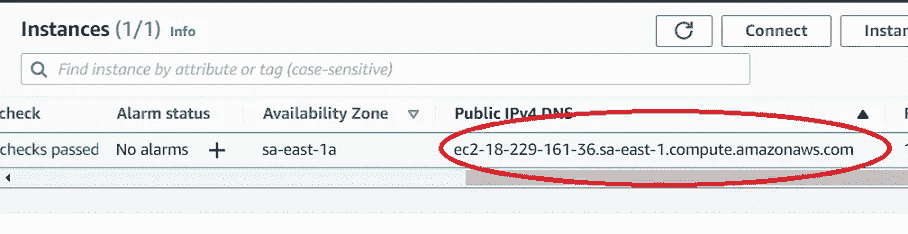

就是这样，现在你可以从任何地方向这个地址发出请求了！出于测试目的，让我们使用 jupyter 笔记本

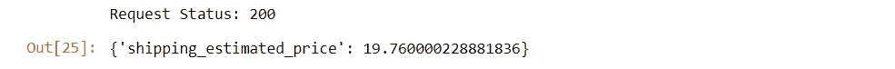

您也可以直接在网页上进行测试(仅限“get”方法)。例如，您可能想看看由 FastAPI 自动生成的令人惊叹的文档

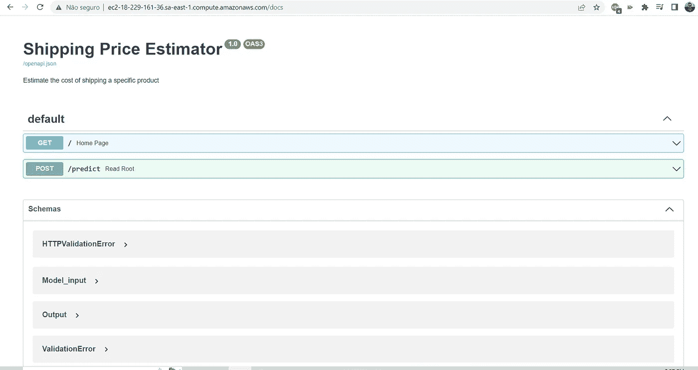

## 重要！

既然您已经测试了您的 API，并确保一切正常运行，不要忘记终止实例，**否则可能会收费。**

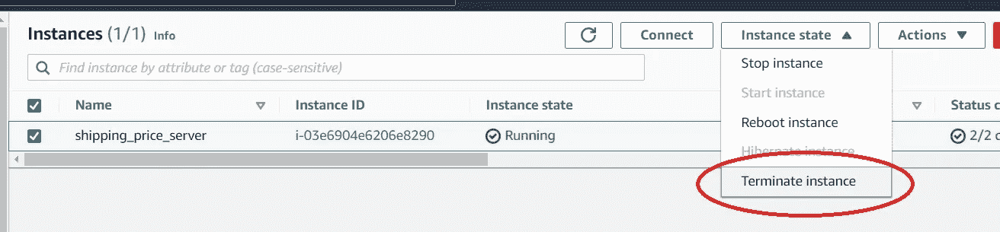

# 从这里去哪里？

重要的是，本指南是一个基本示例。部署是一个复杂的主题，还有比我在这里介绍的更多的内容。

如果你想继续学习，这里有一些你可能想看看的话题:

*   如何随着时间的推移控制指标；
*   如何让模型保持最新(概念漂移，模型再训练)；
*   如何随着时间的推移存储结果；
*   如何提高部署的安全性？

非常感谢你走到这一步！我希望我已经说清楚了，但是如果有任何问题或反馈，请随时联系我！！

[](/mlearning-ai/mlearning-ai-submission-suggestions-b51e2b130bfb) [## Mlearning.ai 提交建议

### 如何成为 Mlearning.ai 上的作家

medium.com](/mlearning-ai/mlearning-ai-submission-suggestions-b51e2b130bfb)