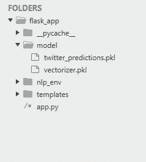
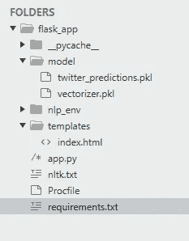
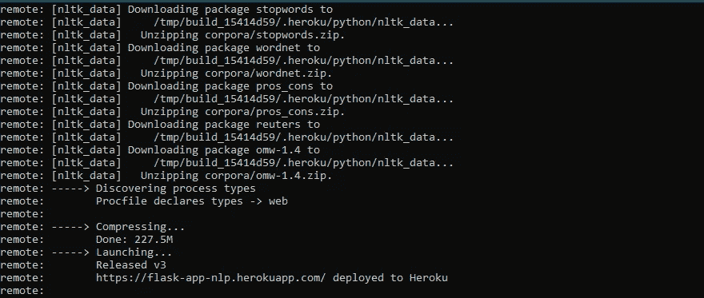

# 如何在 Web 上使用 Flask 部署 NLP 机器学习模型

> 原文：<https://medium.com/mlearning-ai/how-to-deploy-an-nlp-machine-learning-model-with-flask-on-web-788c2825b792?source=collection_archive---------1----------------------->

本文分为三个部分

NLP 模型，使用 flask 部署，在 web 上部署(Heroku)

你可以在这里查看工作部署模型:[http://www.nltkbot.com/](http://www.nltkbot.com/)


在阅读本文之前，您需要在您的系统上正确安装 Python，并且需要对 ML 模型有基本的了解

本文仅涉及使用 flask 的模型部署部分，而不涉及深入的模型构建。因此，如果您已经有了一个工作模型，您可以使用该模型进行部署，并且可以直接跳到部署部分，或者您可以使用下面的示例模型。

# 第 1 部分)NLP 模型

由于模型构建超出了本文的范围，所以我将简单地解释模型及其作用。如果有人需要数据集来进一步改进模型，github 链接会在文章末尾的链接部分提供

我们有一个非常基本的模型，它是在客户关于制造和销售手机、电脑、笔记本电脑等各种技术公司的技术推特上训练的，任务是识别推特是否对这些公司或产品有负面情绪

数据清理过程包括移除所有的 URL、标点符号，NLTK 库用于标记化、词条化和移除停用词。确保已经安装了 NLTK 库，否则它会抛出错误

稍后，在将文本发送到模型进行预测之前，使用 TfidVectorizer 对其进行矢量化。LightGbm 模型用于预测，没有任何超参数调整，正如我前面提到的，模型构建超出了本文的范围。最后，应该使用 pickle 保存模型和矢量器，以便我们以后可以在应用程序中加载这些模型来预测用户输入的结果

# 第 2 部分)—使用烧瓶进行部署

在进行部署之前，我希望您已经使用 pickle 保存了一个工作模型文件和矢量文件

Flask 是 Python 的一个微框架，它有趣且易于设置。在安装 flask 之前，创建一个 directoy(我把它命名为 flask_app ),在这个目录中你将拥有 flask app，并创建一个虚拟环境(我把它命名为 nlp_env ),然后激活它，它应该看起来像下面这样

```
C:\Users\Surya\Documents\flask_app>py -m venv nlp_env
C:\Users\Surya\Documents\flask_app>nlp_env\Scripts\activate
(nlp_env) C:\Users\Surya\Documents\flask_app>
```

现在我们可以安装 flask，要安装 flask，我们使用 python 包安装程序 pip。

```
(nlp_env) C:\Users\Surya\Documents\flask_app>pip install flask
```

一旦安装完成，我们就可以创建我们的 flask 应用程序了。第一步是在 flask_app 目录下创建一个文件，并命名为(我将其命名为 app.py)。你可以在你喜欢的文本编辑器中打开这个文件。因为这是你的主应用程序文件，我们需要设置一个环境变量，让 flask 知道当它想运行时要寻找哪个文件

```
(nlp_env) C:\Users\Surya\Documents\flask_app>set FLASK_APP=app.py
```

现在，我们将检查与我们的 flask 应用程序一起工作的著名的“Hello World”。打开文本编辑器，编写下面的代码。

```
import flaskapp = flask.Flask(__name__)[@app](http://twitter.com/app).route('/')
def index():
 return "<h1>Hello World</h1>"
```

代码非常简单，我们只是导入 flask 库并实例化 Flask 类，而 __name__ 引用我们正在工作的当前模块的名称(这里是 app.py)。在下一行中，我们创建了一个路由，后面跟着一个直接返回到浏览器的函数。

是时候看看我们的 flask 应用程序在浏览器中启动和运行了，只需键入 flask run，您应该会看到该应用程序在本地主机地址上运行(类似于在 [http://127.0.0.1:5000/](http://127.0.0.1:5000/) 上运行)

```
(nlp_env) C:\Users\Surya\Documents\flask_app>flask run
```

不鼓励在 app.py 中直接编写 html，这样看起来也不太好，所以我们将直接在中创建一个单独的文件夹，并在 app.py 中引用它。我们还应该创建一个单独的文件夹来保存我们保存的模型，稍后我们将使用它进行预测。创建文件夹后，你的文件夹结构应该如下图所示



我们将更新 app.py 以反映这些变化。首先，我们将加载模型文件，然后用 templates 文件夹更新 Flask 类。除此之外，我们还将更新路由以接受 GET 和 POST 请求

```
import flask#Use pickle to load in the pre-trained model.with open(f'model/twitter_predictions.pkl', 'rb') as f:
    model = pickle.load(f)with open(f'model/vectorizer.pkl', 'rb') as f:
    vectorizer = pickle.load(f)app = flask.Flask(__name__, template_folder='templates')@app.route('/', methods=['GET', 'POST'])
def index():
    return "<h1>Hello World</h1>"
```

我们的应用程序仍然通过 GET 请求返回“Hello World”。所以我们需要我们的应用程序返回一个正确的 html，为此我们将在模板文件夹中创建一个 html 文件(index.html)。我要在 index.html 添加一个简单的 html 表单，允许用户输入一些文本并提交。

```
<!doctype html>
<html>

<head>
    <title>Enter Text</title>
</head>
<form action="{{ url_for('index') }}" method="POST">
    <fieldset>
        <legend>Enter Review:</legend>
        <textarea name="tweet" rows="10" cols="80" required></textarea>
        <br>
        <br>
        <input type="submit">
    </fieldset>
</form>
```

当用户输入文本并提交时，我们的应用程序会收到一个附加有“tweet”文本的 POST 请求。我们需要更新我们的 app.py 来处理这个 POST 请求并相应地呈现结果

```
import flask#Use pickle to load in the pre-trained model.with open(f'model/twitter_predictions.pkl', 'rb') as f:
    model = pickle.load(f)with open(f'model/vectorizer.pkl', 'rb') as f:
    vectorizer = pickle.load(f)app = flask.Flask(__name__, template_folder='templates')@app.route('/', methods=['GET', 'POST'])
def index():

    if flask.request.method == 'GET':
        return(flask.render_template('index.html'))

    if flask.request.method == 'POST':

        tweet = flask.request.form['tweet']
```

我们从 POST 请求中获得了需要预测的用户输入，因此我们将使用之前加载的模型来预测结果。由于用户输入仍然是原始形式，我们需要将它转换成机器可读的形式，就像我们在第一部分构建模型时所做的那样。首先，我们将把它转换成一个具有相同列名的 dataframe，这个 data frame 是我们保存的模型能够理解的，然后我们在模型构建中使用的所有步骤将按照相同的顺序进行。因此，我们最终的 app.py 应该如下所示

app.py 中的预测结果存储在一个结果变量中，该变量将在 index.html 显示结果。当 POST 请求呈现 index.html 时，我们将创建一个新的 div 元素来显示结果和用户输入。div 元素有一个简单的 if else 语句来检查结果类型并为结果添加颜色。我给 html 页面添加了一些样式，让它看起来更漂亮。因此，我们最终的 html 文件将如下所示

现在输入，flask 运行，在浏览器中看到 ML 模型启动并运行，准备预测一些 tweets。耶！！您已经成功地在本地机器上部署了带有 flask 的 NLP 模型。你还可以给应用添加一些样式和背景，让它看起来更有活力，或者你可以查看我的应用的完整模板[https://github . com/vijjeswarapusuryateja/mobile-review-rating](https://github.com/vijjeswarapusuryateja/mobile-review-rating)

# 第 3 部分)——网络部署(Heroku)

这里我只讲述在 Heroku 上部署 NLP 模型的部分，假设你已经在 Heroku 上有了一个帐户。如果你不知道 Heroku，网上有很多关于 Heroku 的丰富信息来源。解释 Heroku 注册过程不在本文的讨论范围之内。因此，在继续下一步之前，您需要安装 git、Heroku CLI

第一步是为我们的 web 应用程序创建 git 存储库

```
(nlp_env) C:\Users\Surya\Documents\flask_app>git init
```

向 heroku 认证并创建一个新的 Heroku 应用程序

```
(nlp_env) C:\Users\Surya\Documents\flask_app>heroku login
(nlp_env) C:\Users\Surya\Documents\flask_app>heroku create flask-app-nlp
```

为了让我们的应用程序在 Heroku 上成功运行，我们需要添加三个额外的文件

在 flask_app 目录中创建一个 requirements.txt 文件，它应该包含以下内容

```
flask
pandas
numpy
gunicorn
lightgbm
nltk
```

类似地，创建一个 nltk.txt 文件，并添加以下内容

```
stopwords
wordnet
pros_cons
reuters
omw-1.4
```

最后，在 flask_app 目录中创建一个 Procfile，并添加以下行

```
web: gunicorn app:app
```

您最终的 flask_app 文件夹现在应该如下所示:



使用 git 命令将所有这些文件添加到存储库中，如下所示

```
(nlp_env) C:\Users\Surya\Documents\flask_app>git add .
(nlp_env) C:\Users\Surya\Documents\flask_app>git commit -m "First commit!"
```

设置从 git 推送到 heroku 的远程目的地

```
(nlp_env) C:\Users\Surya\Documents\flask_app>heroku git:remote -a flask-app-nlp
```

运行以下命令后，你的应用将处于在线状态。Heroku 将上传你的应用程序文件，安装它需要的软件包，并启动应用程序运行

```
(nlp_env) C:\Users\Surya\Documents\flask_app>git push heroku master
```

一旦所有东西都被推送到 Heroku，你会看到下面的屏幕



上传完成后，你可以输入 heroku open，然后在网络浏览器上看到应用程序运行。或者，你可以用你创造的名字 http://flask-app-nlp.herokuapp.com[来查看你的应用程序。我已经在 Heroku 中创建了一个同名的应用程序，所以请使用不同的名称](http://flask-app.herokuapp.com))

```
(nlp_env) C:\Users\Surya\Documents\flask_app>heroku open
```

# 可能的错误！

如果您在 heroku 部署中遇到问题，建议您检查 heroku 日志来解决问题。NLP 部署中引起的最常见问题的解决方案之一是由于 NLTK 库，它可以通过在出现在 heroku 日志中的 nltk.txt 文件中指定相应的语料库来纠正

# 有用的链接(数据集、Github repo、部署的模型)

模型训练数据集的链接:【https://github.com/vijjeswarapusuryateja/Datasets 

已部署应用的代码链接:[https://github . com/vijjeswarapusuryateja/mobile-review-rating](https://github.com/vijjeswarapusuryateja/mobile-review-rating)

工作部署模式:[http://www.nltkbot.com/](http://www.nltkbot.com/)

投资组合:【https://vijjeswarapusuryateja.github.io/】T2

[](/mlearning-ai/mlearning-ai-submission-suggestions-b51e2b130bfb) [## Mlearning.ai 提交建议

### 如何成为 Mlearning.ai 上的作家

medium.com](/mlearning-ai/mlearning-ai-submission-suggestions-b51e2b130bfb)