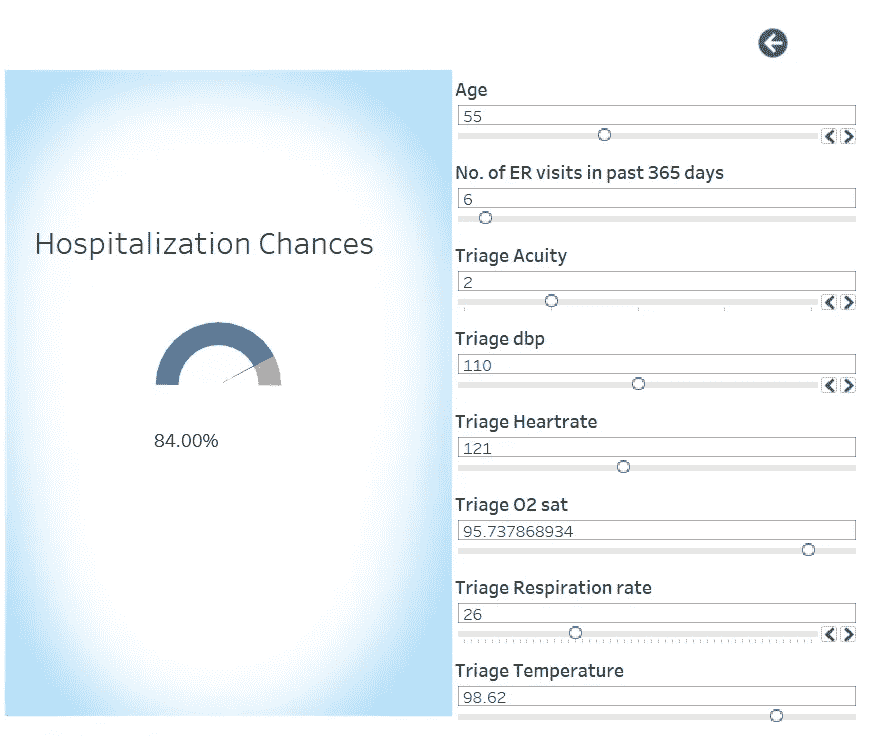
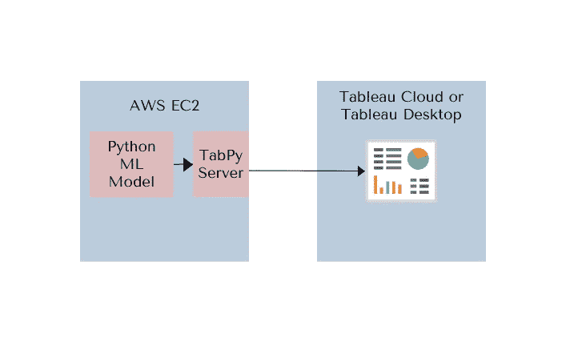
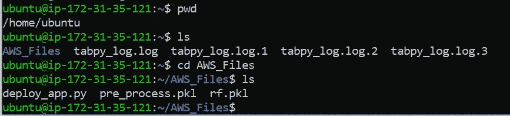
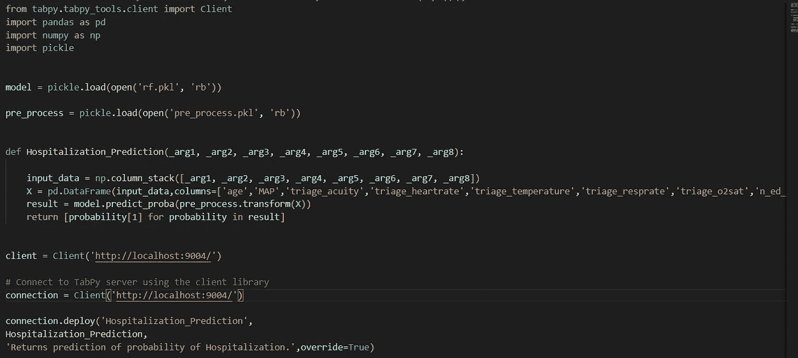
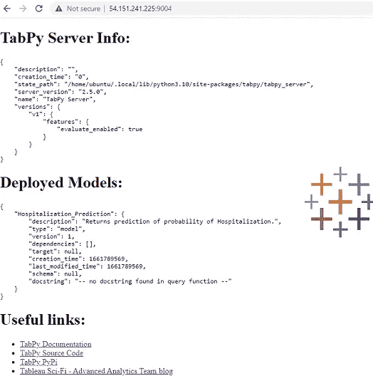
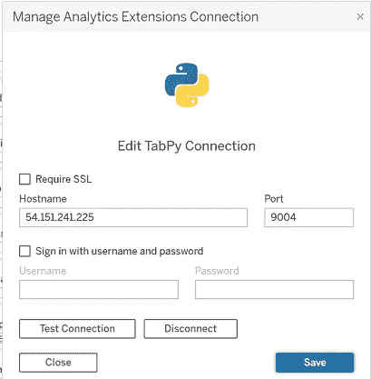
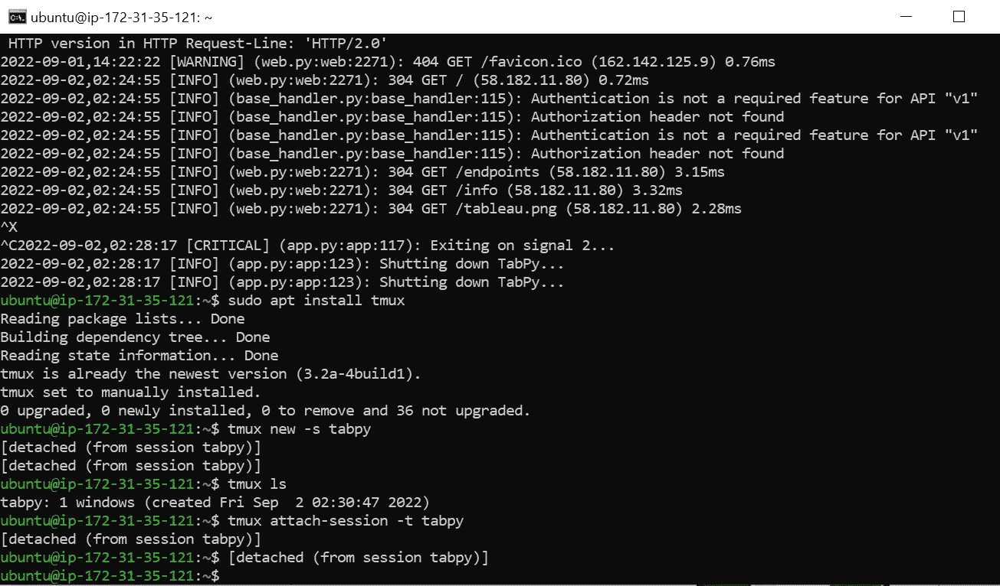

# 如何将 ML 模型部署到云并与 Tableau 集成

> 原文：<https://medium.com/mlearning-ai/how-to-deploy-ml-model-to-cloud-and-integrate-with-tableau-54aae634930e?source=collection_archive---------3----------------------->

开发机器学习模型的整个想法是让目标受众可以使用它。假设您已经训练了一个预测模型并构建了数据管道来转换输入要素。用户需要做的就是用输入值调用模型并接收预测值。我们如何实现这一点？这无需大量编程和昂贵的基础设施即可实现。该模型可以部署在服务器或云上，以便可以通过您的公司网络或 web 访问它。对于这个演示，我们将把它部署到 AWS EC2，并将我们的 Tableau 仪表板链接到它。



云提供商通过允许人们部署和运行他们的应用程序，使技术世界民主化

*   无需购买和管理硬件
*   通过 GUI 轻松设置
*   几分钟内完成安装和拆卸
*   只为您使用的东西付费

在本文中，我们将了解如何在 **AWS EC2** 上部署我们预测住院机会的模型，并从 **Tableau 仪表板**访问该模型，以便用户可以选择输入值，预测的百分比值将显示在屏幕上。

Tableau 允许使用 Tabpy 访问 API 的**分析扩展**。 **Tabpy** 是由 Tableau 开发管理的 python 包。我们将使用 tabpy 包来集成 Tableau dashboard 和使用 python 开发的机器学习模型。请注意，分析扩展仅在 **Tableau 桌面**和 **Tableau 云**上可用。它不适用于发布到 Tableau Public 的仪表板。

简而言之，我们的架构将是这样的:



Fig 1: Architecture for ML implementation

# 设置 AWS EC2 例程

使用基本配置在 AWS EC2 上设置一个实例是免费的，但是 2GB 内存对于 tabpy 实例来说可能不够用。使用 **t2.medium** 有更好的可用性。它配有 4GB 内存和中低网络性能。此外，ubuntu 对于操作系统来说也是一个不错的选择。

关于如何设置 AWS EC2 实例的详细步骤，请参考[https://docs . AWS . Amazon . com/AWS C2/latest/user guide/EC2 _ get started . html](https://docs.aws.amazon.com/AWSEC2/latest/UserGuide/EC2_GetStarted.html)。

记下密钥对名称和公共 IPv4 DNS，并保存密钥对，这是后续步骤所必需的。

# 设置服务器

一旦我们启动并运行了 AWS EC2 实例，让我们进行部署模型所需的设置。Ubuntu 自带最新版本的 Python。我们将安装 pip 和 tabpy。但是首先，在任何安装之前更新环境是一个好习惯。

按照以下命令从 windows 命令提示符连接到 AWS EC2 实例。确保将 cd 放入保存 EC2 密钥对的文件夹中。

从 windows 命令提示符连接到 AWS EC2 的命令。

> ssh -i "key_name.pem" ubuntu@

它看起来会像这样

> ssh-I " key _ name . PEM " Ubuntu @ ec2–11–222–333–444 . AP-southeast-1 . compute . Amazon AWS . com

更新 ubuntu 环境的命令

> sudo apt-get 更新

安装 pip 的命令。

> sudo apt-get -y 安装 python3-pip

安装 tabpy 的命令。

> pip3 安装标签

在安装了 tabpy 包之后，ssh 需要重新初始化才能运行 tabpy 服务器。

启动 tabpy 服务器的命令

> 泰比

现在我们的 tabpy 服务器已经启动并运行，准备好托管 ML 模型了。让我们将所需的文件传输到 AWS EC2。理想情况下，这些应该是保存为 pickle 文件和 Python 脚本的模型和数据管道。

将文件传输到 AWS EC2 的命令

> scp -r -i "key_name.pem "。/AWS _ Files Ubuntu @ ec2–11–222–333–444 . AP-southeast-1 . compute . Amazon AWS . com:~/

我们可以使用 ls 命令确认模型 pickle、pre_process pickle 以及 python 脚本 deploy_app.py 在 AWS EC2 上。



Fig 2: Model related files moved to AWS EC2 instance

在 tabpy 上部署 ML 模型的 Python 脚本

```
from tabpy.tabpy_tools.client
import Client
import pandas as pd
import numpy as np
import pickle model = pickle.load(open('rf.pkl', 'rb')) 
pre_process = pickle.load(open('pre_process.pkl', 'rb')) #Function to receive data, transform it using pipeline, predict #using trained model and return probability of class 1def Hospitalization_Prediction(_arg1, _arg2, _arg3, _arg4, _arg5, _arg6, _arg7, _arg8):
    input_data = np.column_stack([_arg1, _arg2, _arg3, _arg4, _arg5, _arg6, _arg7, _arg8])
    X = pd.DataFrame(input_data, columns=['age', 'MAP', 'triage_acuity', 'triage_heartrate', 'triage_temperature', 'triage_resprate', 'triage_o2sat', 'n_ed_365d']) result = model.predict_proba(pre_process.transform(X))
    return [probability[1] for probability in result]client = Client('http://localhost:9004/')# Connect to TabPy server using the client library
connection = Client('http://localhost:9004/') connection.deploy('Hospitalization_Prediction', Hospitalization_Prediction, 'Returns prediction of probability of Hospitalization.', override=True)
```



Fig 3: Python script to deploy ML model to Tabpy

现在让我们使用下面的命令运行 deploy_app.py

> python3 部署 _ 应用程序. py

deploy_app.py 中的 python 脚本在 tabpy 服务器上部署机器学习模型。该脚本也在 [Github](https://github.com/RakenduR/Healthcare_Analytics/tree/main/AWS_Files) 上分享

运行上面的 python 脚本后，我们可以使用 AWS EC2 实例的 IP 地址来验证我们的函数`Hospitalization_Prediction`在 tabpy 服务器上可用。9004 是 tabpy 的默认端口。



Fig 4: Tabpy server

# Tableau 仪表板上的设置

现在让我们设置 tableau，从 Tableau 桌面→帮助→设置和性能→管理分析扩展连接访问机器学习模型，如下所示。单击测试连接，测试该功能是否可从 Tableau 访问。

> 主机名是 AWS EC2 公共 IPv4 地址，端口是 9004，这是 Tabpy 的默认端口



Fig 5: Analytics Extension setting on Tableau

现在，您可以通过更改输入值来试用仪表板，并看到住院百分比已更新。仪表盘分享在 [Github](https://github.com/RakenduR/Healthcare_Analytics) 上。


Fig 6: Tableau Dashboard

# 保持 Tabpy 在服务器上运行的步骤

您现在已经启动并运行了仪表板，但是如果您关闭终端，tabpy 将被终止。为了在你没有连接到服务器的时候保持它的运行，我们可以安装 **tmux** 这是一个 unix 类操作系统的终端复用器。

1.  使用控制 X，控制 C 停止 Tabpy
2.  安装 tmux

> sudo 安装 tmux

3.创建名为 tabpy 的新会话

> tmux new-s tabby

4.通过输入“tabby”在新会话中启动 tabby。因此，现在会话是活动的，可以通过键入 Cntrl B，d 来分离它。现在会话被分离，终端可以被关闭，tableau 仪表板将仍然能够访问运行在 AWS EC2 上的 ML 模型。

5.要获取所有活动会话的列表，请使用以下命令

> tmux ls

6.为了连接到活动会话，请使用以下命令

> tmux 附加会话标签

下面终端截图供参考:



Fig 7: Setting to keep Tabpy running

这就对了。机器学习模型已经启动并运行，可以从任何地方访问 Tableau 仪表盘。

希望这篇文章对你有用。欢迎提出建议和反馈，如有任何疑问，请随时联系我。

继续关注**机器学习项目生命周期**:)中的其他帖子

[](/mlearning-ai/mlearning-ai-submission-suggestions-b51e2b130bfb) [## Mlearning.ai 提交建议

### 如何成为 Mlearning.ai 上的作家

medium.com](/mlearning-ai/mlearning-ai-submission-suggestions-b51e2b130bfb)