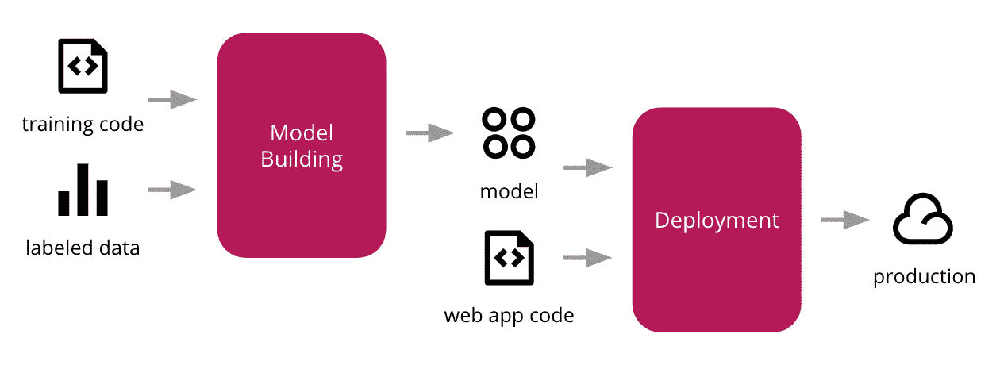

# 如何将 ML 模型部署到生产中？

> 原文：<https://medium.com/mlearning-ai/how-to-deploy-ml-models-to-production-ab7ce1c353de?source=collection_archive---------9----------------------->

大多数初学者认为只做不同用途的模型就够了。从学术角度来说，只关注模型就够了。但是从生产的角度来看，还有许多其他过程，如日志管理、内存和处理能力管理，以及许多其他需要完成的过程，以使它在业务中长期运行。

在本文中，我将分享一些将 ML 模型部署到生产中需要遵循的步骤。这些步骤将帮助您了解行业中遵循的工作，以便在生产中长期成功地部署模型，而不会出现任何突然的不必要的错误。

# 部署模型需要什么？

成功的 ML/DL 模型部署通常利用几个关键的 MLOps 原则，这些原则主要建立在 4 个支柱上:

1.  跟踪
2.  自动化
3.  监控/可观察性
4.  可靠性

要在部署时将上述特性引入模型，需要遵循几个步骤。以下是步骤…

1.  **在代码中使用 Try-Except 块**

每个开发人员都必须在他们的代码中使用 try-except 块来处理出现的错误。Try- Except 块连续运行，不会因为任何不必要的错误而停止。这些块应该被明智地放置在任何可能出现错误的地方，以便用正确的方式处理它，并使程序不间断地运行。这是最基本的实践之一，任何模型生产就绪后都要遵循。这将使训练和运行模型自动化。[阅读更多](https://docs.python.org/3/tutorial/errors.html)

2.**维护日志**

这是在实现第一步(代码中的 try-except 块)之后需要实现的一个重要步骤。日志是用于监控程序的文件。维护日志是监控程序正在进行的实现的重要步骤，这可以由一个甚至对编码一无所知的人来完成，因为它是用人类可读的语言编写的。日志最常用于深入了解程序在连续运行期间发生的错误。这将跟踪您的程序，并将其存储在日志中。

使用 Python 内置的[日志库](https://docs.python.org/3/library/logging.html)可以非常容易地编写日志。[阅读更多](https://docs.python.org/3/howto/logging.html)

3.**监控和改善 GPU 使用情况**

如果不进行测量，就无法提高 GPU 的使用率。通过***NVIDIA-SMI**命令监控 GPU 的使用情况非常简单，但要跟踪 GPU 随时间的使用情况，一个非常简单的方法是使用 Python 的[Weights and bias(Wandb)](https://docs.wand-py.org/en/0.6.7/)包。Wand 跟踪计算的使用情况和许多其他指标，如每个时期的损失和准确性。它给出了每个指标的图表，这使得在运行过程中分析模型的各种指标变得更加容易。这将有助于监控程序。[阅读更多](https://docs.wandb.ai/quickstart)***

***我希望这篇文章能帮助你收集一些关于 ML 模型在生产中的生产和部署的知识。***

***敬请关注我即将发布的有趣帖子。***

*** [## Mlearning.ai 提交建议

### 如何成为 Mlearning.ai 上的作家

medium.com](/mlearning-ai/mlearning-ai-submission-suggestions-b51e2b130bfb)***