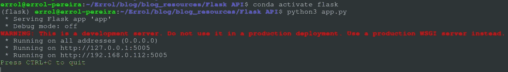
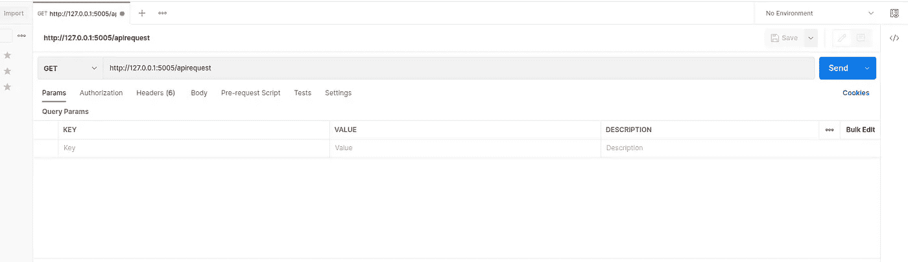
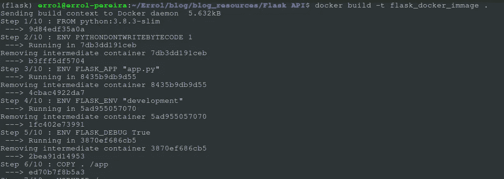
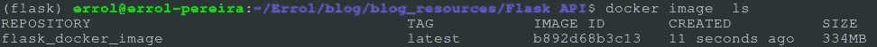
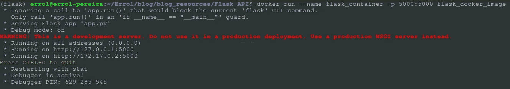

# 如何在 Docker 容器中部署简单的 Flask API

> 原文：<https://medium.com/mlearning-ai/how-to-deploy-simple-flask-api-in-docker-container-bf661fcffcbb?source=collection_archive---------2----------------------->

在这篇文章中，我将指导你在 docker 容器中部署一个简单的 flask API。

完成本教程后，您将了解:

*   创建并测试一个简单的 Flask API
*   创建 Dockerfile 文件
*   使用 Docker 文件创建应用程序的 Docker 映像
*   创建运行应用程序的容器

[Import vector created by freepik — www.freepik.com](https://www.freepik.com/vectors/import)

# 创建和测试一个简单的 Flask API

我们首先需要的是一个 Flask API 应用程序，它将接收来自客户端的请求，并在收到请求后返回确认。

我已经创建了一个简单的 API 来做我上面提到的事情。你可以从[这里](https://github.com/errolPereira/blog_resources/tree/main/Flask%20API)克隆这个库。

将目录更改为 Flask API，并运行下面的命令在本地环境中运行您的 API。

`cd Flask API``pip install -r requirements.txt`

现在，您应该会在控制台中看到上面的输出。太好了！这意味着 API 正在您的本地环境中运行。是时候测试我们的 API 了。为此，我们将使用名为 Postman 的 API 测试应用程序。如果还没有安装，可以在这里安装[。](https://www.postman.com/downloads/)

打开应用程序并创建一个新标签，然后将下面的 URL 粘贴到标签中。

`[http://127.0.0.1:5005/apirequest](http://127.0.0.1:5005/apirequest)`

让我们来分解一下网址:

1.  [**http://127 . 0 . 0 . 1**——这个](http://127.0.0.1-This)是本地 URL 或本地主机，我们的 API 部署在其上。
2.  **5005** :这是部署 API 的端口
3.  **/apirequest** —这是 API 的端点。基本上，这意味着我应该点击应用程序的哪个部分来从 API 获得相关的响应。一个 API 可以有多个端点。

除此之外，API 还可以有一个主体来传递额外的输入给应用程序，以获得想要的结果。要了解更多关于 API 的知识，请阅读这个[牛逼的博客](https://realpython.com/api-integration-in-python/)。

单击 send 按钮，您应该会从 API 得到类似“Hello from the FLASK GET API”的响应

# 为 API 创建 docker 文件

太好了！我们已经创建并测试了 API，并准备好进行部署。我们需要在 docker 容器上部署这个 API。为此，我们首先需要为我们的应用程序创建一个 docker 映像。如果你的系统中安装了 docker，请按照他们[官方网站](https://docs.docker.com/engine/install/)上的说明进行安装。

一旦安装了 docker，使用下面的通用方法创建 API 的 docker 镜像。

`docker build -t flask_docker_image .`

这将把运行我们的应用程序所需的所有依赖项安装到 docker 映像中，并将创建一个名为 flask_docker_image 的新映像。

要验证是否已创建映像，请运行以下命令

`docker image ls.`

既然我们的映像已经创建好了，接下来是时候创建一个 docker 容器并在该容器上部署我们的应用程序了。

运行下面的命令来创建一个 docker 容器实例。

`docker run --name flask_container -p 5000:5000 flask_docker_image`

当我们在本地系统上运行我们的模型时，您应该能够看到类似的输出。

现在，您可以继续使用 Postman 再次测试您的 API。您应该能够看到类似的响应。但是这次您的 API 运行在 docker 容器实例上，而不是您的本地系统上。

**参考文献**:

[Docker 官方文档](https://docs.docker.com/engine/reference/commandline/run/)

*原载于 2022 年 8 月 24 日*[*https://errolpereira . github . io*](https://errolpereira.github.io/deploy_flask_api_using_docker_container/)*。*

 [## Mlearning.ai 提交建议

### 如何成为 Mlearning.ai 上的作家

medium.com](/mlearning-ai/mlearning-ai-submission-suggestions-b51e2b130bfb)