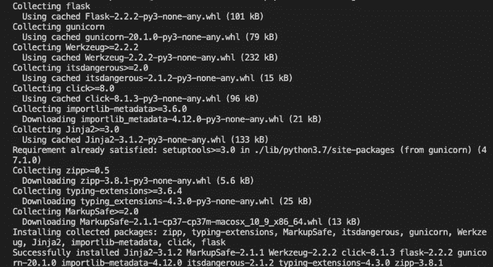
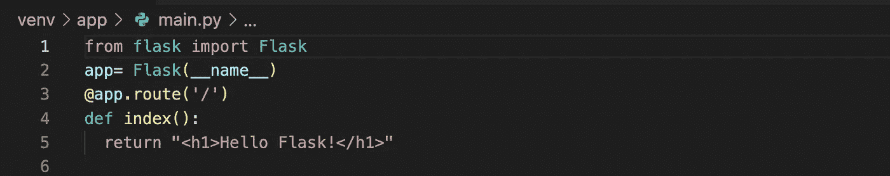
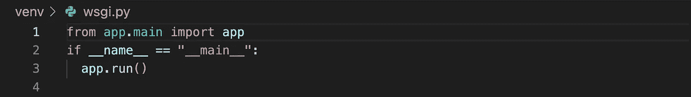
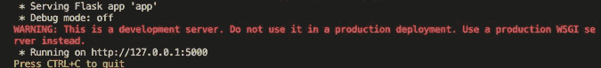
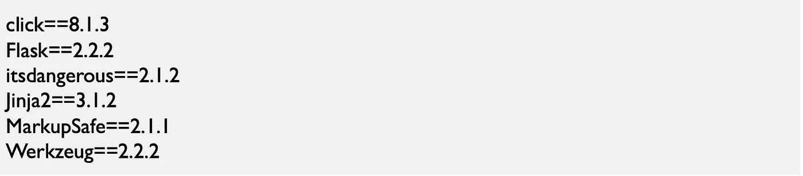
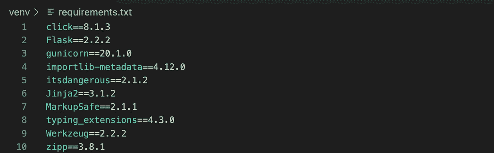
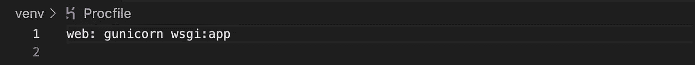
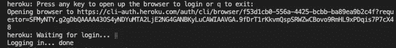

# 如何在 Heroku 上部署你的第一个 Flask App？

> 原文：<https://medium.com/mlearning-ai/how-to-deploy-your-first-flask-app-on-heroku-815fc528e30f?source=collection_archive---------10----------------------->

## 在 Heroku 上部署 Python Flask 应用程序的分步指南

Photo: Pixabay on Pexels

## 介绍

我们建立了我们的模型。我们使用各种机器学习算法在数据集上训练我们的模型。我们根据测试数据计算模型的准确性。现在呢？人们如何使用我们的模型？对，下一步是部署我们的模型。对于如何部署我们的机器学习模型，有不同的选项。其中一个选择是使用 Flask 和 Heroku。Heroku 是一个云平台即服务(PaaS)。它支持几种编程语言。Heroku 的用途是部署、管理和扩展现代应用。

# 概观

在这篇文章中，我们想展示

*   如何在我们的机器上安装烧瓶
*   如何创建我们的第一个烧瓶应用程序
*   如何将我们的应用程序部署到 Heroku

## 步骤 1:创建项目文件夹

首先，我们将创建我们的项目文件夹。我们将把当前的工作目录更改为桌面文件夹。我们将运行以下命令:

之后，我们将使用以下命令创建一个新目录:

然后，我们将当前工作目录更改为我们创建的文件夹:

## 步骤 2:创建一个 Python 虚拟环境

我们不会将 Flask 安装在 Python 的主目录中以供系统广泛使用。我们建议创建并安装一个虚拟环境，以便在 Python 中安装 Flask。它是一个文件夹，包含 Python 解释器的本地副本及其安装的包。优点是项目的安装包不会相互影响。

在 Python 3 中构建虚拟环境的建议方式是使用标准的 venv 模块。不需要安装带有 pip 的 venv。如果您使用 virtualenv，您将需要安装 pip。我们将转到项目根文件夹，并使用以下命令:

第二个 venv 是一个名为 venv 的文件夹。我们会将所有包存储在该文件夹中。之后，我们将需要在开始项目工作之前激活环境。为了激活环境，我们将运行以下命令:

之后，我们将当前工作目录更改为我们创建的文件夹:

我们将在 shell 提示符中看到当前活动环境的名称。

## 步骤 3:安装烧瓶和 Gunicorn

像其他 Python 包一样，Flask 很容易使用 pip 实用程序安装。pip 实用程序是 Python 标准发行版的一部分。你可以在这里阅读更多关于烧瓶的信息。我们将运行以下命令来安装 Flask 和 Gunicorn:

结果是:

Figure 1: Installing flask and gunicorn (Screenshot taken by Author)

## 步骤 4:创建一个简单的 Python 应用程序

我们将使用以下命令创建一个应用程序文件夹:

我们将把当前工作目录更改为我们创建的文件夹:

之后，我们将使用此命令创建一个 Python 文件，并输入以下代码:

Flask 应用程序如下所示:

Figure 2: First flask app (Screenshot taken by Author)

*   代码的第一行导入 Flask 类。
*   第二行代码创建了它的实例。
*   app.route()前的@符号表示 route()是一个装饰函数。
*   这个对象是 WSGI 应用程序对象。我们将把 URL 映射到 index()函数。每当/它触发映射的函数。

注意:缩进(代码行开头的空格)在 Python 中很重要。

## 步骤 5:创建文件 wsgi.py

首先，我们将使用以下命令返回到上一个工作目录:

然后，我们将使用以下命令创建文件 wsgi.py:

wsgi.py 看起来像这样:

Figure 3: The file wsgi.py (Screenshot taken by Author)

## 步骤 6:在您的本地系统中运行应用程序

我们使用内置的开发服务器、调试器和重新加载器。为了在您的本地系统中运行该文件，我们发出以下命令:

Figure 4: Development server (Screenshot taken by Author)

## 步骤 7:创建文件 requirements.txt

这个文件是一个简单的文本文件，包含项目使用的所有 Python 模块和包。它简化了所需模块在任何计算机上的安装。这使得与他人共享项目变得很容易。Heroku 需要一个 requirements.txt 文件来检测它是一个 Python 项目。该文件的内容如下所示:

使用下面的命令，我们可以检查哪些模块已经安装了 pip install:

顺序不区分大小写。它还显示安装的模块的版本。

requirements.txt 文件必须位于项目根文件夹中。否则，Heroku 应用程序将无法部署。我们将转到项目根文件夹，并运行以下命令:

Figure 5: The file requirements.txt (Screenshot taken by Author)

## 步骤 8:创建一个 Procfile

procfile 指定了应用程序在启动时执行的命令。Procfile 是 Heroku 应用程序的必备组件。我们将在项目根文件夹中创建一个 Procfile:

我们将添加下面一行:

Figure 6: Procfile (Screenshot taken by Author)

*   单词 wsgi 代表运行我们的应用程序的 python 文件的名称。
*   app 这个词代表我们的 app 名称。

## 步骤 9:将我们的应用程序部署到 Heroku

我们将使用以下命令登录 Heroku:

Figure 7: Heroku Login (Screenshot taken by Author)

我们需要安装 git 和 Heroku CLI。如果您没有安装 Git 和 Heroku CLI，请按照以下说明安装 Git 和 Heroku CLI:

*   [Git 安装说明](https://git-scm.com/book/en/v2/Getting-Started-Installing-Git)
*   [Heroku CLI 安装说明](https://devcenter.heroku.com/articles/heroku-cli#install-the-heroku-cli)

为了在我们的目录中初始化一个新的 git 存储库，我们将在应用程序的根目录中使用 git init 命令:

在运行 git init 之后，git 将开始跟踪项目中的变化。

Figure 8: Running git init command (Screenshot taken by Author)

**注意**:如果你的应用在你的存储库的子目录中，当被推送到 Heroku 时，它不会运行。

为了添加 main.py，我们将使用 **git add 命令**将其保存到存储库:

要添加所有有更改的文件，我们将使用以下命令:

暂存文件意味着我们添加提交的文件。一旦暂存，就不可能再进行更改。

**注意**:如果您准备好提交它们，您应该只添加阶段文件。

在每个 git 存储库中包含一个. gitignore 文件是很重要的。这个文件告诉 git 忽略哪些文件。例如，我们将忽略以下文件:

*   Python 中的字节码文件(*。pyc)
*   数据库(*。db)
*   秘密
*   IDE 元数据文件(。想法)
*   env 或 venv

为了跟踪本地 Git 存储库中的代码，我们将使用 **git commit 命令**来提交更改。我们将使用-m 添加我们的提交消息:

该应用尚未存在于任何远程服务器上。我们将通过把它的代码推送到一个与它相关联的 Heroku 托管的特殊遥控器来部署应用程序。Heroku create CLI 命令将在 Heroku 上建立一个新的空应用程序。我们将转到应用程序的根目录。我们将使用以下命令:

我们还可以从命令行向我们现有的 Heroku 应用程序之一的本地存储库添加一个远程:

为了将代码从我们的本地存储库推送到 Heroku remote，我们将使用 **git push 命令**:

现在我们打开网络浏览器，在地址栏中键入 [http://127.0.0.1:5000/](http://127.0.0.1:5000/) :

Figure 9: Deployed app (Screenshot taken by Author)

如果我们不需要虚拟环境，我们可以使用 deactivate 命令将其停用。

*如果你喜欢这篇文章，请鼓掌。如果您希望阅读我的类似文章，请关注我，每当我发表新文章时，您都会收到一封电子邮件。*

参考资料:

德怀尔，g .，阿加尔瓦尔，s .和斯托福，J. (2017)烧瓶:构建 Python Web 服务。第一版。包装出版公司。可从以下网址获得:[https://www . per Lego . com/book/527263/flask-building-python-we b-services-pdf](https://www.perlego.com/book/527263/flask-building-python-web-services-pdf)(访问日期:2022 年 8 月 30 日)。

Grinberg，M. (2014)烧瓶网开发。用 Python 开发 Web 应用程序。奥莱利媒体。可在:[https://www . or eilly . com/library/view/flask-we b-development/9781491991725/](https://www.oreilly.com/library/view/flask-web-development/9781491991725/)(访问时间:2022 年 9 月 25 日)。

## [**成为 MLearning.ai 的作家**](https://mlearning.substack.com/about)

 [## Mlearning.ai 提交建议

### 如何成为 Mlearning.ai 上的作家

medium.com](/mlearning-ai/mlearning-ai-submission-suggestions-b51e2b130bfb)