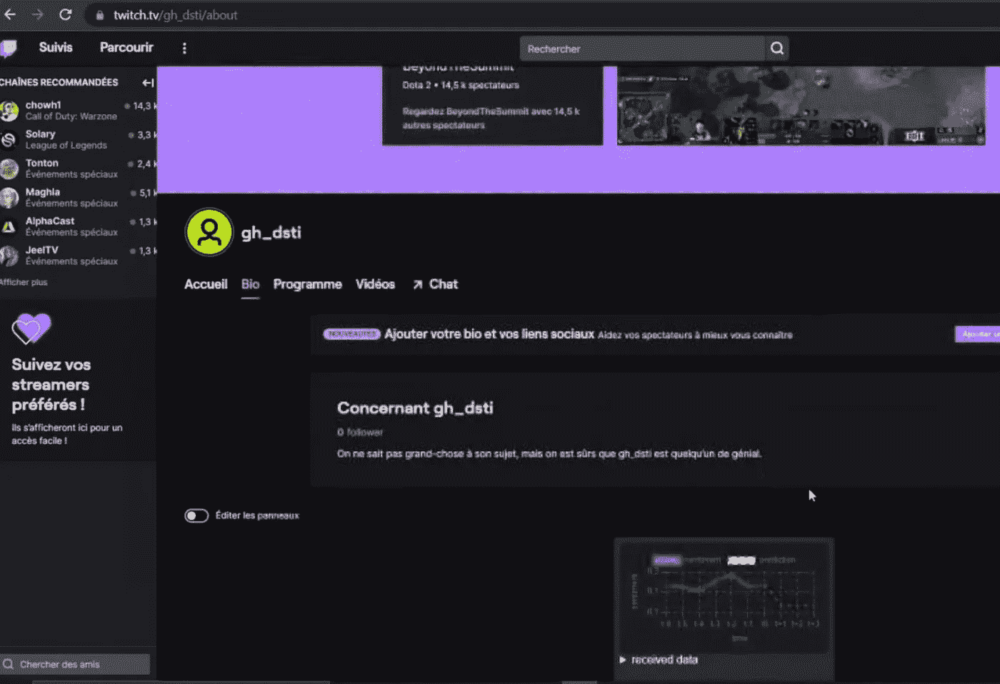
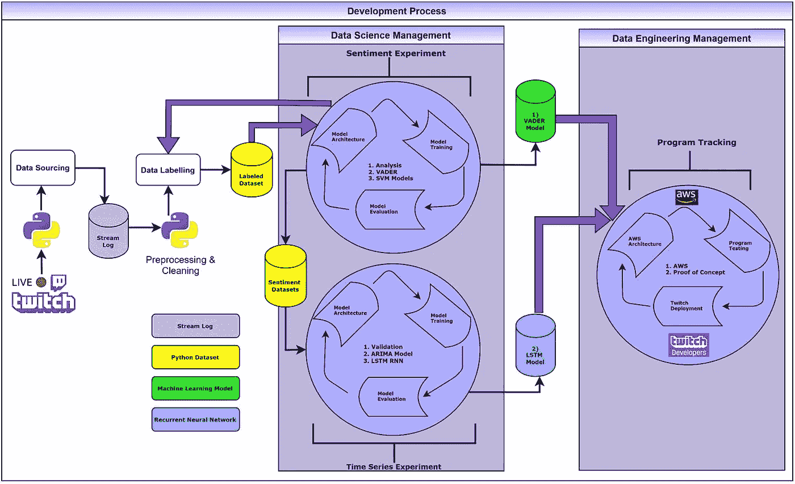
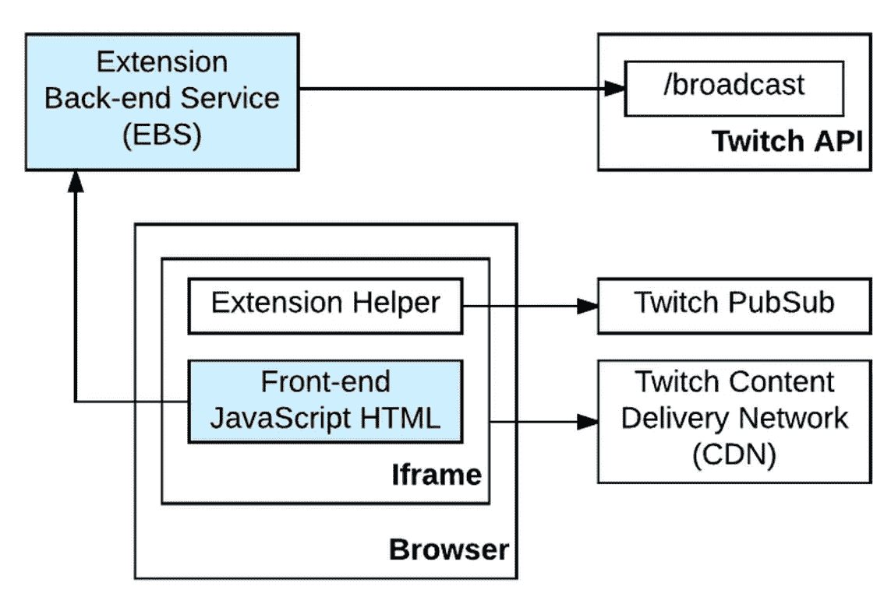
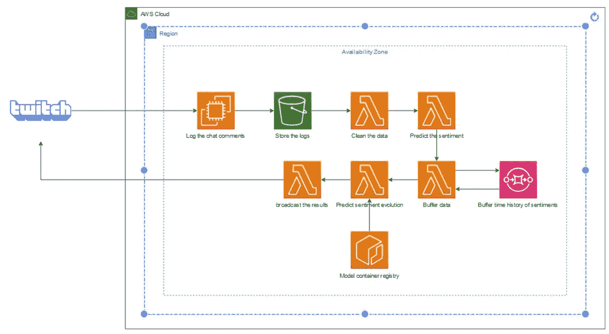
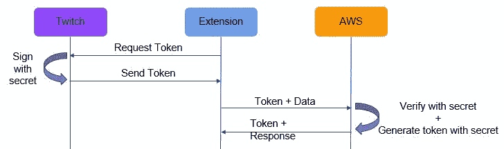
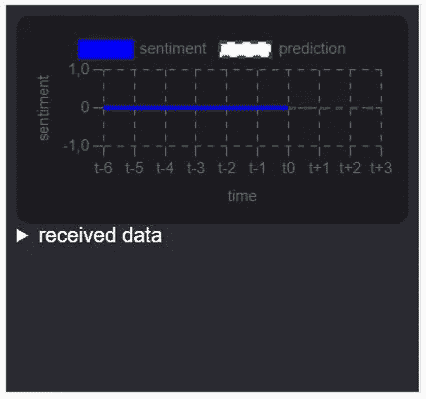
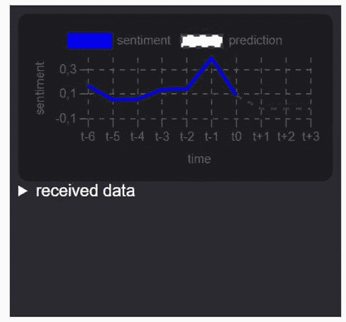

# 如何检测 Twitch 第 2 部分的疵点

> 原文：<https://medium.com/mlearning-ai/how-to-detect-le-defect-on-twitch-c0d11cb1ea98?source=collection_archive---------11----------------------->

## 在直播平台中预测情绪可能吗？-数据工程和概念验证(演示)部分

# 概观

在第二部分中，讨论的重点将基于 Twitch 扩展、EBS 设计选择、AWS 架构、概念验证演示和未来改进。

Sample of application being used on Twtich Platform

正如在前面的部分中所讨论的，使用递归神经网络模型是通过使用从 VADER 数据集得到的分数来预测情绪的最有效的方法。

# 方法扩展

这是结合了数据科学和数据工程管理的开发过程的整个结构。在 AWS 云服务的帮助下，VADER 和 LSTM 模型都被整合到 Twitch 平台上注册的 API 扩展中。

Methodology of both Data Science and Data Engineering Management

# 抽动伸展

为了在 Twitch 平台上使用该应用，在 [Twitch Developers](https://dev.twitch.tv/) 注册了一个开发者账户。API 的前端是用 Javascript 和 HTML 编写的 web 应用程序。它使用 Twitch API 与后端通信。扩展的后端可以用任何语言编写，但是在这个特殊的例子中，我们选择了 Python。

Services created by the DLD application are in blue

## 扩展后端服务(EBS)

我们决定使用 Amazon Web Cloud Services (AWS)来托管解决方案，以无服务器模式来限制数据成本。如前所述，数据收集是通过 Twitch web socket 方法使用 Python 脚本完成的。流集合托管在 AWS EC2 实例上，因为流持续超过 15 分钟，并且由于 Twitch 聊天的流量而生成大量数据。我们使用了一个免费的 t3.micro 服务器，因为它足以托管 10 个插槽(这是 Twitch 推荐的)，对我们来说，它有足够的数据来执行概念验证。

## AWS 架构

历史数据存储在一个列表中，并被发送到亚马逊 SQS，每个循环都添加一个情绪预测。为了简单起见，我们使用了几个 AWS lambda 控制台，它们代表了一组不同的功能，包括清理数据、用 VADER 对情绪进行分类、缓冲数据以及用神经网络模型进行预测。LSTM 模型(由于其大尺寸约。1 GB)被托管在一个容器上，因为它对于 lambda 控制台来说太重了(限制为 256 MB)。AWS 架构可以在不使用太多 lambdas 的情况下得到改进，但是，我们的主要目标是确保我们的简单应用程序模型能够在 Twitch 平台上工作。

The AWS architecture is end-to-end

## **与 JWT 的数据传输**

出于认证和安全目的，Twitch APIs 需要访问令牌来访问资源。为了在 Twitch 平台和 AWS 服务上使用我们的应用程序，使用了 OAuth2.0 框架方法。我们的扩展请求一个令牌以获取令牌，与 AWS 类似，以生成用于访问的令牌。

OAuth2.0 framework method

# 概念证明

我们创建的扩展是一个用 Javascript 和 HTML 编写的简单 web 应用程序。该应用程序主要由一个位于顶部中央的情感图组成。情绪在 y 轴上，在-1 和 1 之间，表示实时聊天的消极和积极情绪。时间在 x 轴上，每个单位代表一个定时间隔(30 秒)。底部的接收数据部分显示了情感得分。

Initiation of the web application

该应用程序生成一条连续的蓝线，从聊天中获取历史数据(t-1、t-2、t-3 等)，并使用绿色虚线所示的 LSTM 模型进行预测。

Application making prediction

看看我们在之前的演示中使用的演示

## 未来的改进

●不断更新新表情的词汇

●找到 LSTM 车型的最佳价值。

●升级架构以扩展到数十个并发用户

●向扩展添加额外的功能和指标

由于我们发现这个项目的结果非常有见地和有趣，我们决定继续传递火炬。我们的目标是最终与一个直播平台合作，进行更多的测试，以持续验证该扩展。我们相信，媒体行业的未来将包括更多的现场观众-客户参与和互动。

# 合作:

如果你对这种独特的扩展感兴趣或者想了解更多，请不要犹豫，通过 detectledefect@gmail.com 联系我们。

# 感谢

由于这是我理学硕士学位的一个论文式的期末考试，如果没有同事们的帮助，这个项目是不可能实现的。该项目从开始到结束历时约 6 个月，并于 2021 年末作为课程成果的一部分提交给了一名讲师。感谢菲利普·洛佩兹(应用数据科学和人工智能硕士)、亚历山大·拉济奇(应用数据科学和人工智能硕士)、莫尼克·罗利耶(数据工程硕士)和纪尧姆·霍尔德罗夫(数据工程硕士)。

 [## Mlearning.ai 提交建议

### 如何成为 Mlearning.ai 上的作家

medium.com](/mlearning-ai/mlearning-ai-submission-suggestions-b51e2b130bfb)