# 如何检测抽动障碍

> 原文：<https://medium.com/mlearning-ai/how-to-detect-le-defect-on-twitch-e67bb864ce78?source=collection_archive---------6----------------------->

## 在直播平台中预测情绪是可能的吗？第 1 部分-时间序列/NLP/机器学习/深度学习

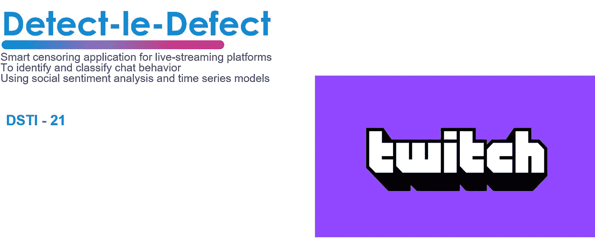

# 该项目

这是作为 DSTI 应用 DS 和 AI 硕士项目的一部分的最终数据科学和工程项目。根据项目的规模，本文将分为两部分。第一部分将讨论数据科学部分，第二部分将讨论数据工程部分，并提供概念证明演示。

## 什么是检测缺陷(DLD)？

DLD 是流媒体直播平台的一个智能审查应用程序，关注的焦点是 Twitch。该应用程序的目的是使用社会情绪分析和时间序列模型识别、分类并最终预测聊天行为。理想情况下，目标是衡量现场反馈情绪，以帮助制作内容的人提高质量，改善观众体验。

## 那么什么是[抽动](https://www.twitch.tv/)？

嗯，这是一项免费的实时视频流媒体服务，专注于视频游戏、电子竞技、体育和生活方式。成立于 2011 年，2014 年被亚马逊收购。Twitch 有一个由观众组成的聊天版块，自从 2020 年 3 月 covid 疫情开始以来，观众数量增长了近三倍！

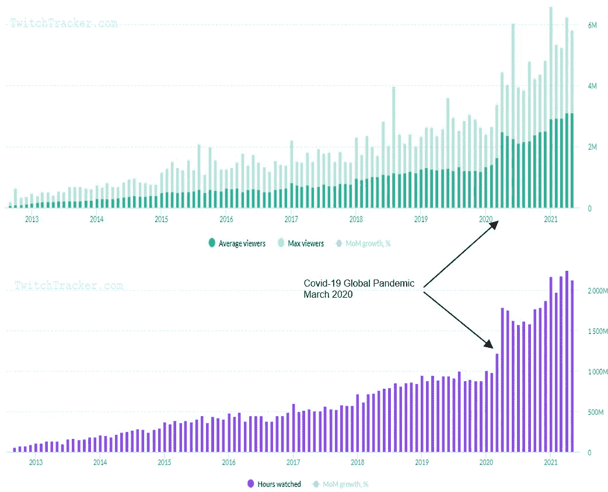

Twitch Audience growth between 2013–2021 from twitchtracker.com

## 只是聊天

这一部分很有趣，为什么你会说？我认为我们现在生活在一个时代，我们不再只是看电视，而是可以和它互动！一个投入的观众可以带来实时的反应和情绪，每一秒钟，这种反馈可以有用的创造者生产的内容。


Just Chatting section: HasanAbi

# 实验

## 假设

如果聊天反馈是可识别的并且分类正确，那么只要它通过了社会情绪分析和时间序列的所有验证测试，它就可以被预测。

## 步伐

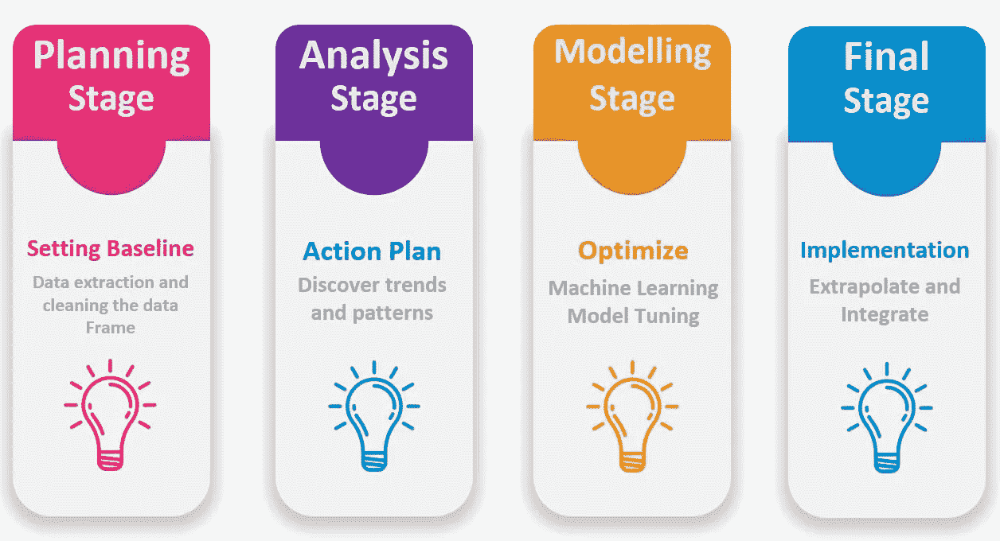

Step of each stage conducted

## 方法学

在第一个实验中，我们建立了一个模型，可以使用分类方法检测和分析现场事件中的情绪。我们的第二个实验是观察带有情感评分的数据集是否能预测未来的情感。最后，我们将在 AWS 云服务的帮助下，将该模型作为 API 扩展集成到 Twitch 上。


Methodology Part 1

## 数据析取

通过抽动互联网中继聊天(IRC)，使用网页抓取技术(Python 套接字库)提取拖缆的实时抽动聊天。这只能通过创建一个抽动开发者帐户来访问。数据集作为 JSON 日志下载。更多信息见[此处](https://www.learndatasci.com/tutorials/how-stream-text-data-twitch-sockets-python/)。

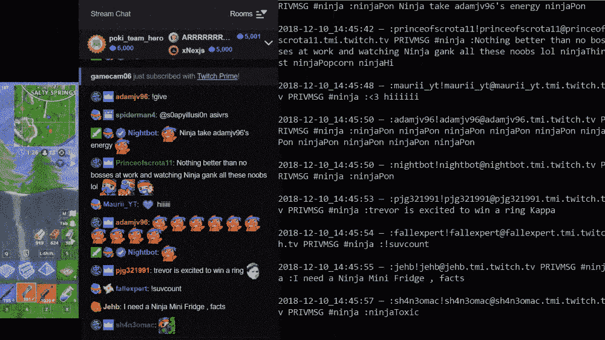

Data Extraction with the Python Socket tool

## 数据预处理和清理

我们采取了许多步骤来清理和标记数据集(作为一名学生，我们都知道这是项目中最耗时的部分，而现实情况是，在工作场所，作为一名数据科学家，这也是至少 50%的工作)。

我们从词干分析开始，这是一个将屈折词(或有时是派生词)简化为词干、词根或词根形式的过程。其他步骤，如删除罕见的词，链接(' https '或'。消息中的‘com’)，仅包含数字、停用词(我、我、我的等等)的消息。)，重复单词，只包含一个字符的单词，空消息。最后，我们使用了一个拼写检查 python 库(Spellchecker)下面是一个例子:

```
**from** spellchecker **import** SpellChecker
spell **=** SpellChecker()
**def** correct_spellings(text):
    corrected_text **=** []
    misspelled_words **=** spell**.**unknown(text**.**split())
    **for** word **in** text**.**split():
        **if** ((word **in** misspelled_words) **and** (**not**(word **in** twitchEmotesToUse)) **and** (**not**(word **in** EMOTICONS_EMO))):
            corrected_text**.**append(spell**.**correction(word))
        **else**:
            corrected_text**.**append(word)
    **return** " "**.**join(corrected_text)df**.**to_csv('..'**+** folderName **+** documentName **+** 'Clean' **+** '.csv', index**=False**)
```

清除数据集中的所有消息后，将其另存为。csv，以便通过分类方法进行处理。

# 情感分析

30 个最常见的表情基于我们使用的数据集。为了给每个表情符号一个值，情绪和评级是基于小组判断的。


Emotes of Twitch [https://twitchemotes.com/](https://twitchemotes.com/)

## **化合价** **感知词典(VADER)**

我们在我们的数据集中使用了 VADER 算法，因为我们认为它在社交聊天分类方面是最好的，因为它主要用于 Twitter。

VADER 是一个基于词汇和规则的情绪分析工具，专门针对社交媒体中表达的情绪。它用于对具有两种极性(即正面/负面)的文本进行情感分析。VADER 用于量化文本中积极或消极情绪的多少以及情绪的强度。抽搐表情被上传到 VADER 词典库进行识别。下面是用 VADER 更新的数据集片段。

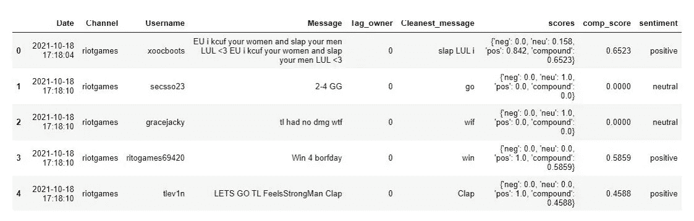

Dataset with VADER (score, comp_score, sentiment columns)

查看我们数据集中最常用的词语/表情:

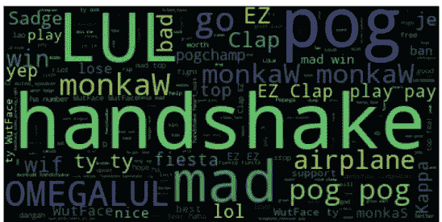

Python wordcloud library

# 时间序列模型

预测情绪的引入是最终目标。然而，为了做出这样的声明，运行验证测试来证明这个理论是很重要的。在这个项目进行期间，文章讨论了社会情绪分析的重要性，但是对时间序列的预测讨论得不多。预测活跃观众的现场行为可能是媒体行业的未来，因为可以从中提取大量数据。

## 确认

具有情感分数的 VADER 数据集被用于平稳性序列测试，这是因为统计模型更容易有效和精确地预测。平稳性是指时间序列没有趋势，有恒定的方差，恒定的自相关模式，没有季节模式。

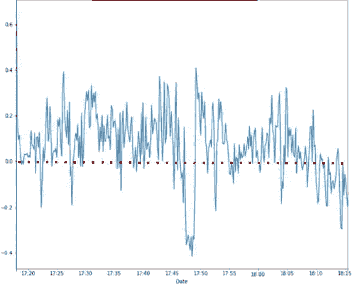

Riot Games VADER Dataset — 10 sec. average

## 扩充迪基-富勒试验

ADF 检验是一种常用的统计检验，用于检验给定的时间序列是否平稳。ADF 检验扩展了 Dickey-Fuller 检验方程，将高阶回归过程包括在模型中。

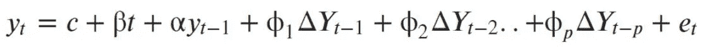

ADF test expands the Dickey-Fuller test equation to include high order regressive process in the model.

获得的 p 值应小于显著性水平(0.05)，以便拒绝零假设。从而推断该序列是平稳的。Riot Games VADER 数据集就是这种情况。因此，使用了额外的测试来进一步验证该模型。

## 自相关(ACF)和部分自相关图(PACF)

这里的目标是看到滞后(蓝线)通过阴影区域。对于平稳的时间序列，自相关函数迅速下降到接近零。相比之下，ACF 下降缓慢，不稳定。在这种情况下，ACF 和 PACF 证明了这一点，因为 ACF 下降缓慢，然而，在 ACF 模型中存在明显的滞后。

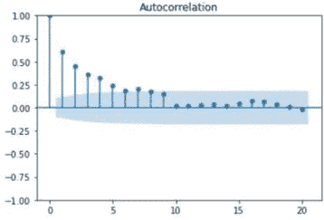

ACF of Riot Games VADER dataset

## ARIMA 模型

使用 pmdarima 库的逐步搜索功能用于在 4 个不同的数据集上找到最佳的 [arima](https://en.wikipedia.org/wiki/Autoregressive_integrated_moving_average) 模型，并发现当与它们的性能指标进行比较时，具有 10 秒移动平均值的 ARIMA 是最佳的。然而，在这种情况下，ARIMA 模型的局限性在于它不能在短时间内做出快速预测。

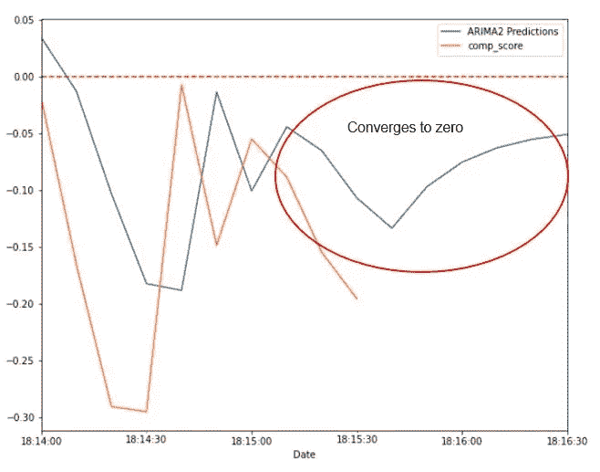

ARIMA model (1,1,2) performed the best for making predictions

## 深度学习的力量

尽管通过以前的模型无法实现快速预测，但该小组最后一次尝试使用一种称为[递归神经网络](https://www.ibm.com/cloud/learn/recurrent-neural-networks)的深度学习模型。

在时间序列的情况下，使用了长短期记忆模型，因为它显示了用少量数据预测未来序列的有效性。请注意，递归神经网络可以处理任何类型的序列数据，并且与 ARIMA 不同，它们不限于时间序列。使用这种类型的模型的困难任务之一是调整超参数(节点数/隐藏层/删除/激活函数/时期数/批量大小)所需的大量实验，以便优化设置成功计算。像 Keras 这样的开源库是允许多种类型实验的有效工具。损失的最小改进可以对模型的质量产生很大的影响。

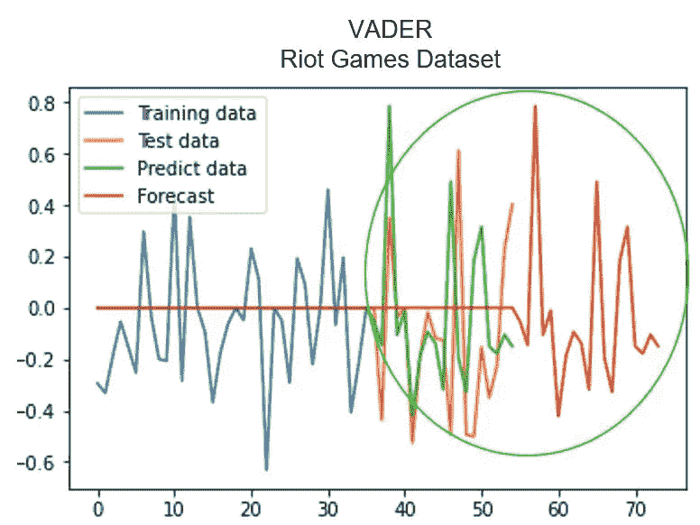

LSTM model used to predict and forecast future data

在这种情况下，只需要 60 秒的数据就可以实现对情绪的良好预测，从而预测未来 20 秒的情况。

# 第二部分

如果你已经读到这里，我推荐你。我将发布的下一篇文章将介绍该项目的数据工程部分。这包括 Twitch 扩展的使用、EBS 设计、AWS 架构和概念验证演示。最后，还讨论了商业计划模型，因为这可能是一个独特的功能。

# 感谢

由于这是我理学硕士学位的一个论文式的期末考试，如果没有同事们的帮助，这个项目是不可能实现的。这个项目从开始到结束花了大约 6 个月的时间，并在 2021 年末作为课程成果的一部分提交给了一名讲师。感谢菲利普·洛佩兹(应用数据科学和人工智能硕士)、亚历山大·拉济奇(应用数据科学和人工智能硕士)、莫尼克·罗利耶(数据工程硕士)和纪尧姆·霍尔德罗夫(数据工程硕士)。

敬请关注。

[](/mlearning-ai/mlearning-ai-submission-suggestions-b51e2b130bfb) [## Mlearning.ai 提交建议

### 如何成为 Mlearning.ai 上的作家

medium.com](/mlearning-ai/mlearning-ai-submission-suggestions-b51e2b130bfb)