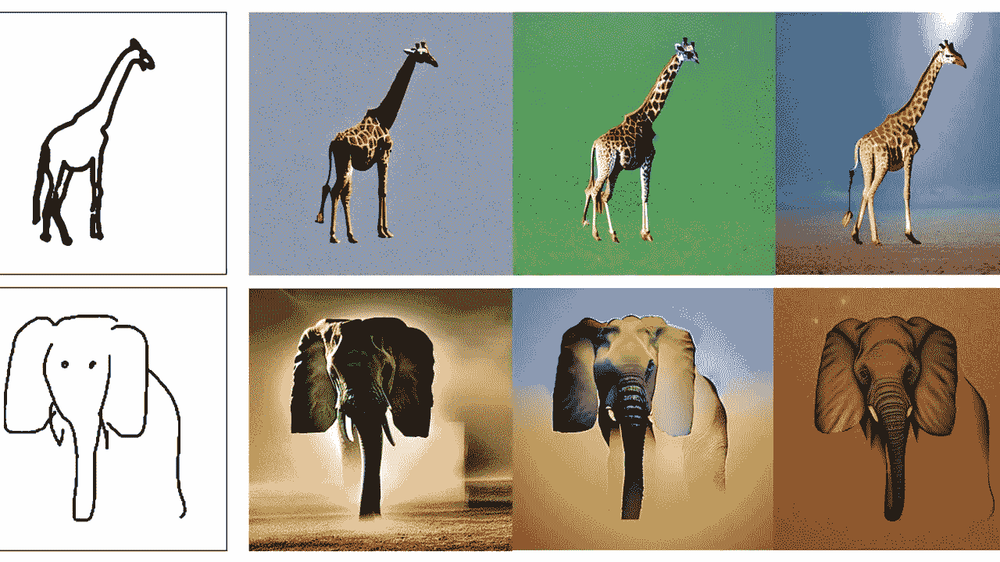

# 如何徒手画出逼真的动物？

> 原文：<https://medium.com/mlearning-ai/how-to-draw-realistic-animals-freehand-d6db56c2c8d5?source=collection_archive---------3----------------------->

## 艾教我画画

## 新的人工智能方法可以用于许多插图风格

[**Try the ready-to-use app now**](https://open.substack.com/pub/mlearning/p/ai-teaches-me-how-to-draw?r=z7zu8&utm_campaign=post&utm_medium=web)

人们如何画出看起来如此真实的东西？
许多第一批照片写实主义艺术家将一张照片投射到画布上，然后使用喷枪技术使这幅画尽可能看起来像照片。人工智能艺术家…