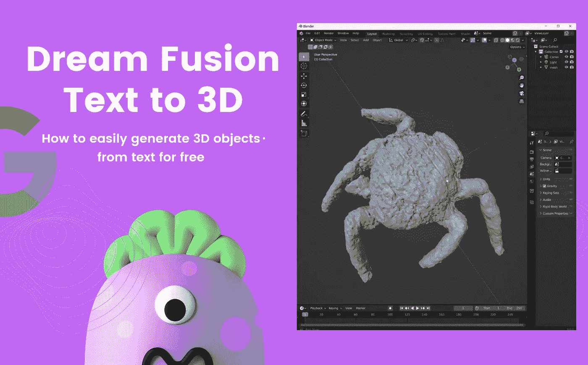

# 如何免费轻松运行 DreamFusion 文本到 3D AI

> 原文：<https://medium.com/mlearning-ai/how-to-easily-run-dreamfusion-ai-text-to-3d-for-free-32e6cecb82d?source=collection_archive---------0----------------------->

Image by [Jim Clyde Monge](https://medium.com/u/819323b399ac?source=post_page-----32e6cecb82d--------------------------------)

自从谷歌宣布其全新的人工智能模型 [DreamFusion](/technology-hits/googles-dreamfusion-ai-generates-3d-model-from-text-3fe994d57321) 以来，这仅仅是几周的时间，它可以根据文本提示生成 3D 对象。

在[的论文](https://arxiv.org/pdf/2209.14988.pdf)中，来自谷歌研究院和加州大学伯克利分校的人们使用 [Imagen](https://imagen.research.google/) 模型从文本中合成图像。由于 Imagen 还没有公开发布，开源的稳定扩散(SD)可以作为一个…