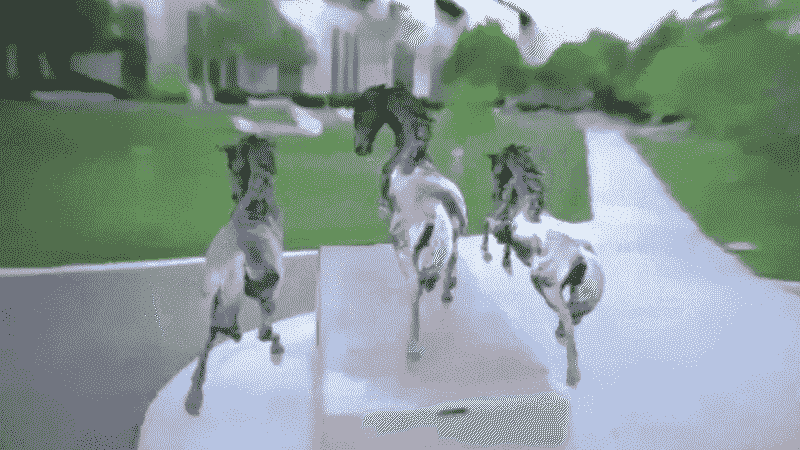

# 如何编辑 NeRF 雕塑

> 原文：<https://medium.com/mlearning-ai/how-to-edit-a-nerf-sculpture-6255e4974396?source=collection_archive---------1----------------------->

## [机器学习艺术](https://mlearning.substack.com)

## 神经辐射场的几何编辑

[https://mlearning.substack.com](https://mlearning.substack.com)

## 【T2 神经渲染】|编辑 3D 对象

神经辐射场(NeRF)在创新的场景视图合成中显示了相当大的前景。另一方面，当前基于 NeRF 的方法不允许用户控制的形状编辑…