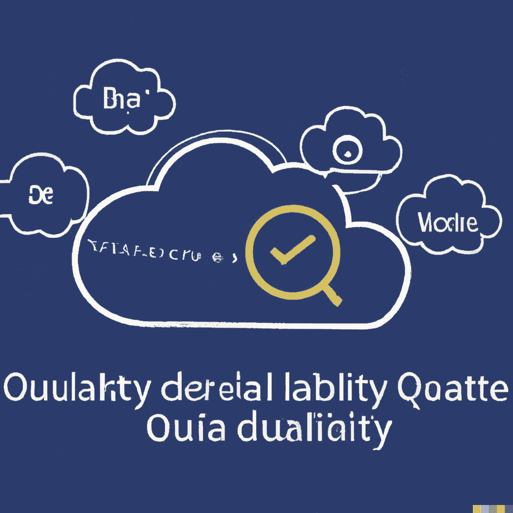

# 如何确保数据湖、管道和仓库中的数据质量

> 原文：<https://medium.com/mlearning-ai/how-to-ensure-data-quality-in-your-data-lakes-pipelines-and-warehouses-72b8948491f6?source=collection_archive---------5----------------------->

Rendered by Dale E

如果数据是新的石油，那么高质量的数据就是新的黑金。就像实际的石油一样，如果你没有好的数据质量，你不会走得很远。事实上，你可能连起跑门都出不了。那么，你能做些什么来确保你的数据符合标准呢？

数据湖、数据管道和数据仓库已经成为现代企业的核心。操作这些数据存储需要可观察性，以确保它们按预期运行并满足性能目标。一旦实现了可观察性，我们如何确信其中的数据是可信的？数据质量是否提供了可操作的答案？

几年来，数据可观察性一直是数据管理界的热门话题。什么是数据可观测性？这是越来越多的企业在努力变得更加数据驱动时提出的问题。简而言之，数据可观察性是一种能够轻松看到和理解数据如何在系统中流动的能力。数据可观察性是指看到数据随时间变化的能力，以及了解系统的所有不同部分如何相互作用的能力。有了可观察性，您将更容易跟踪某些类型的数据错误并解决问题。

但是什么构成了数据的可观察性呢？您如何在您的业务中实施它？

数据可观测性没有一个统一的定义，但它通常包括检测新鲜度、记录量的变化、数据模式的变化、重复的文件和记录，以及数据管道中不同点的记录计数之间的不匹配([https://first eigen . com/blog/how-to-assure-data-quality-in-your-data-lakes-pipelines-and-warehouses/](https://firsteigen.com/blog/how-to-ensure-data-quality-in-your-data-lakes-pipelines-and-warehouses/))。

还有其他因素，如系统性能、数据配置文件和用户行为也可以被监控[【https://firsteigen.com/data-trustability/】T4]。然而，这些通常不被认为是数据可观察性的一部分。

数据可观察性主要有两个限制:

**A)只关注数据仓库和相应的流程**

大多数数据可观察性解决方案都是围绕数据仓库开发和部署的。不过，在这个过程中，这往往为时已晚。

在数据湖和管道中部署数据可观测性比只在数据仓库中部署要好。这将使数据团队更清楚地了解流程每个阶段可能出现的任何问题。

然而，不同的公司有不同的需求，因此定制数据可观察性的部署以适应组织的需求是很重要的。

**B)关注元数据相关错误**

数据团队会遇到两种类型的数据问题:元数据错误和数据错误。

元数据错误是描述数据的数据中的错误，例如数据的结构、数据的容量或数据的配置文件。元数据错误是由不正确或过时的数据、数据结构的变化、数据量的变化或数据配置文件的变化引起的。

数据错误，即实际数据本身的错误，会导致公司亏损并影响其决策能力。一些常见的数据错误包括记录级别的完整性、一致性、异常和一致性问题。

有两种类型的错误会导致决策出现问题，并减慢工作进程。数据可观察性在很大程度上解决了元数据错误。据我们估计，元数据错误仅占数据团队遇到的所有数据问题的 20–30%。

理论上，数据错误是由数据质量计划检测出来的。不幸的是，数据质量计划在检测和预防数据问题方面通常是无效的。这通常是因为:

这些程序通常以数据仓库和数据集市为目标。阻止业务影响为时已晚。

根据我们的经验，大多数组织都关注容易发现的数据风险。这是基于过去的经验。然而，这只是冰山的一小部分。完整性、完整性、重复和范围检查是最常见的检查类型。虽然这些检查有助于检测已知的数据错误，但它们通常会遗漏其他问题，如列之间的关系、异常记录和数据漂移。

由于云技术、大数据应用和分析的兴起，数据源、数据流程和应用的数量最近增加了很多。这些数据资产和流程中的每一个都需要良好的数据质量控制，以便在下游流程中没有错误。数据工程团队可以非常快速地向他们的系统添加数百项数据资产。然而，数据质量团队通常需要大约一两周的时间来对每个新的数据资产进行检查。这意味着数据质量团队通常无法获得所有的数据资产，因此他们中的一些没有任何质量检查。

**什么是数据可信度？您如何在您的业务中实施它？**

数据可信度弥合了数据可观察性和数据质量之间的差距。它利用机器学习算法来构建数据指纹。与数据指纹的偏差被识别为数据错误。它侧重于识别“数据错误”,而不是记录级别的元数据错误。数据可信度是使用机器学习发现错误的过程，而不是依赖于人定义的业务规则。这使得数据团队能够更快、更高效地工作。

更具体地说，数据可信度发现以下类型的数据质量问题:

脏数据:具有无效值的数据，例如不正确的邮政编码、丢失的电话号码等。

完整性:不完整的数据，例如没有地址的客户或没有产品 id 的订单行。

一致性:不一致的数据，例如日期或数值格式不同的记录。

唯一性:重复的记录

异常:关键列值异常的记录

使用数据可靠性有两个好处。首先是写规则不需要人为干预。这意味着您无需付出巨大努力就可以获得大量数据风险覆盖。第二个好处是，它可以在整个数据传输过程中的多个点部署。这使数据管理员和数据工程师能够扩展数据并对数据问题做出早期反应。

数据质量计划将继续共存，并满足特定的合规性要求。数据可靠性是在数据架构中实现高数据质量和可观察性的关键因素。

**结论**

高质量的数据对任何企业的成功都至关重要。数据可观察性和数据质量在检测和防止数据错误方面存在不足，原因有几个，包括人为错误、流程缺陷和技术限制。

数据可信度弥补了数据质量和数据可观察性之间的差距。通过检测上游的数据错误，数据团队可以防止运营中断。

之前在 dataversity.com 出版过

 [## Mlearning.ai 提交建议

### 如何成为 Mlearning.ai 上的作家

medium.com](/mlearning-ai/mlearning-ai-submission-suggestions-b51e2b130bfb)