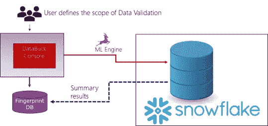
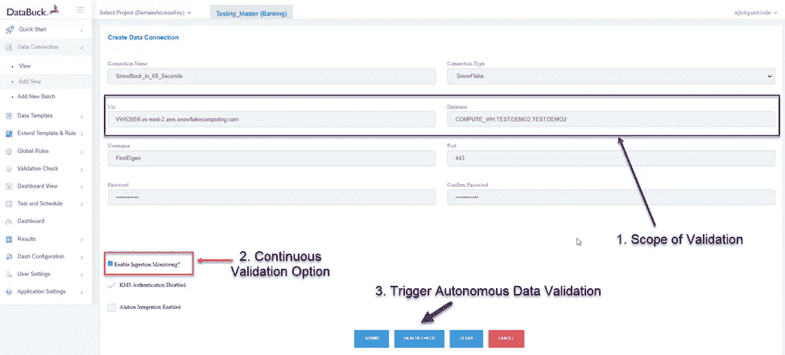
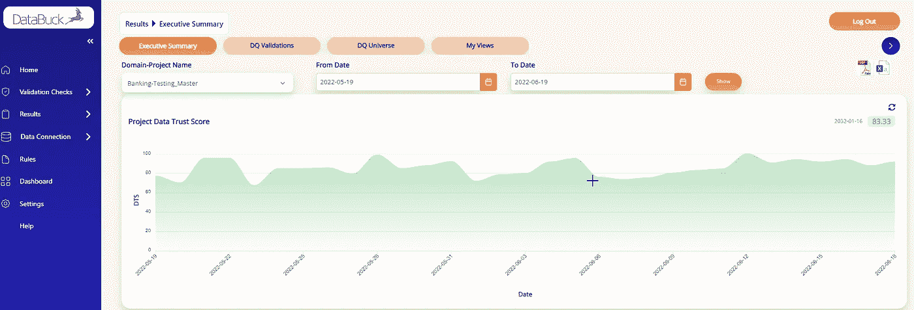
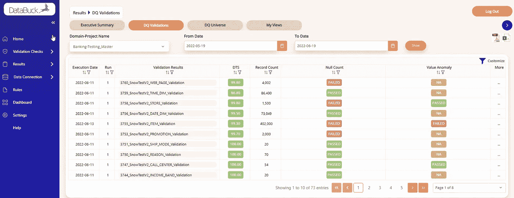
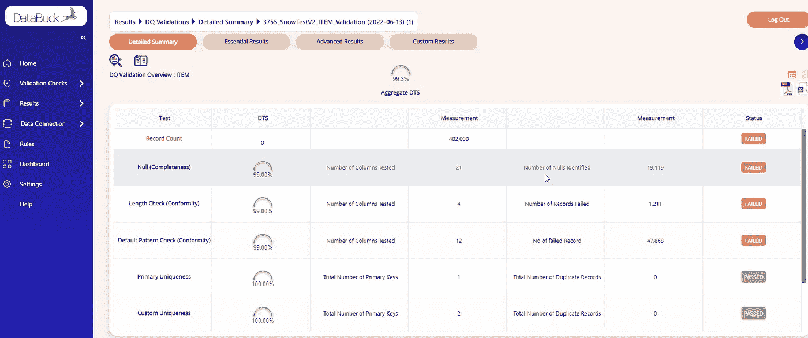
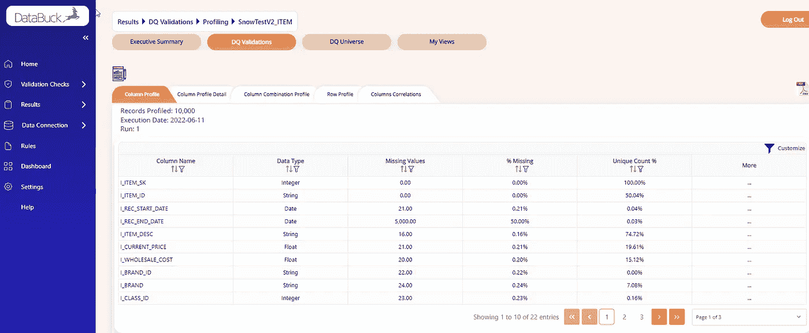
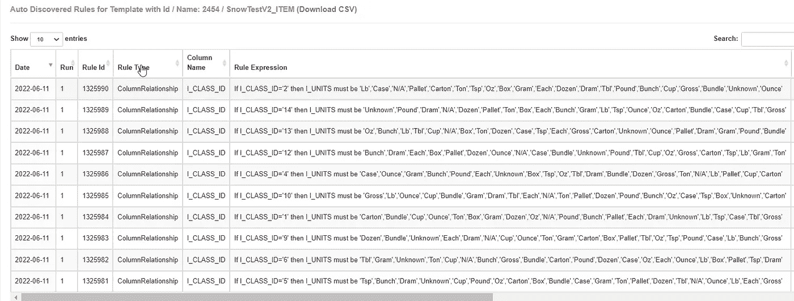

# 如何在 60 秒内建立雪花数据的连续数据验证？

> 原文：<https://medium.com/mlearning-ai/how-to-establish-continuous-data-validation-for-snowflake-data-in-60-seconds-d354b027ad8?source=collection_archive---------2----------------------->

使用 DataBuck 对雪花表进行自动和连续的数据验证

随着越来越多的人选择雪花作为云数据仓库，验证数据的需求变得至关重要。根据波士顿咨询集团 2021 年的一项研究([https://www . LinkedIn . com/pulse/data-quality-key-element-driving-competitive-advantage-Lucas-quarta](https://www.linkedin.com/pulse/data-quality-key-element-driving-competitive-advantage-lucas-quarta))数据质量在大多数公司都是滞后的。

尽管在数据质量解决方案上进行了大量投资，但大多数组织都无法确保其数据资产的质量，因为存在以下挑战:

**实施成本高**:现有的数据质量解决方案依赖于基于规则的方法。因此，实现工作与雪花中的表数量成线性比例。随着数据的发展，维护数千个已实现的规则会增加总拥有成本

**架构限制**:许多现有工具的架构并不能验证一些雪花表可能包含的数十亿条记录。此外，数据需要从雪花移动到数据质量解决方案，从而导致延迟和重大安全风险。

**知识差距:**数据质量分析师通常不熟悉数据资产。为了创建数据质量规则，他们需要广泛咨询主题专家。在雪花数据云中，由于组织之间共享数据集，数据质量分析师可能无法访问其他组织的主题专家。

DataBuck 是由 first eigen([https://firsteigen.com/snowflake-data-quality-lp/](https://firsteigen.com/snowflake-data-quality-lp/))开发的，用于解决雪花环境中的这些问题。

**什么是 DataBuck？**

DataBuck 是一个自主的“由雪花驱动”的雪花数据验证解决方案。它使用 ML 功能为雪花中呈现的每个数据资产(模式、表、列)建立数据指纹和客观的数据信任分数。对数据的信任将不再是一场人气竞赛。不需要让个人对表/文件的健康状况给出他们的主观意见。所有利益相关者都能普遍理解客观数据信任分数。

更具体地说，它利用机器学习，通过标准化数据质量维度来衡量数据信任得分，如下所示:

1.**新鲜度** —确定数据是否在流程的下一步之前到达

2.**完整性** —确定上下文重要字段的完整性。应该使用各种数学和/或机器学习技术来识别上下文重要的领域。

3.**一致性** —确定与上下文重要字段的模式、长度、格式的一致性。

4.**唯一性** —确定单个记录的唯一性。

5.**漂移** —从历史信息中确定关键分类和连续字段的漂移

6.**异常** —确定关键列的体积和值异常

只要新数据进入雪花表，DataBuck 就可以自动触发数据信任分数，或者可以计划在特定时间运行，或者作为数据管道的一部分。

**data buck 是如何工作的？**

在 DataBuck 中，用户提供雪花连接信息和数据库细节，并触发连续的数据验证过程。一旦数据验证过程被激活，DataBuck 就将它的 ML 引擎发送给 snowflake 来分析数据并识别数据质量问题。然后，汇总结果通过 web 控制台呈现给用户。在这个过程中，用户不需要编写规则或将数据移出雪花。

**在 60 秒内设置数据仓库。**

如下图所示，用户按照以下步骤在 60 秒内设置数据压入([https://youtu.be/p2g94QU-qkM](https://youtu.be/p2g94QU-qkM)):

1.  提供需要进行数据验证的数据库和方案名

2.指示是否需要执行连续数据验证

3.通过单击运行状况检查按钮触发数据验证过程。

**数据推送结果:**

DataBuck 可以验证雪花数据库，而不管表的数量和每个表的大小。DataBuck 提供以下结果:

1.  一段时间内方案的数据质量:

2.每个表的汇总数据质量结果

3.每个表的详细数据质量结果

4.每个表的详细数据配置文件

5.发现每个表的数据质量规则

**总结**

DataBuck 提供了一种安全且可扩展的方法来持续验证雪花数据。只需一次点击，您就可以验证数百个雪花表。

 [## Mlearning.ai 提交建议

### 如何成为 Mlearning.ai 上的作家

medium.com](/mlearning-ai/mlearning-ai-submission-suggestions-b51e2b130bfb)