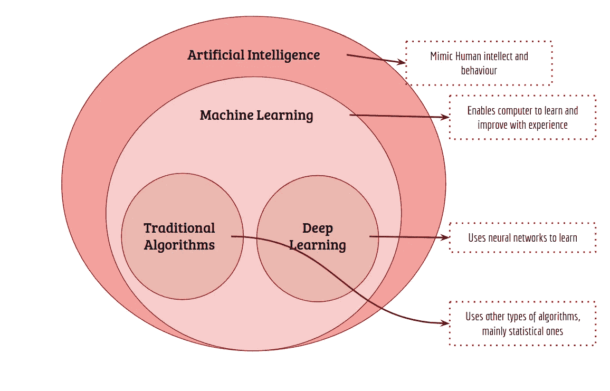
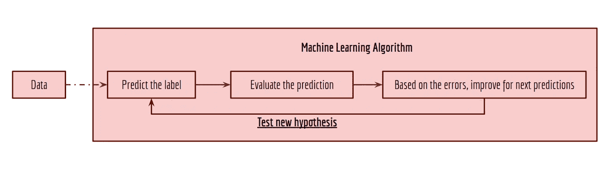
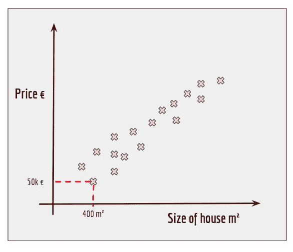
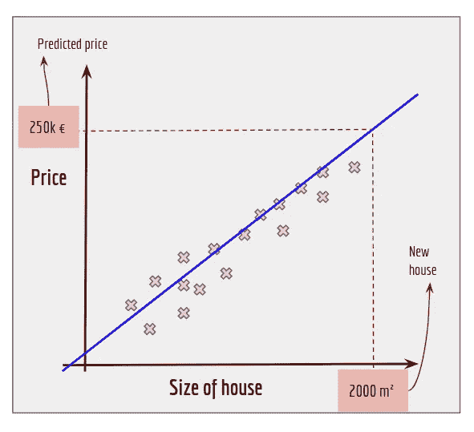
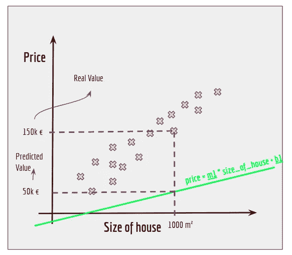
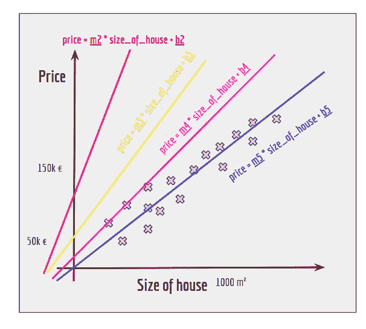

# 如何向父母解释人工智能

> 原文：<https://medium.com/mlearning-ai/how-to-explain-artificial-intelligence-to-your-parents-93b2d7ac7854?source=collection_archive---------7----------------------->

Photo by [Amanda Dalbjörn](https://unsplash.com/@amandadalbjorn?utm_source=medium&utm_medium=referral) on [Unsplash](https://unsplash.com?utm_source=medium&utm_medium=referral)

最近，我妈妈问了我以下问题:

> “你觉得未来的父母会懂 AI 吗？嗯，我想和你讨论一下人工智能，但是我真的不能，因为我不理解它。例如，你姐姐从事国际关系领域的工作，我可以和她就某些话题进行高水平的讨论。”

我对这个问题进行了反思，决定写一篇深入浅出地解释人工智能的文章。目标是任何非技术人员都可以理解围绕人工智能和机器学习的高级概念。这不是一项容易的任务，但让我们努力去做吧！

为了开始这个解释，我们将首先定义一些概念，然后给出两个现实生活中的类比，以保持事情的简单性。我们必须首先定义概念，这样我们才能在所有这些概念和术语上都有相同的基础。不要放弃第一个层次，因为在接下来的两个层次，事情变得有趣——通过类比和可视化，学习概念更容易。

文章分为三个层次:

1.  [**一级—概念介绍**](http://de2c)
2.  [**二级——计算机如何学习的真实世界类比**](http://6b6d)
3.  [**第三级—真实世界类比+算法的高级示例**](http://a558)

你不必一口气读完整篇文章。每天可以读一级。

# 第一级—概念介绍

我们都听说过人工智能、机器学习和深度学习等术语。*但它们是什么意思，有什么区别？*

要理解其中的区别，看下图更容易。从图像中，我们看到**人工智能**是试图让机器模仿人类行为*的大领域*，人类的很大一部分正在学习。*在人工智能领域，我们有**机器学习**。机器学习是人工智能*的一个子领域，由无需明确编程就能让计算机学习的技术组成。*最后，在机器学习内部，我们有**传统算法和深度学习。这两个子领域只是使计算机能够学习的两种更广泛的技术。***

**人工智能**

如前所述，人工智能是试图赋予计算机智能、推理、逻辑和学习等人类特征的大领域。目标是拥有一台能够模仿人类智力和行为的计算机。这可以通过一个简单的基于规则的方法来完成*(如果阳光明媚，没有云，那么就没有雨——是的，这就是人工智能！你给计算机一套规则来决定是否要下雨)*或者通过更难的算法比如机器学习算法。

**机器学习**

简而言之，机器学习*是系统从经验中学习和改进的能力，而无需明确编程。* **但是“没有明确编程”到底是什么意思？**

我举了一个基于规则的方法的例子。在这个例子中，我们编写了一个计算机程序来告诉我们是否会下雨。我们给了它一套规则(如果晴朗无云，那么就没有雨)，现在计算机可以根据新的数据做出预测。所以，每天我们给计算机提供数据(太阳高度，云层高度),根据这些数据和规则，计算机会告诉我们是否会下雨。通过给出规则，我们对计算机进行了显式编程，使其能够根据规则和新数据做出预测。

机器学习带来的新范式**是我们不必给计算机制定规则，即。不需要显式编程。我们只需要给计算机大量的数据，它就会自己学习规则。我们给计算机的数据由解释事件和答案的信息组成。然后计算机试图将信息映射到答案。在上面的例子中，信息可以是温度、太阳高度、云量，答案是下雨或不下雨。这里的假设是:**通过看到大量的例子(经验)，计算机最终会学习**。就像我们做的一样:我们活的日子越多，我们的经验越多，我们就能更好地判断是否会下雨。*主要思想是给出大量数据(经验),让计算机/程序计算出如何将 X 映射到 Y***

但是它是怎么学习的呢？保持冷静，下一章我会举个例子

现在请记住这一点:在此之前，我们必须思考和编写规则来让计算机做我们想做的事情。但是现在，我们只需要给出数据，计算机就会尝试使用机器学习算法来学习规则。

**传统 vs 深度学习**

实现一个目标总有多种方式。在这种情况下，目标是赋予计算机从数据中学习的能力。传统算法有点简单，但这并不意味着它们不能完成任务！而深度学习算法的灵感大致来自人脑和神经网络的结构。我们的大脑由神经网络组成，控制着从运动到学习的一切。深度学习从我们的大脑中提取一些概念，并在计算机中实现它们。深度学习使用人工神经网络来使计算机能够学习。

> 希望这些定义没有让你睡着:)。接下来是最有趣的部分，因为我们将看到真实世界的例子。

# 第二级——计算机如何学习的真实世界类比

所以我说，我们只需要给计算机大量的数据，它就会自己找出规则和答案。 ***但它是如何学习的呢？*** *嗯，多一个少一个像你和其他人类一样:* **经历。**

宝宝怎么知道一个图像代表的是狗还是猫？首先，宝宝要学习。每当你找到一只猫，你就把它给婴儿看，并说“猫”。通过多次这样做，婴儿最终会知道什么是狗，什么是猫。婴儿的这种能力是通过经验获得的——通过展示多个例子并给出答案。这就是我们对机器学习算法所做的:*我们给它例子(狗和猫的图像)，并说哪张图像对应于猫或狗。通过查看所有的图像和标签，算法试图找出基于图像预测标签的方法。*

在第一次尝试中，该算法将失败，但是随着我们显示更多的图像，该算法将从以前的错误中学习，并最终学习如何将图像映射到相应的标签。部分**“从以前的错误中学习”**是一个重要的部分，*因为错误给出了关于算法做错了什么的信息，并且它将在下次尝试时纠正它。*

我们称训练阶段为算法学习将图像映射到正确标签的阶段。培训阶段可以分为三个主要任务:

1.  我们向算法提供数据——数据包含信息和相应的标签
2.  该算法反复测试不同的假设:

*   看到信息并试图预测标签
*   评估他的预测。检查预测是正确还是不正确
*   基于该评估，试图发现它做得不好的地方并纠正它，以便不犯同样的错误并提高它自己的预测的准确性。

在训练阶段的每次迭代中，该算法将看到它如何以及为什么做出了错误的预测，并针对未来的预测进行自我校正。最终，经过多次迭代后，**误差会变小，因为算法总是在试图改进和消除所有的错误和误差。**

这就是为什么我们说机器学习**是通过经验学习，是基于试错的。**该算法测试多个假设，评估每个假设的缺点，每次都提出一个更好的假设。

现在，您已经知道了机器学习背后的迭代过程，是时候了解机器学习算法如何根据上一次迭代的误差在每次迭代中做出更好的预测了。走吧，这是最后一关🙂

# 第三级——真实世界的类比+算法的高级示例

在本节中，我将尝试解释算法如何从以前的错误和失误中学习，以改进自己的预测。

想象一下，你想买房子。那里有很多房子，价格各不相同。你并不真正知道房子的合理价格是多少。所以，你实现了一个机器学习算法，根据房子的特征来预测它的价格。为了做到这一点，你首先必须给你的算法提供数据来训练它。学习。算法会通过看到大量的例子来学习。在这种情况下，我们将举例说明房子的大小。目标是根据房子的大小预测价格。

想象一下，你去了一个房产中介网站，收集了各种房源的价格和房子的大小。现在你有了数据，你画出它。它将看起来像下面的图像。

这些都是你有的例子。他们把房子的大小和价格对应起来。例如，我们可以看到一个例子，一个房子是 400 平方米，其价格是 50000€。我们还可以推断，房子越大，价格越高。

想象你是机器学习算法。*给定房子的面积，你怎么算出它的价格？*嗯，**我们可以看到，将一条线放入数据中是相当容易的。**看看下图中的蓝线。

有了这条线，我们就可以根据房子的大小来预测价格。例如，**如果我们看到一栋 2000 平方米的房子，我们可以将它放入我们的地块，借助蓝线，我们可以预测房子的价格是 25 万€**

**niceeeeee！但是算法如何找到最佳线路呢？**

2d 绘图中的一条线由 **y = m*x + b** 定义。y 和 X 是我们的数据——房子的价格和大小。因此，**该算法唯一能够*调整*的是 m 和 b。**在这种情况下**，该算法必须找到创建完美线条(蓝线)的最佳 m 和 b 值。**它通过**测试大量的线，检查预测中的错误并找到更好的线**来找到值。就像我们上面说的步骤——预测、评估、改进。

我们来目测一下。

算法从随机选择对应于绿线的 **m1** 和 **b1** 开始。然后，它**将预测值与实际值进行比较。**例如，对于一栋 1000 平方米的房子，我们的算法预测价格为 5 万€，但实际价格为 15 万€。哇，这是 10 万€的误差。

所以我们看到我们的算法**低估了房屋的价值。也就是说，它预测的值比真实值低。**基于这些错误，算法认为“*好吧，我预测价格低，所以我必须找到一个 m 和 b，它们创建了一条不能预测更低价格的线*”。他开始尝试我们在下一张图中看到的红线。

嗯，看起来我们的算法现在预测了更高的价格，但价格比实际价格高得多。算法认为“ *Ups，线路预测值真的很大。必须在绿线(低预测)和红线(高预测)之间找到一条线*。

他开始测试黄线。分析错误后，发现他可以做得更好，并尝试使用*紫色线。*还是不满意，**分析了紫线的错误**，觉得“*好了我快到了。对于一些房子，我仍然预测价格高于实际价格。必须降低线一点点*”。

最后，算法会找到几乎完全符合数据的蓝线。该算法是令人满意的，因为它的预测和真实值之间的误差很小。

在这里，我们看到了算法**测试多个假设(在这种情况下，线条)，分析每个假设的错误，并创建新的更好的假设。**

需要注意的一点是，机器学习算法**真的很擅长找模式**。在这个例子中，**房子越大，价格越高**。因此，当算法找到这种模式时，它会尝试创建与该模式匹配的线。

总而言之，该算法将迭代地:

*   阅读房子的大小
*   预测价格
*   将价格预测与实际价格进行比较
*   评估错误并从中吸取教训
*   创建一个新的假设(线)
*   下一次迭代

**该算法的目标是找到 *m* 和 *b* 来创建一条减少误差的线。**

想象你正试图调到一个无线电频率。你转动旋钮**找到减少噪音和干扰的最佳值。**

[https://www.ndf.church/what-frequency-are-you-tuning-in/](https://www.ndf.church/what-frequency-are-you-tuning-in/)

这正是机器学习算法所做的:**调整旋钮以减少错误。**在这种情况下，旋钮为 **m** 和**b。**算法会对 **m** 和 **b** 和*进行调整，以使预测值和实际值之间的误差较小。*不同的机器学习算法有不同的旋钮，会产生不同的结果。

# 要点:

*   人工智能试图模仿人类行为。人类很重要的一点是**学习**。这就是机器学习的意义所在
*   机器学习是实现算法的领域，这些算法是**以试错的方式通过经验学习的。**
*   机器学习算法**测试多个假设**以找到在任务中表现良好的最佳假设。
*   它不会盲目地检验假设。**根据前一个假设的误差决定下一个假设**
*   提出新的假设就像**将旋钮向左或向右旋转一点点**
*   转动旋钮一会儿后，**算法最终找到每个旋钮的正确位置**

干得好，你已经到文章结尾了！我真的希望这篇文章能帮助你对人工智能和机器学习有更多的了解。

如果有不清楚的地方，或者你有改进这篇文章的建议，请在评论中告诉我:)

继续学习！:)