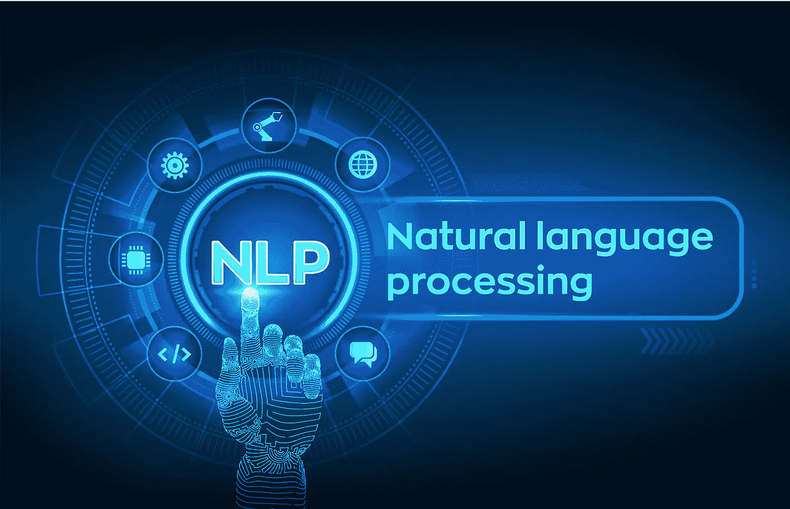
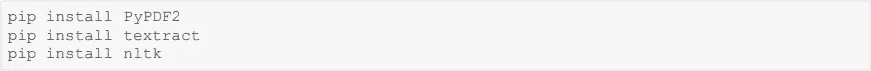
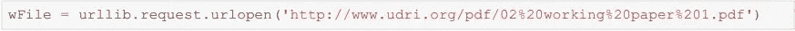
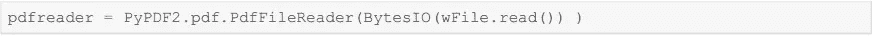
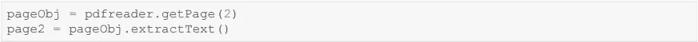
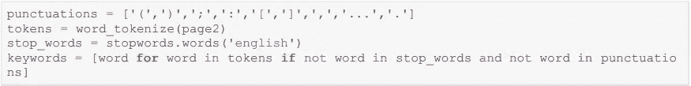
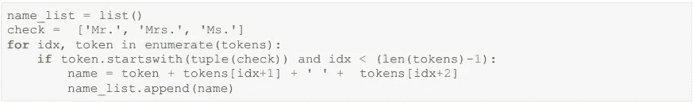
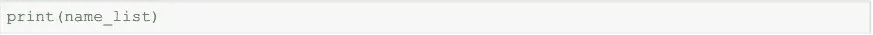
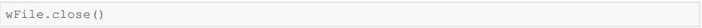

# 如何从 PDF 中提取文本(NLP)

> 原文：<https://medium.com/mlearning-ai/how-to-extract-text-from-a-pdf-nlp-b6409422cfd2?source=collection_archive---------1----------------------->

从 pdf 文件中提取特定文本

Source : [https://cognitechx.com/wp-content/uploads/2020/04/107_agfuzc1tyxpllu5muc1kyxjrlwjsdwu-scaled-1.jpg](https://cognitechx.com/wp-content/uploads/2020/04/107_agfuzc1tyxpllu5muc1kyxjrlwjsdwu-scaled-1.jpg)

我对学习自然语言处理(NLP)越来越感兴趣。这是一个非常庞大的主题，但对各行各业都有着有趣而深远的影响。首先，我从一个从给定文档中提取文本或特定数据的简单任务开始。

让我带你看一下我是如何接近它的整个过程。

要求:从本 pdf 的第 2 页提取大孟买市政公司的个人姓名—([http://www.udri.org/pdf/02%20working%20paper%201.pdf](http://www.udri.org/pdf/02%20working%20paper%201.pdf))

步骤 1:安装所需的 python 包。

这里我们使用了三个包 PyPDF2，textract 和 nltk。

PyPDF2 是一个作为 PDF 工具包构建的 python 库。它提供了多种功能，如从 pdf 中提取信息，逐页拆分或合并文档，裁剪页面，加密或解密 pdf 文件等等。Textract 是提取文本的核心函数。NLTK 代表自然语言工具包。它是一个平台，用于构建使用人类语言的 python 程序。它包含用于标记化、解析、分类、词干、标记和语义推理的文本处理库。

Install required packages

步骤 2:导入所需的库

Importing libraries

步骤 3:接下来，我们使用 urllib.request 从给定的 url 获取 pdf，并将文件保存在 wFile 中。

Access the PDF from the url

第四步:在这一步我们创建一个 PyPDF2 模块的**pdf reader**类的对象，并通过 pdf file 对象&获取一个 pdf reader 对象。

步骤 5:这里我们使用 getPage 函数从 pdf 中访问所需的页面。getPage(2)将获取第二页，并使用 **extractText()** 从 pdf 页面中提取文本。

步骤 6:在下面这段代码中，我们执行标记化，并从数据中删除标点符号和停用词。

步骤 7:输入 pdf 中的所有姓名都以先生、夫人或女士为前缀。在我们的代码中，我们使用它们来提取全名。我们借助枚举函数将所有的名字保存在一个列表中(name_list)。

第八步:最后一步是打印姓名并关闭文件。

希望这篇文章能在一定程度上帮助你理解提取文本的过程。

以下是 GitHub 的代码链接:[https://github.com/poonam-ydv/NLP-](https://github.com/poonam-ydv/NLP-)