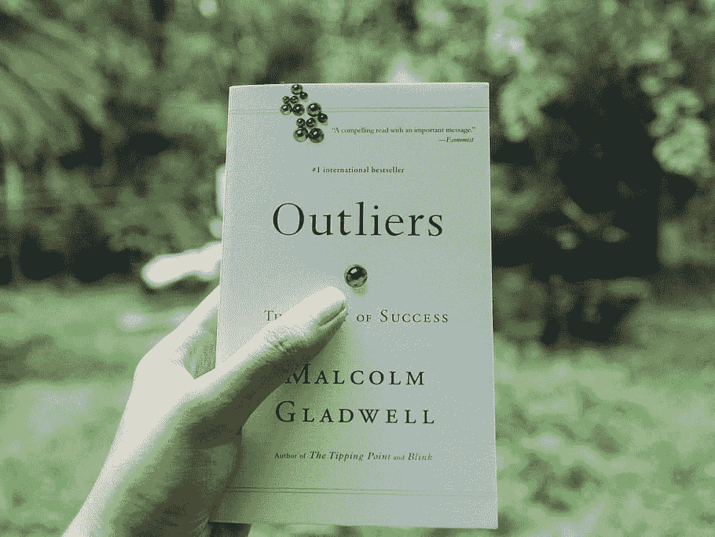

# 如何在 Python 中查找和移除回归中的异常值

> 原文：<https://medium.com/mlearning-ai/how-to-find-and-remove-outliers-from-a-regression-in-python-449bc9e13101?source=collection_archive---------1----------------------->

在过去的几周里，我一直在研究机器学习，并学到了研究离群值的课程。根据数据科学专业人士的说法，提高准确性的一种方法是识别异常值，然后将它们从数据集中删除。在寻找欺诈时，识别异常值会很有用。因为异常值可能会对数据集的准确性产生影响…