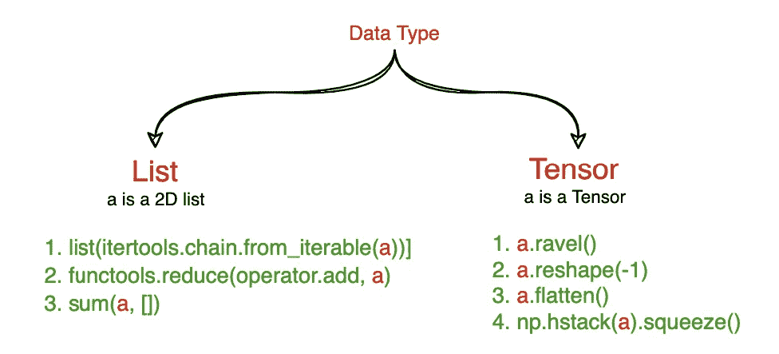
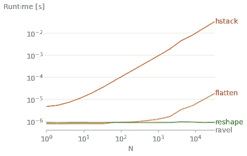
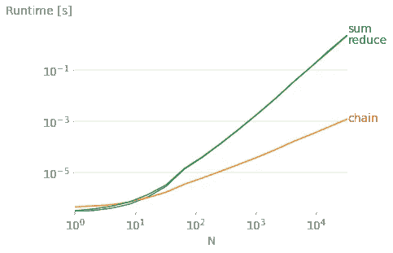
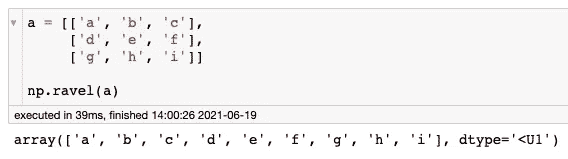
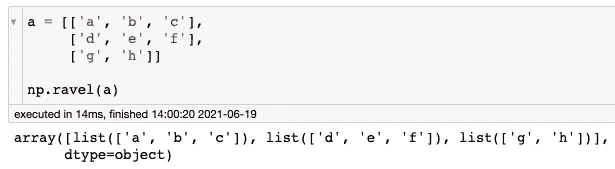
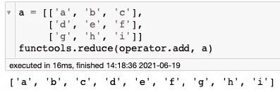
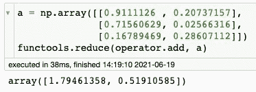

# 扁平化 2D 列表 Vs 2D 张量:方法和复杂性

> 原文：<https://medium.com/mlearning-ai/how-to-flatten-2d-lists-1be8e0bea511?source=collection_archive---------10----------------------->

在扁平化 2D 时部署错误的策略是很常见的。显而易见，但最重要的一点是:

因此:

*一旦你知道你的数据，只需相应地选择以下方法之一。(我们不会深入研究这些函数)*

**

*(注意:对于张量，显示的方法是基于 NumPy 的，但是每个科学计算库都有自己相似的张量函数)*

> ****所以我们知道数据类型，但是它有多大呢？****

*并不是所有的方法都可以有效地扩展数据大小，如下所示:
(这些只是张量类型的方法)*

**

*接下来是列表式方法:*

**

*(注意:我使用[性能图](https://pypi.org/project/perfplot/)来绘制对比图)*

*因此，上面列出的方法已经按照复杂程度递增的顺序排列。*

***但是等等，难道不应该把上面两个图合并起来，把所有的方法放在一起比较吗？** 如果你的答案是“当然可以，为什么不可以”，那你就需要更加用心了:P.
还记得“数据类型”这一点吗？这两个图的数据类型是不同的。第一个是张量，第二个是列表列表。*

> ****如果你没有得到任何错误，并不意味着它是正确的****

***示例 1:在 2D 列表上使用张量方法***

*我曾经碰巧在一个列表列表中应用了 **np.ravel()** ，并且很高兴它成功了。但是做到了吗？*

*在我的脑海中，我期待着这个:*

**

*但实际上，它是这样的:*

**

*请注意数据中的差异。第二个没有相同大小的所有子列表。 **ravel()** 没有给出任何错误但是没有按预期工作。*

***示例 2:在张量上使用列表方法***

*这就是 **reduce()** 在 2D 列表上的工作方式。*

**

*但是当给定一个张量时，它只是简单地将特定轴上的值相加:*

**

***结论:远离混合不同类别的方法。***

## *我的偏好:*

1.  *如果是 2D 列表，只需使用 **sum(a，[ ])** 就可以了，因为我们不需要导入任何东西，如果数据量很大，就远离它，因为它会非常慢。*
2.  *如果它是一个张量，使用 **ravel()，**因为它比其他的更快(因为它返回一个修改的视图，不像 **flatten()那样创建张量的副本)。***
3.  *请记住，如果数据超过 2 维，方法将会不同。所以在继续之前简单地测试一下这个函数。*

*如果我错过了您的任何便捷方法，请告诉我:)*

* [## Mlearning.ai 提交建议

### 如何成为 Mlearning.ai 上的作家

medium.com](/mlearning-ai/mlearning-ai-submission-suggestions-b51e2b130bfb)*