# 如何利用机器学习预测客户销量？

> 原文：<https://medium.com/mlearning-ai/how-to-forecast-customer-sales-volume-using-machine-learning-575df6acef36?source=collection_archive---------1----------------------->

Photo by [Johann Walter Bantz](https://unsplash.com/@1walter2?utm_source=unsplash&utm_medium=referral&utm_content=creditCopyText) on [Unsplash](https://unsplash.com/s/photos/customer-old-man?utm_source=unsplash&utm_medium=referral&utm_content=creditCopyText)

内容:

1.  行动纲要
2.  介绍
3.  方法学
4.  结果
5.  讨论
6.  结论
7.  附录

# 1.行动纲要

在本文中，我们将了解如何使用交易历史和人口统计数据集来预测客户销售量。我们的结论是，一个简单的线性回归可以使用年收入作为未来销售的一个强有力的预测指标。

# 2.介绍

本案例研究是爱丁堡大学预测分析使用 Python MicroMasters 项目中“使用 Python 的预测分析简介”的一部分。该项目的范围是建立一个性能良好的预测模型，使用人口统计和交易数据预测客户销售量。

# 3.方法学

## 3.1 分析方法和数据要求

选择预测分析方法是因为我们需要预测一个连续的数字。一路上，我们涵盖了经典的 KDD(数据库中的知识发现)循环，包括数据清洗、数据选择和转换、数据挖掘，从而产生知识。该模型最终形成一个简单的回归模型，作为得出结论的预测模型的一个例子。因为我们使用简单的线性回归，所以数据必须是数字格式。

对于给定的数据集，有两种可能的方法来处理销售预测问题:按客户或按产品合计销售量。在本案例研究中，我们采用前一种方法。

## 3.2 数据

我们使用以 CSV 格式导入的两个数据集:CS_Purchase_data 和 CS_Customer_data。

**数据集 1: CS_Purchase_data**

第一个数据集包含 50000 个关于客户人口统计数据和产品数据的交易，其中“购买”功能表示购买金额。这些变量如下:

*   用户标识
*   产品标识
*   性别
*   年龄
*   职业
*   城市 _ 类别
*   停留在当前城市的年数
*   婚姻状况
*   产品 _ 类别 _1
*   产品 _ 类别 _2
*   产品 _ 类别 _3
*   购买

Photo by [Beth Macdonald](https://unsplash.com/@elsbethcat?utm_source=unsplash&utm_medium=referral&utm_content=creditCopyText) on [Unsplash](https://unsplash.com/s/photos/purchase-transaction?utm_source=unsplash&utm_medium=referral&utm_content=creditCopyText)

**功能选择:**
由于练习方法是按客户预测交易，我们删除产品功能‘产品标识’，‘产品类别 1’，‘产品类别 2’，‘产品类别 3’。

**汇总观察:**
接下来，我们使用 User_ID 汇总客户的交易，并创建一个新特性“Purchase_Sum”，为用户汇总交易值。该数据集包括 5424 个客户的交易。

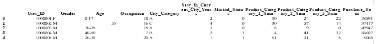

Figure 3.1 Purchase Dataset Aggregated by Customer

**数据集 2: CS_Customer_data**

然后，我们导入第二个数据集 CS_Customer_data，它包含 5424 条客户记录，具有五个特征:

*   用户标识
*   年收入
*   孩子的数量
*   邻近城镇
*   总和

Photo by [Jonathan Borba](https://unsplash.com/@jonathanborba?utm_source=unsplash&utm_medium=referral&utm_content=creditCopyText) on [Unsplash](https://unsplash.com/s/photos/customer?utm_source=unsplash&utm_medium=referral&utm_content=creditCopyText)

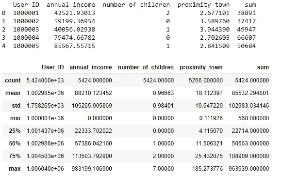

Figure 3.2 Customer dataset

**合并数据集**

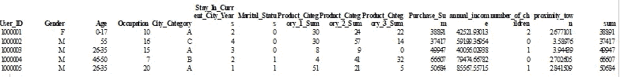

Figure 3.3 Merged Dataset

附录 1 特征直方图显示了变量直方图分布。

**变量格式**
接下来，我们通过创建虚拟变量，将分类特征(性别、城市类别)、二进制(婚姻状况、职业)和入库变量(在当前城市停留的年份、年龄)转化为数字格式。我们还删除了用户 id，因为它对回归没有帮助。

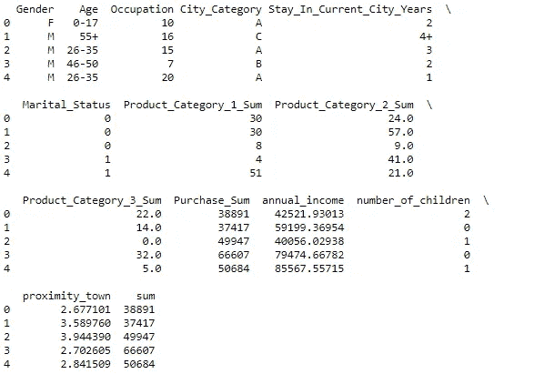

Figure 3.4 Dataset Before Format Correction

**最终预处理**
自变量 proximity_town 有 158 个缺失值。我们用平均值代替缺失值。LocalOutlierFactor 算法使用 20 个邻居和 5%的污染作为参数来识别异常值。

## 3.3 转型

**规格化**
我们变换规格化‘职业’，‘购买 _ 总和’，‘年收入’，
，‘子女数量’，‘邻近 _ 城镇’，‘总和’。

Figure 3.5 Normalised Dataset

## 3.4 建模方法

Photo by [Enayet Raheem](https://unsplash.com/@raheemsphoto?utm_source=unsplash&utm_medium=referral&utm_content=creditCopyText) on [Unsplash](https://unsplash.com/s/photos/regression?utm_source=unsplash&utm_medium=referral&utm_content=creditCopyText)

我们使用一个简单的线性回归模型来预测连续变量，捕捉变量之间的关系接近城镇和年收入分别。

# 4 个结果

离城镇近不是一个好的预测。随着不同的邻近值，预测线几乎保持水平。对于具有较低接近度的较低值，误差异常高。

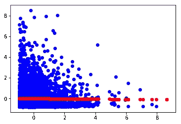

Figure 4.1 proximity_town SLR

从图 4.2 年收入单反可以看出，即使没有额外的功能或进一步的改造，年收入似乎也与销量有很强的线性关系。

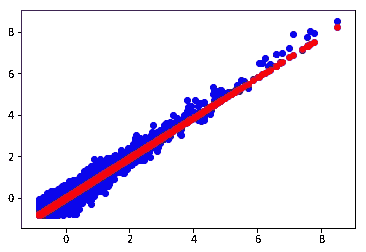

Figure 4.2 annual income SLR

# 5 讨论

如果没有进一步的转化，邻近性本身并不是一个好的预测因子。对数变换、多项式变换或包含变量的新特征创建(例如，神经网络节点或与另一个变量的手动乘法)可能会使该特征更有用。

年收入将是预测客户销售量的一个强有力的预测因素。
除了使用 SLR 模型进行预测，该公司还可以利用这种洞察力更深入地挖掘以下问题:

Photo by [irfan hakim](https://unsplash.com/@journeysia?utm_source=unsplash&utm_medium=referral&utm_content=creditCopyText) on [Unsplash](https://unsplash.com/s/photos/income?utm_source=unsplash&utm_medium=referral&utm_content=creditCopyText)

除了可支配收入，为什么低收入客户的产品销量较低？对价格敏感的客户可能得不到充分的服务吗？是否有机会推出更多预算友好的利基产品？我们如何利用这些见解来策划我们的营销活动？
收入变量是否与能够更好地解释客户行为的其他人口统计变量相关？多元线性回归，一个高度可解释的模型，可以帮助回答这个问题。我们可以解释系数，并进一步深入了解细分市场，以设计新产品。

# 6 结论

我们合并了来自交易的数据，客户数据集争论并转换了数据。然后我们回答了能否建立一个性能良好的模型来预测客户销售的问题。答案是肯定的。使用年收入作为预测值的简单线性回归，我们可以直观地看到回归线紧紧跟随数据点。

在深度学习风靡一时的时代，看到只有一个变量的线性回归如此有效令人耳目一新。计算成本低且高度可解释。在构建一个更需要数据的复杂算法并收集更多数据来支持它之前，也许应该停下来思考一下。一个简单的模型能形成一个强有力的起点并完成这个应用程序的工作吗？如果不能，至少我们可以用它来探索和解释变量和预测值之间的关系，这可以辅助特征选择，了解不同维度之间的真实世界关系，更糟的是有一个基准。我们先不要放弃旧的线性回归！

未来方向
我们需要将数据集分为训练集、验证集和测试集，以微调超参数并报告未知数据的预测性能。我们可以扩展模型以包含更多的特征来捕捉数据中存在的更多差异。

# 附录

## 附录 1:特征分布直方图

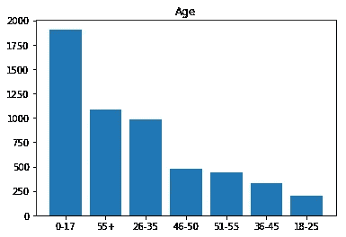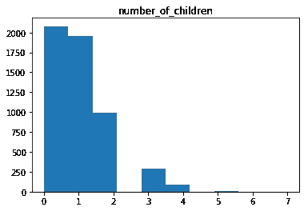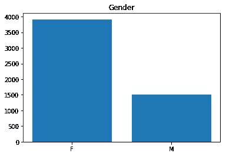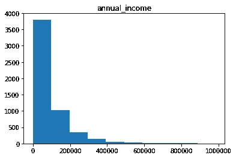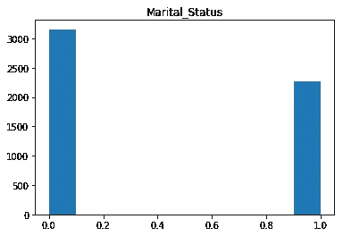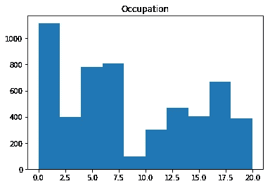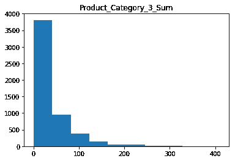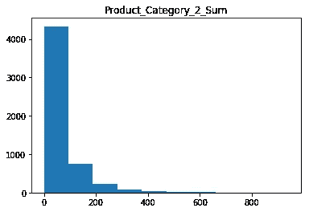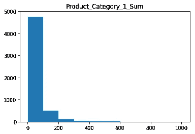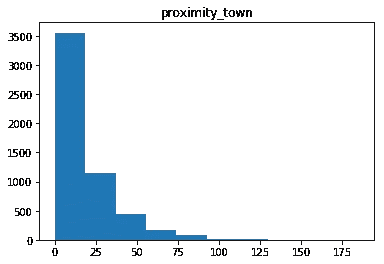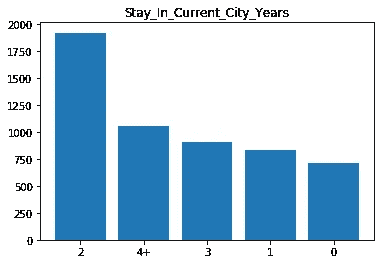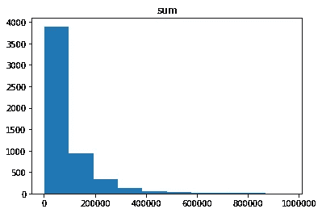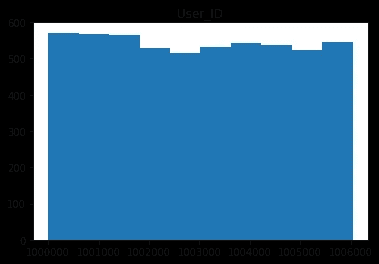

## 附录 2:参考文献

该案例研究是*使用 Python 进行预测分析简介
爱丁堡大学使用 Python MicroMasters 进行预测分析项目的一部分*

*版权所有 2021 Schwarzwald_AI*