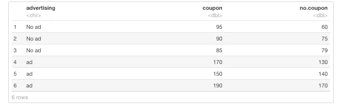
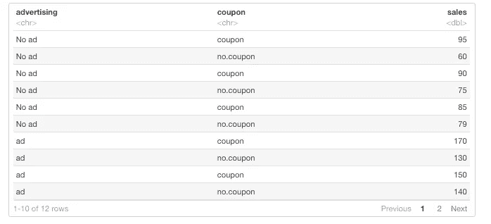
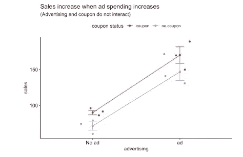
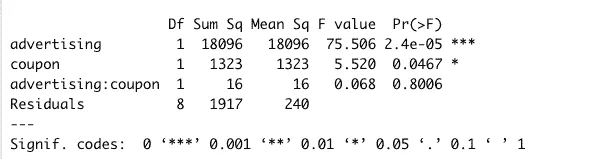
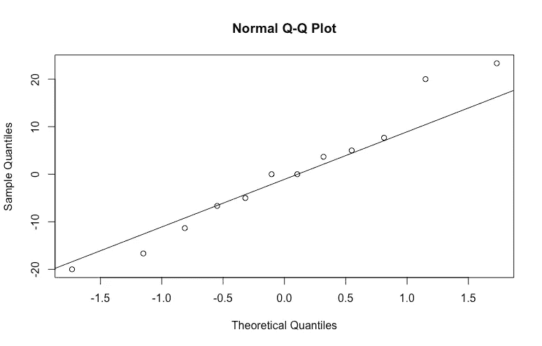
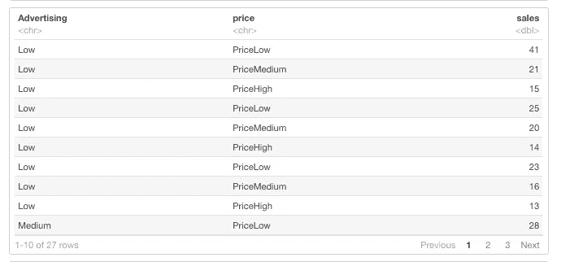
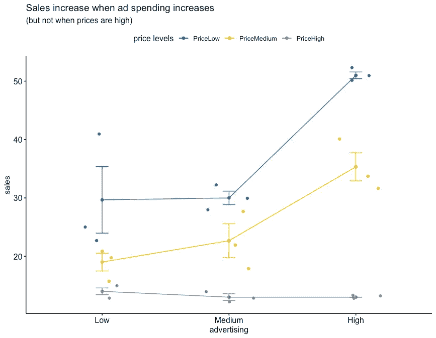
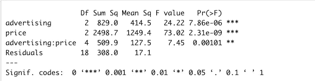

# R 中如何用双向方差分析进行预测

> 原文：<https://medium.com/mlearning-ai/how-to-forecast-with-two-way-anova-in-r-33d1c09790b3?source=collection_archive---------0----------------------->

预测工具箱中的强大统计技术


Photo by [Aaron Doucett](https://unsplash.com/@adoucett?utm_source=medium&utm_medium=referral) on [Unsplash](https://unsplash.com?utm_source=medium&utm_medium=referral)

在之前的一篇[文章](/mlearning-ai/how-use-one-way-anova-for-forecasting-in-r-908bb1b5b4d3)中，我介绍了使用 ANOVA(方差分析)进行单向 ANOVA 预测的步骤。在这种情况下，我们根据书架位置(一个因素)预测图书销售。预测取决于因素(货架位置)和结果(销售)之间是否有显著关系。

但是，如果你有两个因素呢？可以用双向方差分析进行预测(甚至三向方差分析！)，但是事情变得稍微复杂一些，因为:1)复制和 2)交互。

# 分身术

如果我们试图分析两个因素(x)对一个(y)变量的影响，需要对两个因素(x)的每个组合观察相同的次数(称为 k)。

如果 **k = 1** ，则称为双向**无**复制。例如，如果我们试图确定两个因素(如销售区域或销售代表)是否影响销售，我们只能将一个销售代表的**与一个销售区域的**配对。这也称为随机区组设计。

如果 **k > 1** ，那么就是双向方差分析**与**复制。如果我们想知道广告和价格是否影响产品销售，我们可以观察所有广告和价格水平的产品销售。

> **方差分析复制场景** (k =次数)
> 
> k = 1
> 无复制
> 
> K > 1
> 带复制 T20

# 互动

对于我们感兴趣的两个变量，我们还必须考虑它们是否相互作用。换句话说，我们感兴趣的两个变量的**组合会对我们正在观察的观察结果产生任何奇怪的影响吗？**

# 方差分析假设

像所有的统计测试一样，需要做一些假设来确保我们可以进行方差分析。这些假设是:

1.数据来自随机样本
2。观察是独立的。正态分布的底层数据
4。方差的同质性

然而，我们 ***真正关心的是*** 方差分析对预测有效的是**残差**或预测误差(实际销售额—预测销售额)正态分布，并且每组残差的**方差**相同。

同样，让我们为双向方差分析定义零假设和替代假设:

> H₀ —系数 a 的平均值相等
> Ha —系数 a 的平均值不同
> 
> H₀ —因子 b 的平均值相等
> Ha —因子 b 的平均值不同
> 
> h₀——因素 a 和因素 b 之间没有相互作用——因素 a 和因素 b 之间有相互作用

# 分析:带复制场景的双向方差分析

广告和优惠券会影响销售吗？我们将预测花生酱销售额(y ),广告和优惠券作为我们的独立变量或因素(x)。这个分析假设只有广告和优惠券会影响销售。

让我们来看看数据集。



Wide dataset. Image by author.

我们有 3 栏:1)广告 2)优惠券和 3)没有优惠券。我们的优惠券栏有我们的单位销售数据。但是，我们需要使用 pivot_longer()函数将宽数据集转换成长数据集，以便进行进一步的分析。

```
#Pivot data from wide to long dataset
(peanutbutter_long <- peanutbutter %>% 
  pivot_longer(!advertising, names_to = "coupon", values_to = "sales"))
```



Long dataset. Image by author.

让我们使用 ggpubr 包中的 ggline()来可视化我们的销售数据。



Peanut butter sales by advertising and coupon status. Image by author.

现在我们使用 aov()函数完成双向方差分析。在这里，我们通过广告和优惠券的主要效果以及广告和优惠券之间的相互作用来测试销售额。

```
two_way_aov <- aov(sales ~ advertising*coupon, data = peanutbutter_long)#The anova table
summary(two_way_aov)
```



ANOVA summary table. Image by author.

广告非常重要(p 值小于 0.001)，而优惠券非常重要(p 值为 0.0467)。*广告:优惠券*变量没有显示交互作用，因为 p 值非常大，为 0.8006。这意味着广告和优惠券独立影响销售。由于我们的两个因素之间没有相互作用，那么我们的预测将是:

> 预测销售额=总体平均值+因素 A 影响(如果显著)+因素 B 影响(如果显著)。

**注意:**如果一个因子**不显著**，那么该因子效应被假定为 **0** 。

## 模型诊断

可以使用核密度图绘制残差，但是如果数据集很小，使用分位数-分位数图(qq 图)可能更有用。如果数据呈正态分布，观察值应该落在对角线上。



QQ plot of the ANOVA residuals. Image by author.

这张 QQ 图清楚地表明，我们有一些观察值沿着偏离直线的尾部，这意味着我们的数据有一点偏斜。由于大多数观察值都落在对角线上，我认为我们在这里很好，点预测应该可以很好地使用，尽管预测区间可能相当宽。

## 我们在销售方面能期待什么？(在这里，我根据每个因素级别创建了一个平均销售额表)

与没有广告相比，有广告往往会增加 78(158.33–80.67)的销售额。优惠券往往比没有优惠券的销售额增加 21(130–109)。

## 当既有广告又有优惠券的时候，我们在销售上能期待什么呢？

首先，计算整体平均值。

```
#Calculate the overall average
overall_avg <- mean(peanutbutter_long$sales)
paste("The overall sales average is", overall_avg, sep=" ")**Output:** **The overall sales average is 119.5**
```

第二，计算广告效果(有广告减去无广告)。

```
#Calculate advertising effect
adv_effect <- (158.33 - 80.67)
```

接下来，计算优惠券效应(有优惠券减去无优惠券)。

```
#Calculate coupon effect
coupon_effect <- (130 - 109)
```

最后计算预测值。

```
#Calculate Forecast:
predicted_sales <- overall_avg + adv_effect + coupon_effectpaste("Forecast when there is both advertising and a coupon is:", predicted_sales, sep = " "**Output:  Forecast when there is both advertising and a coupon is: 218.16**
```

# 如果有交互效应呢？


Photo by [Adam Mills](https://unsplash.com/@mills_digital_imaging?utm_source=medium&utm_medium=referral) on [Unsplash](https://unsplash.com?utm_source=medium&utm_medium=referral)

这是一个有交互作用的数据集的例子。我们有几周的视频游戏销售额(y ),广告和价格是我们的独立变量或因素(x)。



Games dataset long. Image by author.

让我们想象一下这个数据集:



Game sales by advertising and price levels. Image by author.

x 轴是广告，y 轴是销售额，价格水平用线条表示。

为了解释这是怎么回事，我们先来看看这条灰线。灰色线代表所有广告级别的高价格水平(x 轴),该线与所有广告级别相当平行。当我们从中等广告转向高广告时，黄色(中等价格水平)和蓝色(低价格水平)线都显示销售增加。这张图表清楚地表明，当广告支出增加时(蓝线和黄线)，销售额会增加**，但当价格高时**不会增加**(灰线)。**

现在我们使用 aov()函数完成双向方差分析。在这里，我们通过广告和价格的主要效应，加上广告和价格之间的相互作用来测试销售。

```
aov(sales ~ advertising*price, data = games_long)
```

汇总输出:



ANOVA output. Image by author.

由于**互动**(广告*价格)的 p 值非常小(显著的互动效应)，我们可以预测任何价格和广告组合的销售额，等于具有该因素水平组合的观察值的平均值。

## 销售方面我们能期待什么？

Games dataset forecast. Image by author.

如果我们想预测广告和价格较低时的销售额，根据我们的表，预测值将是 29.67。如果广告高，价格低，预测将是 51。

剩下要做的就是检查我们预测的残差是否有效。

# **关键要点**

我们可以使用双向方差分析(有或没有重复)来预测的预测方程如下:

> 预测值=总体平均值+因素 A 影响(如果显著)+因素 B 影响(如果显著)

如果因子**不显著**，则因子效应被假定为 0。

对于双因素方差分析(带复制)，如果交互作用效应**显著**，则预测值为响应变量(y)的值等于具有该因子水平组合的所有观察值的平均值。如果交互作用的影响**不显著**，您可以继续进行分析，就好像这是一个没有重复情况的双向方差分析。

如果您的数据中存在季节性，您可以加入季节性并进行双向方差分析进行预测。

代码和所有数据集可以在下面的 Github 和 RPubs 上找到:

1.  使用 R 中的双向方差分析进行预测—有复制但无交互[Github](https://github.com/bonheurgirl/Forecasting-in-R/blob/main/Forecasting%20with%20Two-way%20ANOVA%20in%20R%20-%20With%20replication%20and%20no%20interaction.Rmd)RPubs
2.  使用 R 中的双向方差分析进行预测—当没有交互时[Github](https://github.com/bonheurgirl/Forecasting-in-R/blob/main/Forecasting%20with%20Two-way%20ANOVA%20in%20R%20%20-%20When%20interaction%20is%20absent.Rmd)RPubs
3.  使用 R 中的双向 ANOVA 进行预测—当存在交互时 [Github](https://github.com/bonheurgirl/Forecasting-in-R/blob/main/Forecasting%20with%20Two-way%20ANOVA%20in%20R%20-%20When%20interaction%20present.Rmd) [RPubs](https://rpubs.com/anitaowens/forecast-two-way-interaction)

# 参考

[1]温斯顿 W. L. (2014 年)。营销分析:微软 Excel 的数据驱动技术。607–617.威利。

[2] Hyndman，R. J .，Athanasopoulos，George (2021 年)。[预测原理与实践。第三版。](https://otexts.com/fpp3/)

[](/mlearning-ai/mlearning-ai-submission-suggestions-b51e2b130bfb) [## Mlearning.ai 提交建议

### 如何成为 Mlearning.ai 上的作家

medium.com](/mlearning-ai/mlearning-ai-submission-suggestions-b51e2b130bfb)