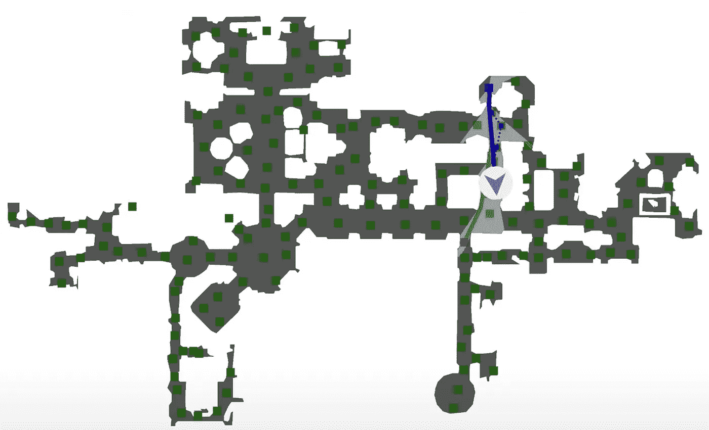

# 如何从文本描述生成 3D 场景

> 原文：<https://medium.com/mlearning-ai/how-to-generate-3d-scenes-from-text-descriptions-2345bfb321?source=collection_archive---------0----------------------->

## [机器学习艺术](https://mlearning.substack.com/p/how-does-a-diffusion-model-work?r=z7zu8&s=w&utm_campaign=post&utm_medium=web)

## 一个机器学习架构师| Github:源代码

[https://mlearning.substack.com](https://mlearning.substack.com)

## 3D 内容创作

一种新的方法，使新的任务，如从文本描述生成三维场景
。

*   【2022 年 8 月— AI 美工工具更新可以 …