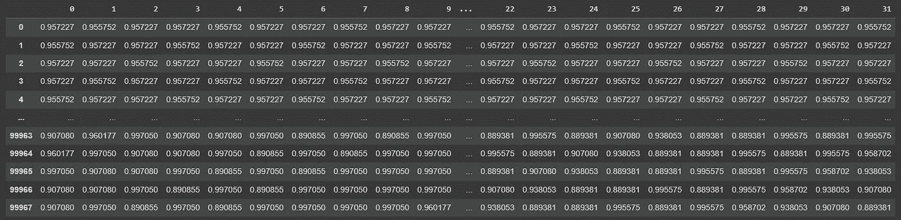
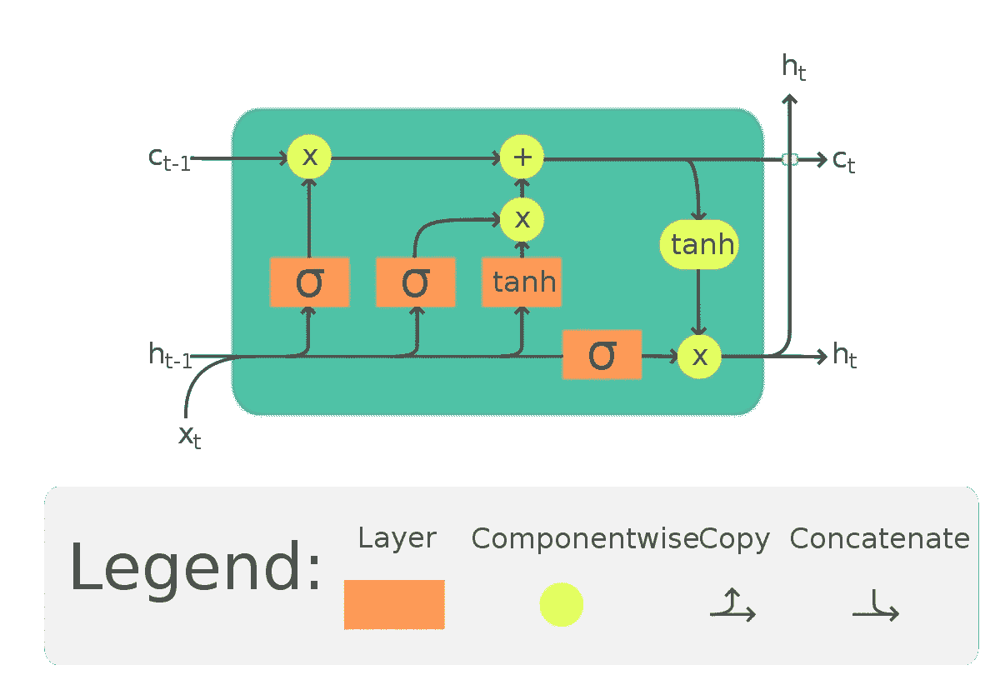
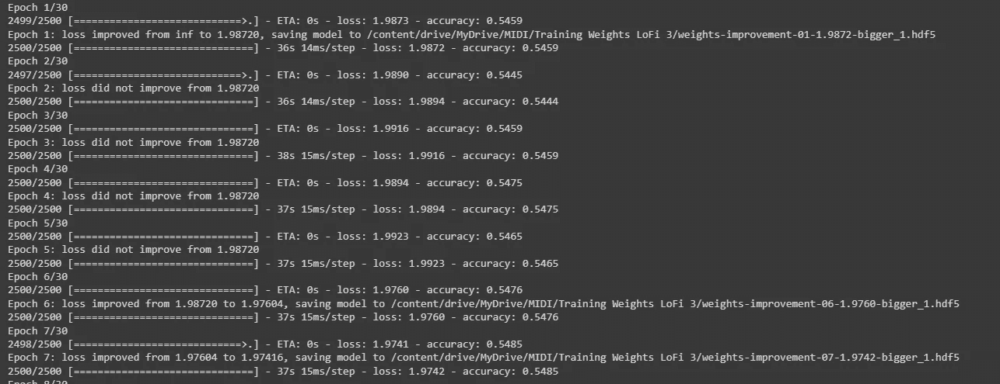
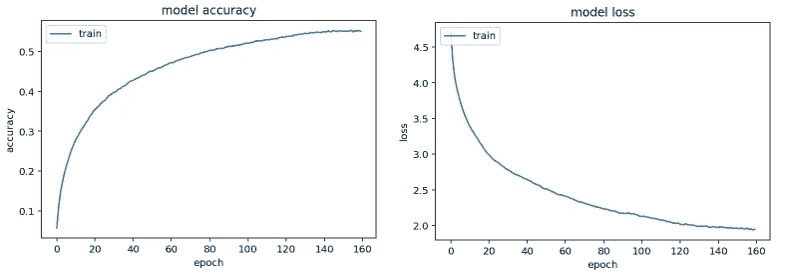
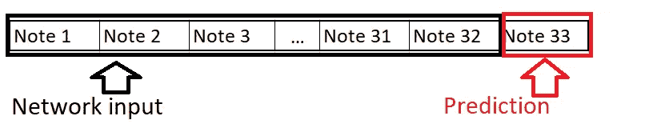
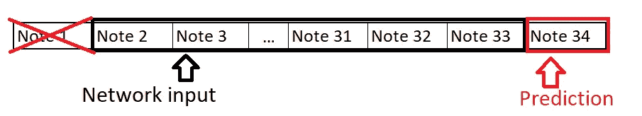
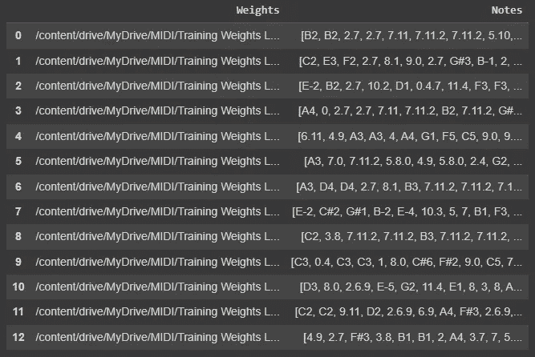

# 如何使用机器学习生成音乐

> 原文：<https://medium.com/mlearning-ai/how-to-generate-music-using-machine-learning-72360ba4a085?source=collection_archive---------4----------------------->

曾经想用 Python 和机器学习生成音乐吗？下面就来看看我们怎么做吧！


Photo by [Namroud Gorguis](https://unsplash.com/@namroud?utm_source=medium&utm_medium=referral) on [Unsplash](https://unsplash.com?utm_source=medium&utm_medium=referral)

作为一名音乐爱好者和数据科学家，我一直想知道是否有办法将音乐和机器学习结合起来，创造出人工智能生成的音乐。嗯，有！有几种方法来处理这个主题，一种方法是使用序列模型(如 GRU 或 LSTM ),并基于 n 个先前的序列创建音符和/或和弦的序列。另一种方法是将原始音频处理成可训练的 VAE(可变自动编码器),并让它输出不同的声音。

我们将在本文中使用前者，以后再尝试后者。

为此，我们将需要一个巨大的音乐数据集(最好都属于一个特定的音乐流派或类似的)，以馈入我们的序列模型，这样我们就可以尝试重新创建一些歌曲，或创建我们自己的歌曲。

在这个项目中，我们将使用 LoFi 风格。我发现了一个充满 LoFi 片段的伟大数据集，它将帮助我们获得我们想要的 LoFi 声音。这个数据集来自 [Kaggle](https://www.kaggle.com/datasets/zakarii/lofi-hip-hop-midi) 和其他几个来源。

现在我们已经获得了充满 MIDIs 的数据集，我们如何将它转化为机器可读的数据呢？我们将使用 music21 将我们充满 MIDIs 的数据集转换成音符和和弦序列的列表。

首先，我们需要获取存储 MIDIs 的目录

```
from pathlib import Path

songs = []
folder = Path('insert directory here')
for file in folder.rglob('*.mid'):
  songs.append(file)
```

或者，我们可以使用整个 MIDIs 列表的一个子集来使训练更加容易和快速(尽管如果我们这样做，我们可能不会得到更好的结果)

```
import random
# Get a subset of 1000 songs
result =  random.sample([x for x in songs], 1000)
```

现在我们有了一个 MIDI 歌曲的路径列表，我们必须将它转换成一系列的音符/和弦，所有的音符/和弦都集中在一个称为音符的列表中。

```
from music21 import converter, instrument, note, chord
notes = []
for i,file in enumerate(result):
    print(f'{i+1}: {file}')
    try:
      midi = converter.parse(file)
      notes_to_parse = None
      parts = instrument.partitionByInstrument(midi)
      if parts: # file has instrument parts
          notes_to_parse = parts.parts[0].recurse()
      else: # file has notes in a flat structure
          notes_to_parse = midi.flat.notes
      for element in notes_to_parse:
          if isinstance(element, note.Note):
              notes.append(str(element.pitch))
          elif isinstance(element, chord.Chord):
              notes.append('.'.join(str(n) for n in element.normalOrder))
    except:
      print(f'FAILED: {i+1}: {file}')
```

(我们暂时不要忘记 music21！我们稍后将再次使用它)在将所有歌曲处理成一个列表(音符/和弦序列)后，我们最好保存这个列表以供将来运行。

```
import pickle
with open('notes', 'wb') as filepath:
  pickle.dump(notes, filepath)
```

我们现在保存的列表如下所示

```
>>> ['C2', 'A4', 'F1', 'F1', ..., '0.6', '0.4.7']
```

我们现在必须将它转换成我们的机器可以读取的东西(在我们的例子中，我们的序列模型接受从 0 到 1 的数字)。为此，我们将使用一个处理函数，将我们的笔记分成 n 个序列+ 1 列数据的块。在我们的例子中，在我们对第 33 个音符/和弦进行预测之前，我们将使用 32 个音符/和弦的 n _ 序列。我在整个代码中添加了一些注释，这样我们就可以跟上了

```
def prepare_sequences(notes, n_vocab):
    """ Prepare the sequences used by the Neural Network """
    sequence_length = 32

    # Get all unique pitchnames
    pitchnames = sorted(set(item for item in notes))
    numPitches = len(pitchnames)

     # Create a dictionary to map pitches to integers
    note_to_int = dict((note, number) for number, note in enumerate(pitchnames))

    network_input = []
    network_output = []

    # create input sequences and the corresponding outputs
    for i in range(0, len(notes) - sequence_length, 1):
        # sequence_in is a sequence_length list containing sequence_length notes
        sequence_in = notes[i:i + sequence_length]
        # sequence_out is the sequence_length + 1 note that comes after all the notes in
        # sequence_in. This is so the model can read sequence_length notes before predicting
        # the next one.
        sequence_out = notes[i + sequence_length]
        # network_input is the same as sequence_in but it containes the indexes from the notes
        # because the model is only fed the indexes.
        network_input.append([note_to_int[char] for char in sequence_in])
        # network_output containes the index of the sequence_out
        network_output.append(note_to_int[sequence_out])

    # n_patters is the length of the times it was iterated 
    # for example if i = 3, then n_patterns = 3
    # because network_input is a list of lists
    n_patterns = len(network_input)

    # reshape the input into a format compatible with LSTM layers
    # Reshapes it into a n_patterns by sequence_length matrix
    print(len(network_input))

    network_input = numpy.reshape(network_input, (n_patterns, sequence_length, 1))
    # normalize input
    network_input = network_input / float(n_vocab)

    # OneHot encodes the network_output
    network_output = np_utils.to_categorical(network_output)

    return (network_input, network_output)

n_vocab = len(set(notes))
network_input, network_output = prepare_sequences(notes,n_vocab)
n_patterns = len(network_input)
pitchnames = sorted(set(item for item in notes))
numPitches = len(pitchnames)
```

让我们看看，如果我们把网络输入转换成一个 *nxm* 矩阵，然后再转换成一个数据帧，它会是什么样子



DataFrame for network_input

如果数据集碰巧不平衡，没关系，不是每个音符/和弦都一样频繁，但我们可能会遇到这样的情况，一个音符出现 4000 多次，而另一个音符只出现一次。我们可以尝试对数据集进行过采样，但这并不总是产生最佳结果，但可能值得一试。对于我们的例子，我们不会过采样，因为我们的数据集是平衡的。

```
def oversample(network_input,network_output,sequence_length=15):

  n_patterns = len(network_input)
  # Create a DataFrame from the two matrices
  new_df = pd.concat([pd.DataFrame(network_input),pd.DataFrame(network_output)],axis=1)

  # Rename the columns to numbers and Notes
  new_df.columns = [x for x in range(sequence_length+1)]
  new_df = new_df.rename(columns={sequence_length:'Notes'})

  print(new_df.tail(20))
  print('###################################################')
  print(f'Distribution of notes in the preoversampled DataFrame: {new_df["Notes"].value_counts()}')
  # Oversampling
  oversampled_df = new_df.copy()
  #max_class_size = np.max(oversampled_df['Notes'].value_counts())
  max_class_size = 700
  print('Size of biggest class: ', max_class_size)

  class_subsets = [oversampled_df.query('Notes == ' + str(i)) for i in range(len(new_df["Notes"].unique()))] # range(2) because it is a binary class

  for i in range(len(new_df['Notes'].unique())):
    try:
      class_subsets[i] = class_subsets[i].sample(max_class_size,random_state=42,replace=True)
    except:
      print(i)

  oversampled_df = pd.concat(class_subsets,axis=0).sample(frac=1.0,random_state=42).reset_index(drop=True)

  print('###################################################')
  print(f'Distribution of notes in the oversampled DataFrame: {oversampled_df["Notes"].value_counts()}')

  # Get a sample from the oversampled DataFrame (because it may be too big, and we also have to convert it into a 3D array for the LSTM)
  sampled_df = oversampled_df.sample(n_patterns,replace=True) # 99968*32 has to be equals to (99968,32,1)

  print('###################################################')
  print(f'Distribution of notes in the oversampled post-sampled DataFrame: {sampled_df["Notes"].value_counts()}')

  # Convert the training columns back to a 3D array
  network_in = sampled_df[[x for x in range(sequence_length)]]
  network_in = np.array(network_in)
  network_in = np.reshape(networkInput, (n_patterns, sequence_length, 1))
  network_in = network_in / numPitches
  print(network_in.shape)
  print(sampled_df['Notes'].shape)
  # Converts the target column into a OneHot encoded matrix
  network_out = pd.get_dummies(sampled_df['Notes'])
  print(network_out.shape)

  return network_in,network_out

networkInputShaped,networkOutputShaped = oversample(networkInput,networkOutput,sequence_length=seqLength)
networkOutputShaped = np_utils.to_categorical(networkOutput)
```

既然我们已经处理完了我们的歌曲，我们现在继续训练我们的模型。但首先，回顾一下我们迄今为止所做的工作，我们有:

*   收集了我们的 MIDI 文件
*   将 MIDI 文件加载到内存中
*   将 MIDI 文件转换为有序音符/和弦列表
*   将列表转换成一个(n，m，1)矩阵和(n，1)向量(n = 99968，m = 32)

对于我们的模型，我们将使用 LSTM 网络来预测第 33 个音符/和弦，同时考虑到我们之前的 32 个音符/和弦。我们将使用 LSTMs，因为它的反馈连接。它们在处理有序数据时非常有用。

LSTMs 是一种递归神经网络，但不同于其他网络。其它网络在每次条目接收到新信息时重复该模块。然而，LSTM 会更长时间地记住问题，并具有类似字符串的结构来重复模块。

LSTM 基本上是如下所示的单位:



Image taken from [https://en.wikipedia.org/wiki/Long_short-term_memory](https://en.wikipedia.org/wiki/Long_short-term_memory)

LSTM 单元由单元、输入门、输出门和遗忘门组成。让我们看看这意味着什么，以及为什么 LSTMs 适合于顺序数据。

遗忘门的工作是决定是保留还是遗忘信息。sigmoid 函数仅保留来自先前隐藏层和当前输入的信息。任何接近 1 的值都会保留，任何接近 0 的值都会消失。

输入门有助于更新单元的状态。当前输入和先前状态信息通过 *sigmoid* 函数传递，该函数将通过将该值乘以 0 和 1 来更新该值。同样，为了规范网络，数据也要通过 *tanh* 函数。现在，*的输出与*的输出相乘。 *sigmoid* 的输出将识别有价值的信息以避免 *tanh* 的输出。**

输出门决定下一个隐藏状态的值。为了找到隐藏的状态信息，我们需要将 *sigmoid* 输出乘以 *tanh* 输出。现在，新的隐藏状态和新的单元格状态将进入下一步。

训练 LSTM 网络时，需要使用 GPU。在我的例子中，我在训练神经网络时使用了 Google Colab Pro。当我们用 GPU 训练时，Google Colab 对我们可以使用的计算单位有一个设定的限制。您可以使用免费的 GPU 进行几十次更新。

```
model = Sequential()
model.add(Dropout(0.2))
model.add(LSTM(
    512,
    input_shape=(networkInputShaped.shape[1], networkInputShaped.shape[2]),
    return_sequences=True
))
model.add(Dense(256))
model.add(Dense(256))
model.add(LSTM(512, return_sequences=True))
model.add(Dense(256))
model.add(LSTM(512))
#model.add(Dense(numPitches))
model.add(Dense(numPitches))
model.add(Activation('softmax'))
model.compile(loss='categorical_crossentropy', optimizer='rmsprop', metrics=['accuracy'])
```

确保通过以下回调保存每一次重量提升:

```
num_epochs = 100

filepath = "weights-improvement-{epoch:02d}-{loss:.4f}-bigger_1.hdf5"
checkpoint = ModelCheckpoint(
    filepath, monitor='loss', 
    verbose=1,        
    save_best_only=True,        
    mode='min'
)    
callbacks_list = [checkpoint]

history = model.fit(networkInputShaped, networkOutputShaped, epochs=num_epochs, batch_size=64, callbacks=callbacks_list)
```



训练网络 100 次以上会产生最好的结果。

下图显示了训练神经网络的结果。



Graph on the left shows the accuracy in relation to the epochs. Graph on the right shows the loss in relation to the epochs.

训练完我们的网络后，我们该做什么？我们从 0 到网络输入的长度中选择一个随机数，这将是训练矩阵中行的索引，我们将使用它来进行预测。我们将这 32 个音符/和弦的序列作为起点来预测 1 个音符。在这之后，我们做这个*(n-1)*更多次(在这个例子中 n 是 500)。在每个预测中，我们将 32 个音符/和弦的窗口向右移动一个元素。换句话说，在第二个预测中，一旦我们预测了一个音符/和弦，我们就消除第一个音符，并且我们的第一个预测成为长度为 32 的序列中的最后一个音符/和弦。下图显示了之前解释的代码



Illustration sequence of the first prediction



Illustration sequence of the second prediction

```
def generate_notes(model, network_input, pitchnames, n_vocab):
    """ Generate notes from the neural network based on a sequence of notes """
    # pick a random sequence from the input as a starting point for the prediction
    # Selects a random row from the network_input
    start = numpy.random.randint(0, len(network_input)-1)
    print(f'start: {start}')
    int_to_note = dict((number, note) for number, note in enumerate(pitchnames))

    # Random row from network_input
    pattern = network_input[start]
    prediction_output = []

    # generate 500 notes
    for note_index in range(500):
        # Reshapes pattern into a vector
        prediction_input = numpy.reshape(pattern, (1, len(pattern), 1))
        # Standarizes pattern
        prediction_input = prediction_input / float(n_vocab)

        # Predicts the next note
        prediction = model.predict(prediction_input, verbose=0)

        # Outputs a OneHot encoded vector, so this picks the columns
        # with the highest probability
        index = numpy.argmax(prediction)
        # Maps the note to its respective index
        result = int_to_note[index]
        # Appends the note to the prediction_output
        prediction_output.append(result)

        # Adds the predicted note to the pattern
        pattern = numpy.append(pattern,index)
        # Slices the array so that it contains the predicted note
        # eliminating the first from the array, so the model can
        # have a sequence
        pattern = pattern[1:len(pattern)]

    return prediction_output

n_vocab = len(set(allNotes))
pitchnames = sorted(set(item for item in allNotes))
prediction_output = generate_notes(model, networkInputShaped, pitchnames, n_vocab)
```

这样，我们就生成了 500 个音符的输出序列，看起来像这样

```
>>> ['B2', 'B2', 2.7, ..., 5.10]
```

我们如何将这个音符/和弦数组转换回 MIDI？这就是 music21 重新发挥作用的地方！这个库不仅可以让我们将 MIDI 转换成数组，还可以让我们将数组转换回 MIDI！

```
def create_midi(prediction_output):
    offset = 0
    output_notes = []

    # create note and chord objects based on the values generated by the model
    for pattern in prediction_output:
        # pattern is a chord
        if ('.' in pattern) or pattern.isdigit():
            notes_in_chord = pattern.split('.')
            notes = []
            for current_note in notes_in_chord:
                new_note = note.Note(int(current_note))
                new_note.storedInstrument = instrument.Piano()
                notes.append(new_note)
            new_chord = chord.Chord(notes)
            new_chord.offset = offset
            output_notes.append(new_chord)
        # pattern is a note
        else:
            new_note = note.Note(pattern)
            new_note.offset = offset
            new_note.storedInstrument = instrument.Piano()
            output_notes.append(new_note)

        # increase offset each iteration so that notes do not stack
        offset += 0.5
    midi_stream = stream.Stream(output_notes)
    midi_stream.write('midi', fp='output.mid')
```

这就是我们作为 MIDI 的预测输出！现在你只需要把它导入你的 DAW，看看它听起来是什么样的！我建议我们应该对模型进行微调，并对其进行试验，看看我们能生产出什么。我在其中一个预测中加入了一些环境噪音和鼓声，结果如下:

可选:在训练神经网络时，每个时期都会产生一组不同的权重，在音乐生成中，每组权重都会产生不同的结果(不同的音符/和弦序列)，因此最好跟踪每个权重。

现在，我们可以更进一步，检查所有先前保存的权重的预测。首先，让我们获取存储权重的位置，并遍历该文件夹:

```
songs = []
folder = Path('Training Weights LoFi')
for file in folder.rglob('*.hdf5'):
  songs.append(file)
```

然后，遍历每个. hdf5，获得预测序列，然后将其存储到 DataFrame 中，以列作为权重的位置，并输出序列。

```
songsList = []
weightsList = []
for i in range(len(songs)):
  try:
    model.load_weights(songs[i])
    prediction_output = generate_notes(model, networkInputShaped, pitchnames, n_vocab)
    songsList.append(prediction_output)
    weightsList.append(str(songs[i]))
  except:
    pass

songs_df = pd.DataFrame({'Weights':weightsList,
                         'Notes':songsList})
```

数据帧应该是这样的:



如果你想复制你在这里看到的，这里显示的所有代码都在我的 [GitHub](https://github.com/AReyH/ai-generated-music) 中。有了这些信息，你应该能够创作自己的歌曲。如果你有，请把它们上传到某个地方，并链接到我这里，这样我就可以查看它们了！

另外，非常感谢扎卡里写了[这篇文章](https://ai.plainenglish.io/building-a-lo-fi-hip-hop-generator-e24a005d0144)，这也是我获得灵感的地方。

一如既往，感谢您抽出时间阅读本文。我希望你今天学到了一些东西！

[](/mlearning-ai/mlearning-ai-submission-suggestions-b51e2b130bfb) [## Mlearning.ai 提交建议

### 如何成为 Mlearning.ai 上的作家

medium.com](/mlearning-ai/mlearning-ai-submission-suggestions-b51e2b130bfb)