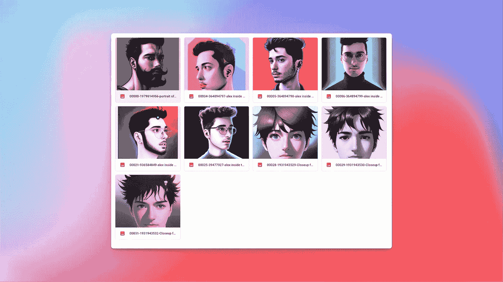

# 如何不用编码免费生成你的 AI 头像

> 原文：<https://medium.com/mlearning-ai/how-to-generate-your-ai-avatar-for-free-without-coding-b2ebfa2264a?source=collection_archive---------0----------------------->

## 快速通过稳定的扩散

随着人工智能的兴起，我们看到越来越多的用例通过 OpenAI 的倡议变得可用。

StableDiffusion 与 OpenIA 的 Dall-E 一样，是一种机器学习模型，用于从自然语言描述中生成真实感数字图像。