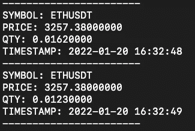
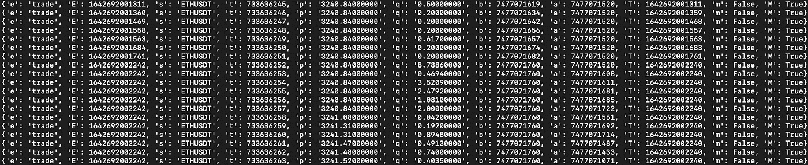

# 来自币安的实时加密数据流

> 原文：<https://medium.com/mlearning-ai/how-to-get-live-crypto-data-from-binance-7a5e5ec10de4?source=collection_archive---------0----------------------->


Photo by [JJ Ying](https://unsplash.com/@jjying?utm_source=medium&utm_medium=referral) on [Unsplash](https://unsplash.com?utm_source=medium&utm_medium=referral)

要制定交易策略，你需要大量的数据。黄牛和日交易者使用高粒度数据，所以 REST API 的性能不足以获取实时数据。

秘密在于传输高精度数据的 websocket 通信。例如，在 websocket 数据流上，我们可以获得实时交易的数据、Klines(参见:[https://medium . com/@ Gabriele . deri/how-to-download-trading-data-from-币安-with-python-21634af30195](/@gabriele.deri/how-to-download-trading-data-from-binance-with-python-21634af30195) )甚至特定符号的订单簿。

我们将使用 python 和 websocket 客户端来连接币安 Websocket 流。这同样适用于其他加密交换，只需更改端点和消息有效负载值。

你可以在这里阅读交易所文档现货、期货或保证金的 websocket 端点:[https://币安-docs . github . io/API docs/spot/en/# web socket-market-streams](https://binance-docs.github.io/apidocs/spot/en/#websocket-market-streams)

首先让我们用 pip 安装 websocket 客户端

```
pip3 install websocket-client
```

然后，我们将从文档中获取 websocket 端点，并检索某个符号的已执行交易的数据。在这个例子中，我将使用 ETHUSDT 贸易流。请记住，交易符号必须以小写形式插入 websocket 路径，而不是像 REST 请求那样以大写形式插入。

像普通函数一样调用 ws_trade()函数，wsapp.run_forever()将处理所有来自币安的消息，并显示消息。

我还创建了一个函数 handle_trades()来将收到的 json 转换成可读性更好的消息。所接收的对象中的每个键的含义在公开的币安文档上是可读的。该函数还将纪元转换为日期。在这里，我将从我的终端放一个示例 png



handle_trades()



Raw websocket message

我希望这篇文章在某些方面有所帮助。如果需要的话，请随时询问进一步的信息，并为将来要发表的文章留下建议！

[](/mlearning-ai/mlearning-ai-submission-suggestions-b51e2b130bfb) [## Mlearning.ai 提交建议

### 如何成为 Mlearning.ai 上的作家

medium.com](/mlearning-ai/mlearning-ai-submission-suggestions-b51e2b130bfb)