# 如何在 AWS 上实现一个端到端的 selenium 项目？

> 原文：<https://medium.com/mlearning-ai/how-to-implement-an-end-to-end-selenium-project-on-aws-5d92eb5b0cb2?source=collection_archive---------4----------------------->

> 学习在 EC2 上托管 selenium 代码，并使用 S3 存储输出


Photo by [Possessed Photography](https://unsplash.com/@possessedphotography?utm_source=medium&utm_medium=referral) on [Unsplash](https://unsplash.com?utm_source=medium&utm_medium=referral)

在本文中，我们做了以下事情:

1.  编写一个示例 selenium 代码，它聚合了来自 GeeksforGeeks 网站主页的机器学习介绍主题和链接，并使用 pandas 显示它。
2.  在 AWS EC2 实例上设置环境，并使用它来托管您的代码
3.  处理后，使用 S3 桶来存储您的输出(熊猫数据帧)

让我们首先编写一个样本代码，从 GeeksforGeeks 主页中提取机器学习课程的介绍主题和链接

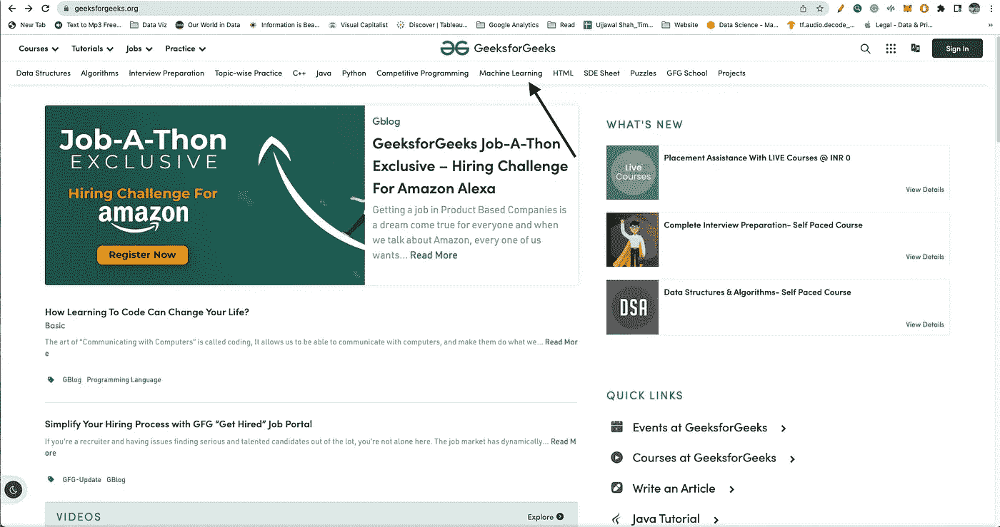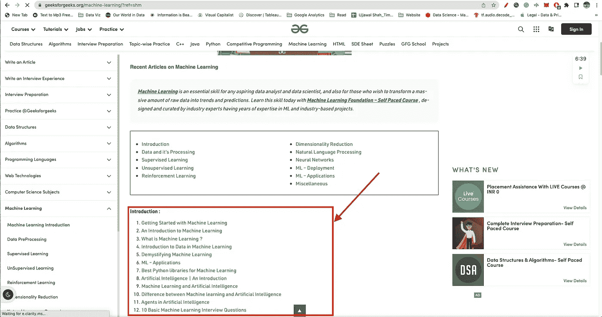

输出应该如下所示:

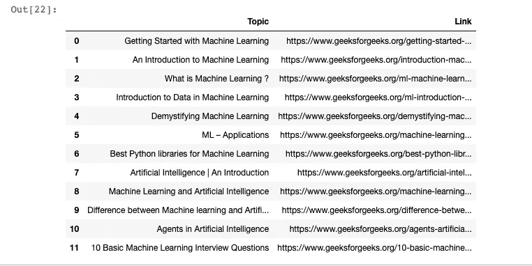

检查代码是否在您的本地上工作。仅当代码在您的本地上工作时才继续。

现在让我们继续在 AWS EC2 上设置环境。首先，确保您拥有 IAM 角色访问权限。您应该有 S3FullAccess(或至少 S3 GetObject & PutObject)策略，以及 EC2FullAccess 策略。

在 AWS 控制台上，您现在必须:

*   配置一个 ubuntu 实例，并让它在 EC2 上运行
*   在实例上配置 AWS 控制台凭据
*   在你的实例上安装谷歌浏览器和 chrome 驱动程序
*   安装 python(应该已经安装在您的实例上)
*   安装 pip 包
*   使用 pip 安装所有库
*   创建 S3 存储桶
*   最后，运行您的代码

要创建一个 ubuntu 实例，

*   去你的 AWS 控制台，在**服务**下搜索 **EC2，**并选择它
*   在左侧导航窗格中，选择**实例**
*   选择**启动实例**
*   在**名称和标签下，**写下您的实例名称。我已经写了我的 Ubuntu 实例
*   在**应用和 OS 镜像(亚马逊镜像机)下，**选择 Ubuntu 服务器。
*   保持默认的实例类型， **t2.micro.** 这个实例类型有 1 个虚拟 CPU 和 1 GiB 内存。

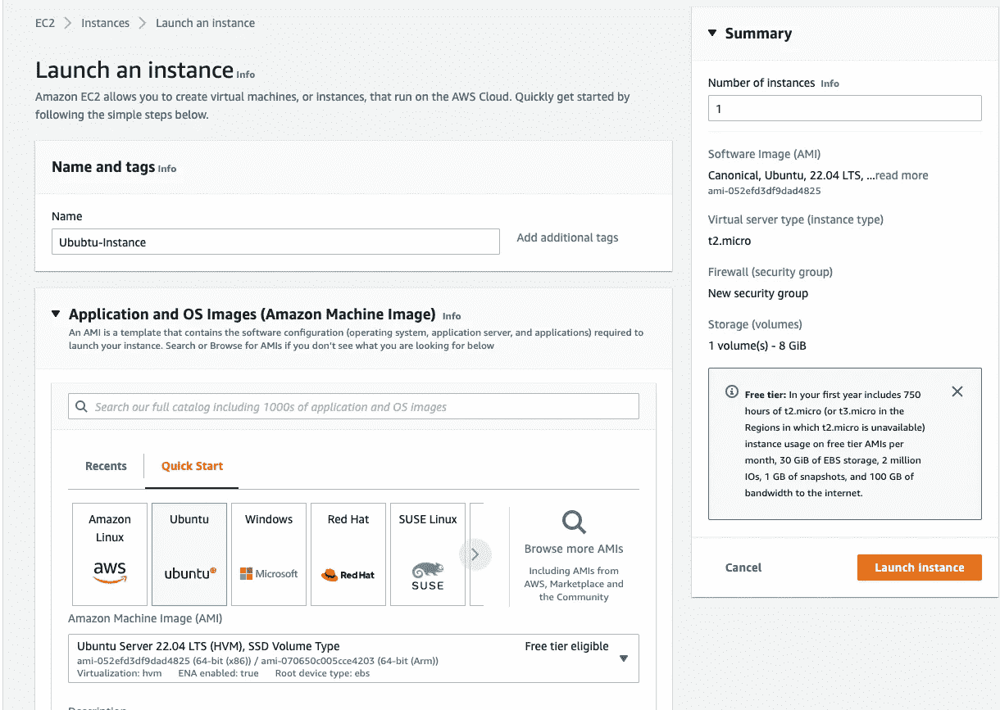

Note: The UI has been changed recently so the options might seem changed

*   现在在**密钥对(登录)下，**选择**创建新的密钥对。**

**注意:**密钥对是登录 EC2 实例的一种安全方式。如果您是第一次使用 EC2，您应该强制生成密钥对。为密钥对命名(例如:SeleniumEC2-Credentials)，然后单击 save。的。pem 会自动下载到您的本地文件夹中，然后您应该将其移动到新文件夹中。我已经把我的保存到一个名为“Medium-Selenium”的文件夹中。如果您已经有了密钥对。pem 文件，然后您也可以使用该文件登录到此实例。

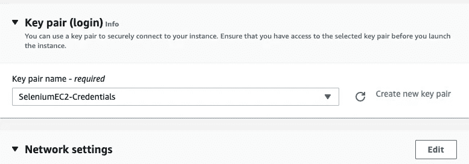

*   保持其他设置默认，选择**启动实例。**您应该看到您的实例启动了。
*   选择**查看所有实例。**实例出现在**挂起**状态，这意味着它正在被启动。然后它变成运行的**，这表明实例已经开始引导。在您可以访问实例之前，将有一小段时间。**
*   等待您的实例显示以下内容:
    **注意:**如果需要，刷新。
*   **实例状态:**运行中
*   **状态检查:** 2/2 检查通过

恭喜，您现在已经安装了一台虚拟计算机。现在让我们把这个连接到这台机器上:

*   单击实例名称旁边的复选框。并选择**连接**选项

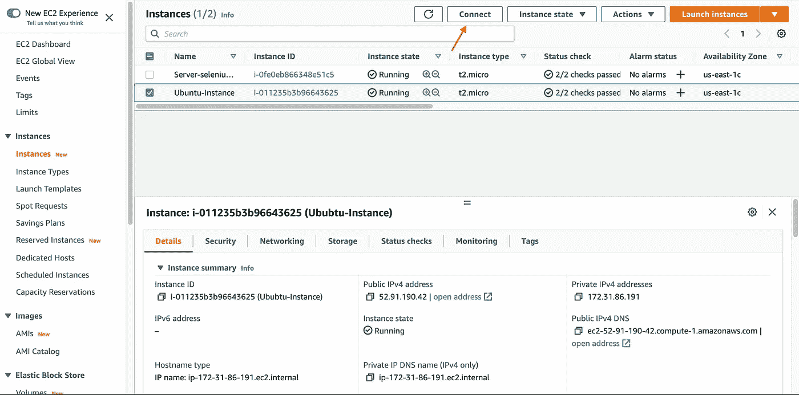

现在，您应该看到了连接到实例的方法。选择 SSH 选项卡，并遵循提供的步骤:

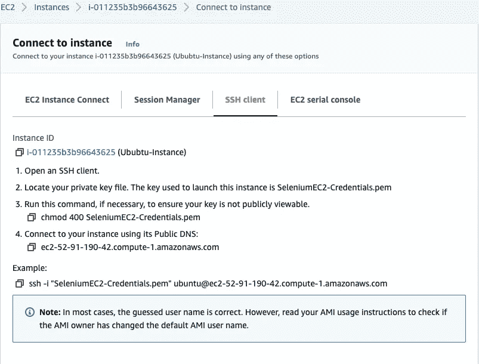

在您的终端上执行命令，并应连接到您的实例:

*   首先，在您的终端上，转到保存。pem 文件，然后执行如下所示的命令。

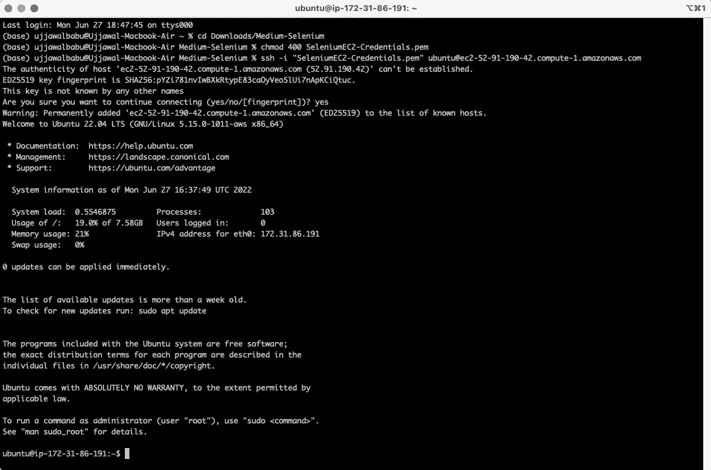

绿色 IP 表示您已成功登录到您的实例。

现在，首先，将您的 AWS 凭证配置到实例中。Aws 凭据是包含控制台用户名、密码、访问密钥 ID 和秘密访问密钥的详细信息。当您在 AWS 中创建新用户时，应该会得到它。

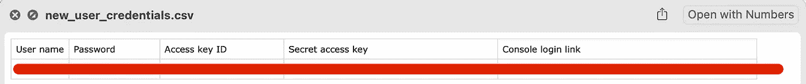

首先在您的终端中，安装 awscli，然后配置您的详细信息:

```
sudo apt install awscli #hit enter when asked
aws configure
```

键入 AWS 访问密钥和密钥。对于您的**默认区域名称**，您也可以从 URL 中看到它。


check the region from the URL


现在让我们在你的 Linux 机器上安装谷歌 chrome 和 chrome 驱动程序:

要安装 googlechrome，请在终端上点击:

```
wget [https://dl.google.com/linux/direct/google-chrome-stable_current_amd64.deb](https://dl.google.com/linux/direct/google-chrome-stable_current_amd64.deb)#run this command to install Chrome using the offline installer:
sudo apt install ./google-chrome-stable_current_amd64.deb
sudo apt -f install
```

现在，使用以下工具检查您的谷歌浏览器版本:

```
google-chrome --version
```

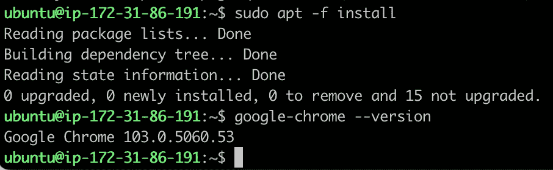

现在让我们下载与谷歌 chrome 匹配相同版本的 chrome 驱动程序:

去网站:[https://chromedriver.storage.googleapis.com/](https://chromedriver.storage.googleapis.com/)找到与谷歌 chrome 相同版本的 chrome 驱动程序，并为你的 Linux 实例:

我的是:103 . 0 . 5060 . 53/chrome driver _ Linux 64 . zip

所以对于我的谷歌 chrome，我需要下载这个 zip:[https://chrome driver . storage . Google APIs . com/103 . 0 . 5060 . 53/chrome driver _ Linux 64 . zip](https://chromedriver.storage.googleapis.com/103.0.5060.53/chromedriver_linux64.zip)

在您的终端点击:

```
wget [https://chromedriver.storage.googleapis.com/103.0.5060.53/chromedriver_linux64.zip](https://chromedriver.storage.googleapis.com/103.0.5060.53/chromedriver_linux64.zip)#Now install unzip command
sudo apt install unzip#unzip the chromedriver now
unzip chromedriver_linux64.zip#move the chromedriver to /usr/bin/chromedriver
sudo mv chromedriver /usr/bin/chromedriver
sudo chown root:root /usr/bin/chromedriver
```

首先，让我们创建一个 s3 存储桶，我们将在后面的阶段使用它:

*   在 AWS 管理控制台的左上角，在**服务**菜单上，选择 **S3** 。
*   选择**创建桶**
*   在**通用配置**部分，输入**铲斗名称。我把它命名为桶硒。**
*   保留所有其他设置的默认值
*   选择**创建存储桶**

现在让我们安装所有的包并在 EC2 上运行代码。

*   在 AWS 管理控制台的左上角，在**服务**菜单上，选择 **EC2。**
*   像以前一样连接到您的实例(通过使用 **SSH 客户端**进行连接)

在您的 Linux 机器上，必须已经安装了 python3。你可以在终端上点击“python3”来查看

```
python3
```

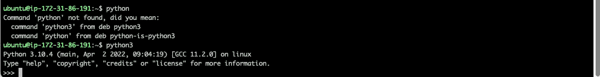

我们可以看到 python3 已经安装好了。通过 Quit()命令退出 python。

使用以下命令安装 pip 命令:

```
sudo apt-get -y install python3-pip#Now after installing pip, make sure you hit
source ~/.profile#check verison using:
pip3 --version
```

现在安装熊猫、硒和 boto3 包:

boto3 是用于 AWS 的 Python SDK 的名称。它允许您从 Python 脚本中直接创建、更新和删除 AWS 资源。

```
pip install pandaspip install seleniumpip install boto3
```

就像这样:

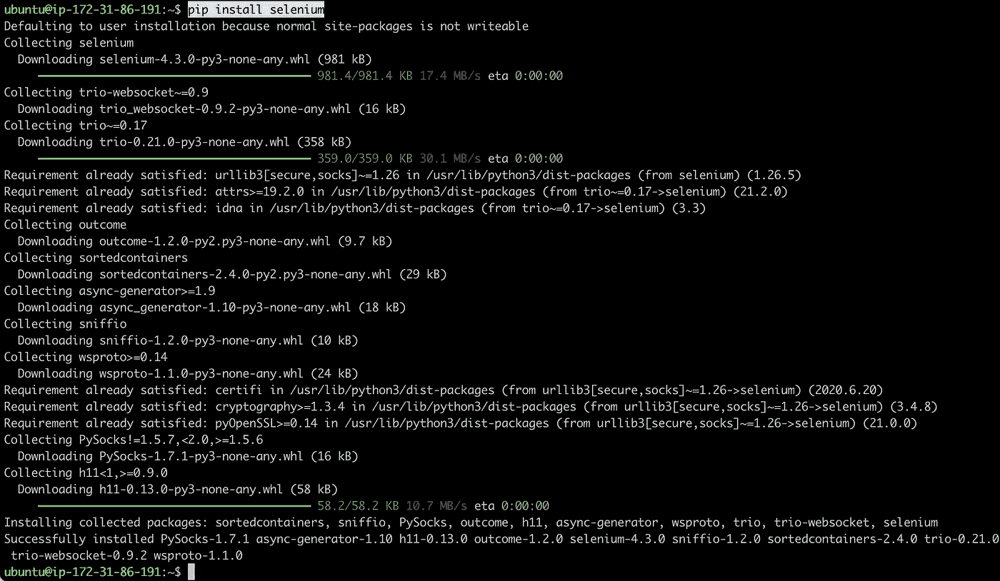

现在让我们创建一个 python 文件并实现我们的代码:

创建名为 selenium-code 的目录

```
mkdir selenium-code
cd selenium-code
vim topics-ML.py
```

现在，最后复制下面的代码，并将其放入 python 脚本中，这样就完成了:

通过键入':wq '保存 vim 编辑器。最后，运行您的 python 脚本:

```
python3 topics-ML.py
```

塔达，密码起作用了。现在，在服务搜索 **S3** 和左侧导航窗格，选择**桶。**点击桶‘桶-硒’。您可以看到创建的 csv 文件。您可以下载该文件并查看输出。

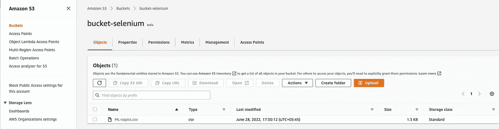

我希望它能帮助任何希望在 AWS 上实现 selenium 的人。

干杯！

[](/mlearning-ai/mlearning-ai-submission-suggestions-b51e2b130bfb) [## Mlearning.ai 提交建议

### 如何成为 Mlearning.ai 上的作家

medium.com](/mlearning-ai/mlearning-ai-submission-suggestions-b51e2b130bfb)