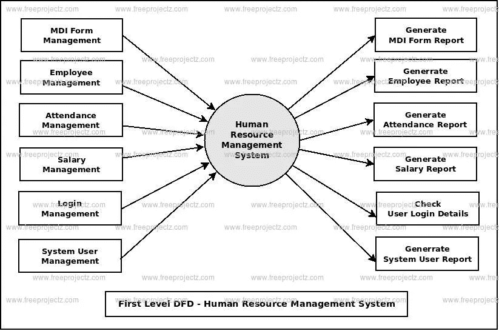
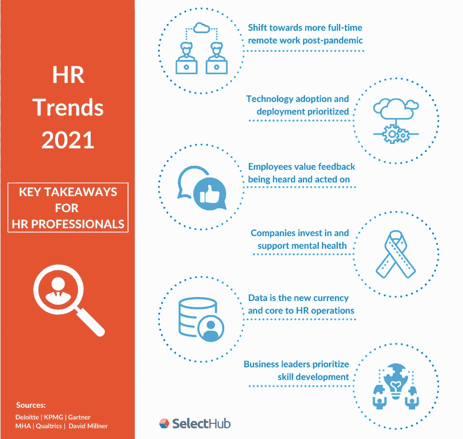
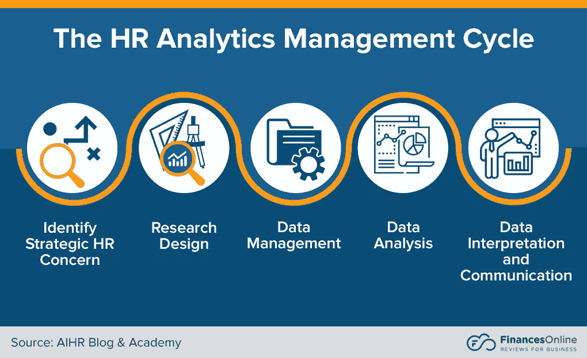

# 如何在人力资源管理中实施数据科学

> 原文：<https://medium.com/mlearning-ai/how-to-implement-data-sciences-in-human-resource-management-8ad2aef8a6b5?source=collection_archive---------2----------------------->

人力资源是一个非常敏感和行为多变的领域，不太强调数字数据，而更多地强调行为分析和人员沟通。

机器学习、深度学习、计算机视觉和商业智能(尤其是统计分析)等方法仍然可以广泛实施和利用，尤其是在全球危机期间管理公司和保持可持续利润而不损害公司受过培训的人力资本方面。

# 从人力资源管理有限的数字数据中可以做出哪些预测？

如上图所示的数字数据可用于分析和预测:

*   员工休假的次数。
*   组织的流失率预测。
*   对正在接受特定工具和技术培训的员工进行市场价值预测，这些工具和技术将用于更好、更有效地执行分配的任务。
*   预测进入公司的新员工人数。

## 员工休假天数的预测

Leaves to be taken by employee’s influences work deadlines and company processing revenue for completion of services.

我们可以通过应用机器学习算法(如决策树和随机森林)以及应用交叉验证准确性和随机搜索的超参数来预测员工将休假的数量。为了获得准确的结果，我们需要每月休假、每个部门每个季度休假的数据特征，并排除强制性公司休假和产假，因为这将逃避数据分析。

**组织的流失率预测。**

It impacts the brand value of the company resulting in managing client relationships and goodwill on the financial sheets and Sales to customers

我们可以通过每月的辞职人数进行时间序列预测，或者使用基于机器学习建模的线性回归或随机森林回归。我们可以将统计回归技术应用于数据，然后看看我们的流失率与工资水平或工作满意度得分的联系有多紧密。

## 对雇员市场价值的预测。

Knowing How employee’s will have future market value helps corporations design training program’s and salary structures accordingly so they don't lose employee’s as they don't wanna lose the investment in training they have made and give any other organization the edge in yielding greater profits from it.

我们可以使用机器学习算法，如基于决策树分类器的方法来预测员工的工资将如何增加，从而增加他们在就业市场中的技能需求。因为它考虑了对他们的工资和市场所需技能的先前概率的迭代。

我们还可以使用 PowerBI 和 Tableau 等商业智能工具，通过下载机器学习预测的 python 文件并将其上传到 PowerBI/Tableau 平台来可视化这些预测。

**数据科学对人力资源有用吗？**

Data Science is essential for decision making in Human Resource management throughout the analytics process.

因此，我们可以说，数据科学可以通过机器学习算法来实现，上面提到的统计方法可以帮助组织获得员工生产力的量化指标，以及它如何影响其日常业务活动，并帮助企业规划未来。 但这是一个非常微观的视角，因为数据科学是一个非常广阔的领域，几乎每天都有新的更新，我们仍然没有完全确定其潜在的用途，即使是在业务用例和科学研究中，随着时间的推移，它将为这两个平台和许多其他平台带来更多潜在的成果。

> 作者指出

大家好，我叫阿玛尔·贾姆希德。

*我目前是联合利华巴基斯坦有限公司的数据专家，也是 Upwork 分析方面的自由职业者。如果您对任何基于分析的项目有任何评论、批评或任何建议需求。请随时在 LinkedIn 上联系我，并使用我的 Github/ka ggle python 代码模板库和已经制作的可视化实现或参考。*

*linked ln:https://www . LinkedIn . com/in/goto-resumemuhammad-ammar-jam shed-029280145/*

*Github:https://github.com/AmmarJamshed*

https://www.kaggle.com/muhammadammarjamshed