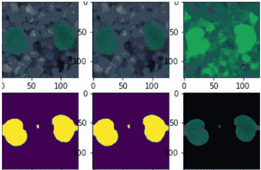

# 如何提高图像分类模型的性能

> 原文：<https://medium.com/mlearning-ai/how-to-improve-image-classification-models-performance-daa5ea7fb683?source=collection_archive---------6----------------------->

图像预处理是关键

Image by author

我们都知道图像分类问题有点混乱，我们如何提高模型性能，如果我们增加更多的层或尽可能使模型变浅，它会增加吗？

在这篇文章中，我将向您解释获得最佳模型的步骤，每一步我们都可以编写一个…