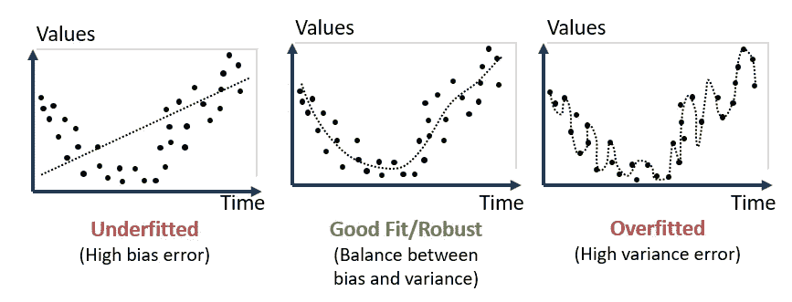
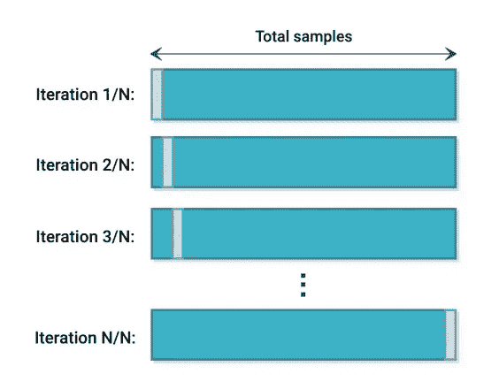
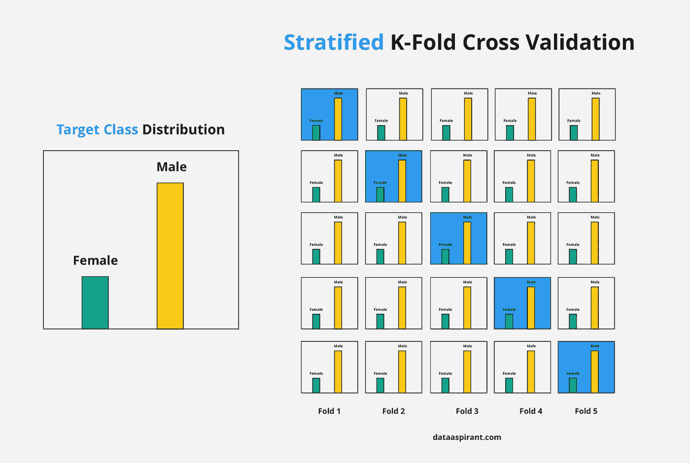

# 如何使用交叉验证技术提高模型的性能

> 原文：<https://medium.com/mlearning-ai/how-to-improve-your-models-performance-using-cross-validation-techniques-d202dfe3edd4?source=collection_archive---------0----------------------->

Source: [Daria Nepriakhina On Unspalsh](https://unsplash.com/photos/zoCDWPuiRuA)

机器学习模型通常无法很好地概括未经训练的数据。因此，总是需要验证你的机器学习模型的稳定性。这意味着我们需要确保模型的效率始终保持不变。换句话说，我们需要验证我们的模型在看不见的数据上表现得有多好。基于模型对未知数据的表现，我们可以说模型是过拟合、欠拟合还是良好泛化。

## 为什么模型会失去稳定性？

让我们用下图来理解:

Source: AnalystPrep

1.  第一个图，我们试图建立一个线性关系，这个关系不太符合数据。它与训练数据有很高的误差，这意味着我们的模型无法获得数据中的潜在模式，这意味着它也会在看不见的数据上表现不佳。这种情况被称为**欠拟合**，当一个模型在训练和测试数据集(验证数据或看不见的数据)上都表现不佳。
2.  在第二个图中，我们发现了恰到好处的关系，即具有低训练误差和良好概括的模型。
3.  第三幅图，我们发现了一个零训练误差的关系。这意味着模型过于敏感，捕捉到了每一个微小的偏差，包括可能只存在于训练数据中的不必要的噪音。模型在训练数据上表现良好并推广到它，但在新的、看不见的数据上未能保持同样的效率，这种情况被称为**过拟合**。

模型开发中的一个常见做法是，在训练阶段，我们区分我们的模型是在提高其性能还是简单地过度拟合数据。为此，我们使用各种交叉验证技术。

## 什么是交叉验证？

交叉验证的定义是:

> 交叉验证是一种评估模型性能的技术，通过在数据子集上训练几个模型，并在以前看不到的数据子集上测试它们。

我们也可以说，它是一种检查统计模型如何推广到独立数据集的技术。

Source: [Rishi Sidhu](/x8-the-ai-community/use-of-cross-validation-in-machine-learning-f3b80ad813e6)

它为给定的预测建模问题比较和选择模型，评估模型的性能。随后通过在新数据集上验证来判断他们的表现，也称为**测试/验证数据集**

## 为什么传统的坚守方式不成立？

拒绝是经典的“最简单的交叉验证”。在这种方法中，我们将数据随机分为两部分:训练集和测试/验证集，即保留集。然后，我们在训练数据集上训练模型，并在测试/验证数据集上评估模型。使用保留方法时，一个常见的划分是将 80%的数据用于训练，其余 20%的数据用于测试。

> 你不应该触摸测试设备

随机拆分数据的问题是，大量原本可用于训练模型的数据丢失给了测试数据，导致我们的模型无法从有限的训练数据中有效学习。由于测试数据集中的数据可能完全不同，这导致了高方差导致的欠拟合。

另一个问题是当我们有高度不平衡的数据集时。如果训练或测试数据集不能代表实际的完整数据，则测试集的结果可能会有偏差。

## 交叉验证的常用技术:

现在我们将看到一些常见的交叉验证技术。

## **1。验证集方法:**

这种方法非常类似于坚持的方法。我们保留 50%的数据集用于验证，剩下的 50%用于训练模型。

这种方法的主要缺点是，因为我们只在 50%的可用数据上训练我们的模型，这导致拟合不足。

## 2.省略 P 交叉验证(LPOCV):

这种交叉验证方法将数据`P`点排除在训练数据之外，即如果原始样本中有`N`个数据点，则`N-P`样本用于训练模型，`P`点用作测试/验证集。

*这种方法计算量很大，因为它为* `*P*` *的所有可能组合训练和验证模型，并且对于适度大的 p，它在计算上可能变得不可行。*

Source: neptune.ai

*计算成本较低的 LPOCV 情况是* `*P=1*` 不会遭受密集计算的情况，因为可能组合的数量等于原始样本中数据点的数量或简单地等于`N`。这种方法被称为**留一交叉验证(LOOCV)。**

这种方法有一个缺点，如果我们训练的数据点被证明是一个异常值，我们的模型会受到数据点的很大影响，这就容易产生很大的差异。

## 3.k 倍交叉验证:

到目前为止，显然永远没有足够的数据来训练模型*。* ***通过减少训练数据*** 、 ***我们冒着丢失数据集中重要模式/趋势的风险，这反过来又增加了由偏差引起的误差。***

因此，我们需要的是一种既能为模型训练提供充足数据，又能为验证留下充足数据的方法。K-Fold 交叉验证正是这样做的。

与所有其他技术相比，它提供了一个 dias 较低的模型。它易于实现，性能良好。涉及的步骤如下:

1.  将整个数据集随机分成`k`个子集。
2.  对于每个 k 倍，在数据集的`k-1`子集上训练模型。然后在`kth`子集(测试集)上测试模型。
3.  记录每个预测的误差。
4.  重复此操作，直到所有的`k`子集都被用作测试集，即我们迭代`k`子集，并记录每次迭代的误差。
5.  对所有`k`试验的误差估计进行平均，以获得模型的总有效性/性能指标。

Source: [ethen8181](http://ethen8181.github.io/machine-learning/model_selection/model_selection.html)

现在，一个最常见的问题是，“如何选择`k`的正确值？”

永远记住，`k`的值越低，越有根据。因此不受欢迎。然而，`k`的值越高，偏差越小，但方差可能越大。较小的`k`值导致我们采用验证集方法，而较大的`k`值导致 LOOCV 方法。

> LOOCV 无非是`n-fold`交叉验证，其中`k=n`，n 是原始数据集中的样本总数。

## 4.简化的 K 倍交叉验证:

分层 K-Fold 交叉验证是 K-Fold 交叉验证的扩展，其中数据集在分裂成`k`折叠数据之前被混洗，使得观察值的比率在所有折叠中保持相同。

在处理偏差和方差时，这通常是更好的方法。随机选择的折叠可能不足以代表次要类别，尤其是在不平衡数据集的情况下。

Source: [Data Aspirant](https://dataaspirant.com/8-stratified-k-fold-cross-validation/)

## 关键要点:

1.  k 倍交叉验证是最常用的验证形式。
2.  在大多数项目中，验证成为最关键的一步，因为它为现实世界准备了模型。
3.  交叉验证是一种程序，用于减轻过度拟合，并根据新数据评估模型的技能。
4.  总是建议在开始交叉验证模型之前进行详尽的**探索性数据分析**。

我希望这篇文章能让你对不同的交叉验证技术有一个基本的了解。这是您开始使用令人惊叹的 **Scikit-Learn** 库进行交叉验证所需的所有基础知识，只需几行 python 代码就能让您上手并运行。祝你好运！

我将在我的下一篇文章中看到你。再见！

## 参考资料:

[1][https://www . analyticsvidhya . com/blog/2018/05/improve-model-performance-cross-validation-in-python-r/](https://www.analyticsvidhya.com/blog/2018/05/improve-model-performance-cross-validation-in-python-r/)

[2][https://towards data science . com/cross-validation-in-machine-learning-72924 a 69872 f](https://towardsdatascience.com/cross-validation-in-machine-learning-72924a69872f)

[3][https://sci kit-learn . org/stable/modules/cross _ validation . html #交叉验证](https://scikit-learn.org/stable/modules/cross_validation.html#cross-validation)

感谢您的阅读，期待您的反馈！

我每天写机器学习教程和文章，讲述我进入人工智能世界的旅程。在 [Twitter](https://twitter.com/SindhuSeelam_) 、 [LinkedIn](https://www.linkedin.com/in/sindhuseelam/) 和 [Medium](https://sindhuseelam.medium.com/) 上关注我。