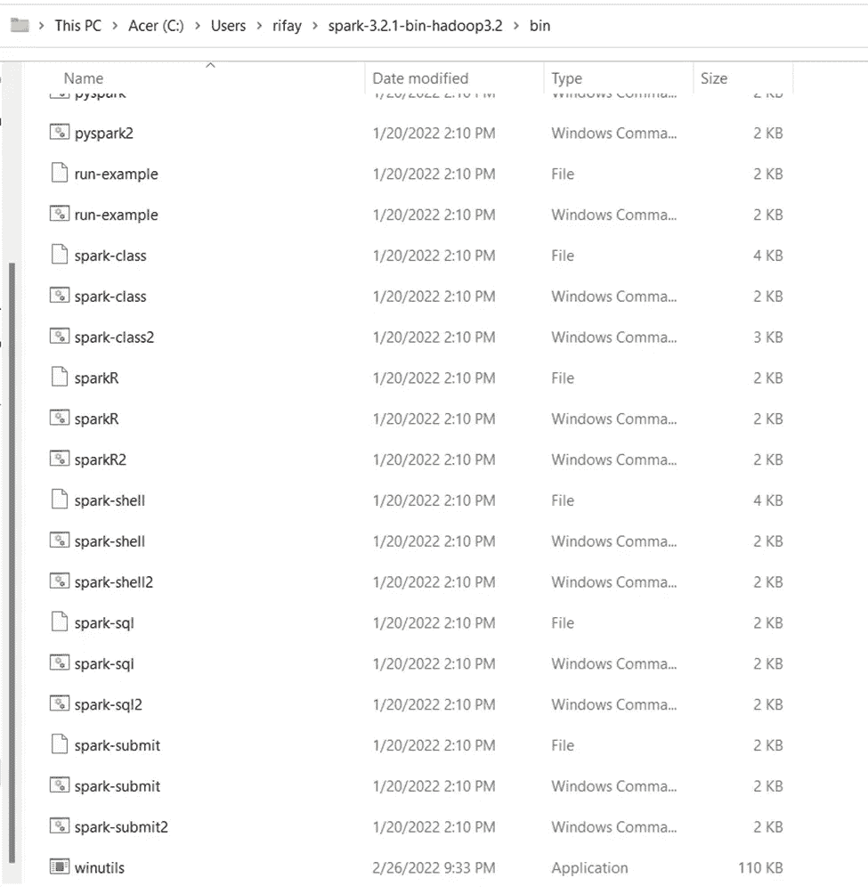
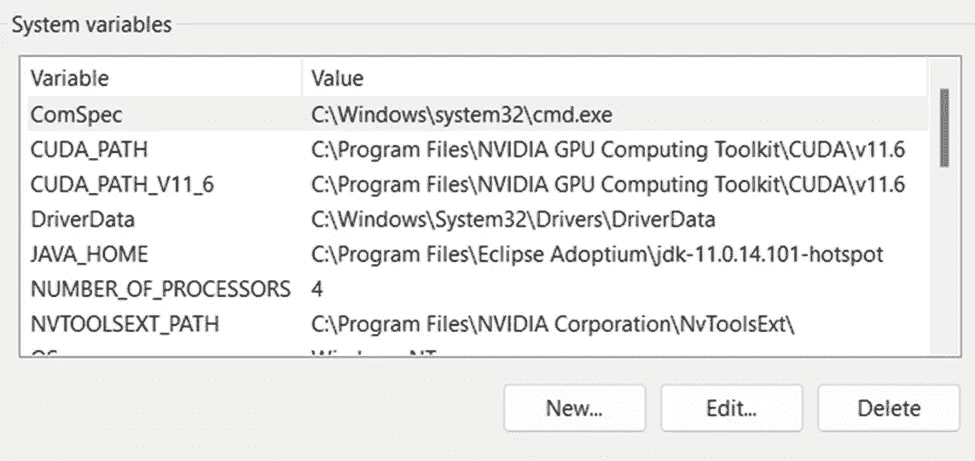
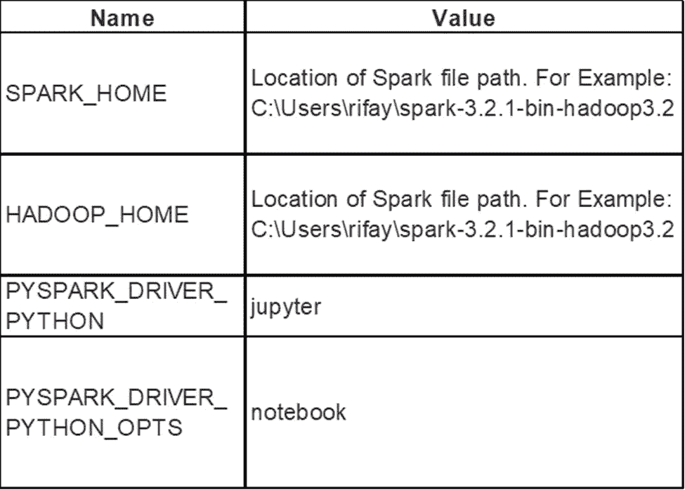

# 如何安装 PySpark

> 原文：<https://medium.com/mlearning-ai/how-to-install-pyspark-6bea2586db7d?source=collection_archive---------7----------------------->

## 像专家一样处理大型数据集


**py spark 是什么？**

PySpark 是 Python 中的一个包，它允许您接入一个名为 Apache Spark 的分布式环境。Apache Spark 是一个开源的分布式计算引擎，可以让您处理和分析大量数据。在 Python 中连接时，这将允许您处理大型数据集。我所说的大型数据集，指的是数据集中数百万、数十亿的行。

顺便提一下，Apache 免费提供这个项目和许多其他开源项目。这绝不是我得到报酬的任何事情，但是如果你是开源的信徒，请为他们的事业做出贡献或捐赠(见下面的链接)。

https://www.apache.org/foundation/contributing

**py spark 的优势**

处理大量数据速度超快，性能惊人

允许您使用 SQL 语句在 python 中处理数据

支持解释性数据分析任务，如汇总统计、特征提取、数据转换等

支持机器学习任务

a 必须知道你是否在努力成为数据科学家、数据分析师、开发人员等等

我可以在这里继续，但那些是主要的亮点。

**安装 PySpark 的先决条件**

我不会讨论这些，但它们是正确使用 PySpark 所必需的:

Python 和 Anaconda 能够使用 Jupyter 笔记本:

[https://www.anaconda.com/products/distribution](https://www.anaconda.com/products/distribution)

还需要 Java(最好是 9.0.0 以上版本):[https://www.oracle.com/java/technologies/downloads/](https://www.oracle.com/java/technologies/downloads/)

你需要一个可以解压 zipped.tgz 文件的东西。这里推荐的是 7-zip:

[https://www.7-zip.org/download.html](https://www.7-zip.org/download.html)

**安装 PySpark 的步骤**

1.下载 spark 的最新版本，并记下您下载的版本:

[https://spark.apache.org/downloads.html](https://spark.apache.org/downloads.html)

2.在您的 Jupyter 笔记本中运行以下程序来安装 findspark:

```
!pip install findspark
```

3.从下面的 GitHub 库([https://github.com/steveloughran/winutils/](https://github.com/steveloughran/winutils/))下载与您的 spark 版本一致的版本的 winutils.exe。

例如，如果我下载了 3.2 版本，我会在下面的存储库中找到/下载 winutils.exe 文件


4.现在回到第 1 步中下载的文件(即 Spark)。右键单击并使用 7-zip 或您选择的工具解压缩文件夹

5.您可能需要再次重复第 4 步

6.现在保存这个解压后的文件，放在你想参考的地方

7.打开步骤 6 中的文件，找到一个名为 bin 的文件夹，将步骤 3 中的 winutils.exe 文件移到这里。此时，你应该在下面



8.接下来，您需要添加环境变量。要在 Windows 11 中做到这一点，点击 Windows 按钮+ I，然后进入关于，高级系统设置，环境变量。您应该会看到下面的屏幕



9.现在添加这些新的系统变量:



10.此外，在“系统变量”下找到 Path 变量，并添加步骤 7 中保存 winutils.exe 文件的文件路径。例如，C:\ Users \ rifay \ spark-3 . 2 . 1-bin-Hadoop 3.2 \ bin

11.运行 Juptyer 笔记本中的以下代码，测试 PySpark 现在是否可以使用

```
import findsparkfindspark.init()import pyspark 
from pyspark.sql import SparkSession
spark = SparkSession.builder.getOrCreate()df = spark.sql(‘’’select ‘hello world’ as say ‘’’)
df.show()
```

12.如果安装成功，您应该会看到以下内容


**结论**

我希望您喜欢这篇文章，并能在您的数据之旅中为您提供帮助。请在评论中让我知道。

[](/mlearning-ai/mlearning-ai-submission-suggestions-b51e2b130bfb) [## Mlearning.ai 提交建议

### 如何成为 Mlearning.ai 上的作家

medium.com](/mlearning-ai/mlearning-ai-submission-suggestions-b51e2b130bfb)