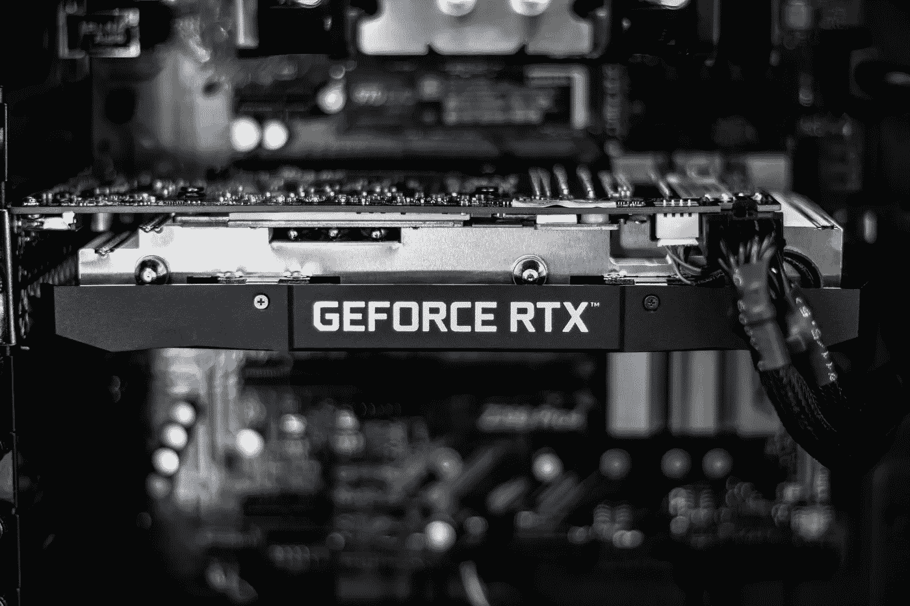
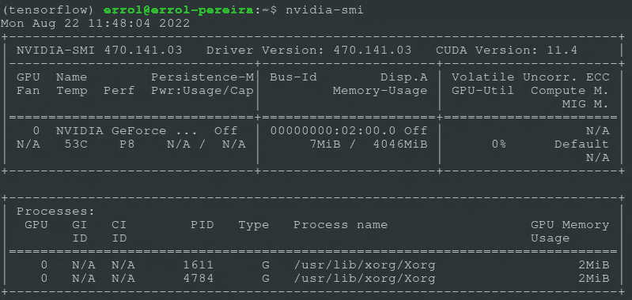
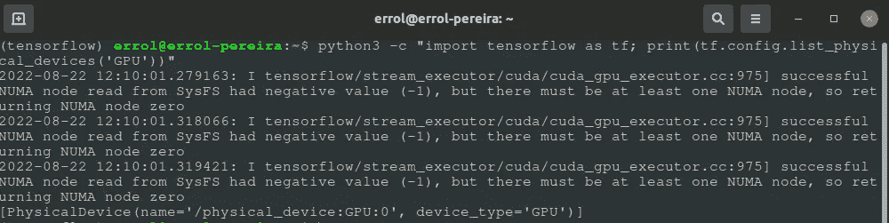

# 如何在 Ubuntu 20.04 LTS 上安装带 CUDA 和 cuDNN 的 TensorFlow 2.x

> 原文：<https://medium.com/mlearning-ai/how-to-install-tensorflow-2-x-with-cuda-and-cudnn-on-ubuntu-20-04-lts-b73c209d8e88?source=collection_archive---------6----------------------->

在这篇文章中，我将指导你在 Ubuntu 机器上安装带有 CUDA 和 cuDNN 的 TensorFlow 2.x。

如果你的系统中有 NVIDIA 显卡，并且想用它来训练机器学习和深度学习模型，你需要先在你的系统中安装 CUDA 和 cuDNN 库。

Photo by [Christian Wiediger](https://unsplash.com/@christianw?utm_source=unsplash&utm_medium=referral&utm_content=creditCopyText) on [Unsplash](https://unsplash.com/s/photos/rtx?utm_source=unsplash&utm_medium=referral&utm_content=creditCopyText)

下面是我的系统配置以及 CUDA 和 cuDNN 的版本:
OS : **Ubuntu 20.04 LTS**

我们开始吧！

# 安装必备组件

在您安装任何东西之前，我们需要确保系统中安装了必要的图形驱动程序。这些驱动程序需要与底层显卡通信。

通过按 cltr + alt + T 打开终端，并键入以下命令。

如果该命令返回一条消息，说明系统无法识别“nvidia-smi ”,则通过运行以下命令来安装 nvidia-smi:

`sudo add-apt-repository ppa:graphics-drivers/ppa`

`sudo apt install nvidia-driver-470`

运行上述命令后，再次运行 nvidia-smi 命令，检查驱动程序是否安装成功。您应该会看到类似如下的输出。

如果你仍然看不到上面的输出，重启你的电脑并再次运行命令。

# 为 TensorFlow 2.x 安装 CUDA 和 CuDNN

访问 [TensorFlow 指南](https://www.tensorflow.org/install/source#gpu)查看您正在使用的 TensorFlow 相应版本的 Cuda 和 CuDNN 兼容版本。对于本指南，我使用 TensorFlow 2.9.1，它使用 Cuda 11.2 和 CuDNN 8.1。

打开一个新的终端并创建一个新的 conda 环境，这样您的所有依赖项都封装在这个特定的环境中。

`conda create --name tensorflow python=3.9`

创建环境后，继续激活环境。

`conda activate tensorflow`

用您将创建的环境的名称替换 TensorFlow。

现在运行下面的命令，在你的 Ubuntu 机器上安装 Cuda 和 CuDNN 库。

`conda install -c conda-forge cudatoolkit=11.2 cudnn=8.1.0`

`export LD_LIBRARY_PATH=$LD_LIBRARY_PATH:$CONDA_PREFIX/lib/`

# 安装 TensorFlow 2.9.1

一旦对 Cuda 和 Cudnn 的依赖关系进行了排序，我们现在可以继续在系统上安装 TensorFlow GPU 了。对于最新的 TensorFlow 版本，现在不需要为 CPU ad GPU 安装特定版本的 TensorFlow。我们只需运行下面的命令，它就会在您的系统中安装必要的版本。

`pip3 install --upgrade pip` `pip3 install tensorflow`

# 测试安装

我们可以使用下面的命令测试安装

`python3 -c "import tensorflow as tf; print(tf.config.list_physical_devices('GPU'))"`

上述命令将列出您系统上可用的 GPU 设备。如果您能够看到您的图形卡设备号作为上述命令的输出弹出，则安装成功。

# 命令过程

对于那些觉得一个接一个地运行命令很麻烦的人，我创建了一个 shell 脚本，它会自动为您安装所有的依赖项。只要在你的终端上运行这个脚本，其他的事情就会迎刃而解。不客气:)

[Shell 脚本(2.x)](https://github.com/errolPereira/blog_resources/blob/main/install_tf_with_gpu.sh)

对于像我这样喜欢使用 TensorFlow 1.x 运行代码的人，我已经创建了另一个脚本，它将安装 TensorFlow 1.15 以及 cuda 和 cudnn 依赖项。再次欢迎:)

[Shell 脚本(1.x)](https://github.com/errolPereira/blog_resources/blob/main/install_tf1.15_with_gpu.sh)

# 参考资料:

[Tensorflow 官网](https://www.tensorflow.org/)

*原载于 2022 年 7 月 12 日*[*https://errolpereira . github . io*](https://errolpereira.github.io/how-to-install-CUDA-and-cuDNN-on-ubuntu/)*。*

 [## Mlearning.ai 提交建议

### 如何成为 Mlearning.ai 上的作家

medium.com](/mlearning-ai/mlearning-ai-submission-suggestions-b51e2b130bfb)