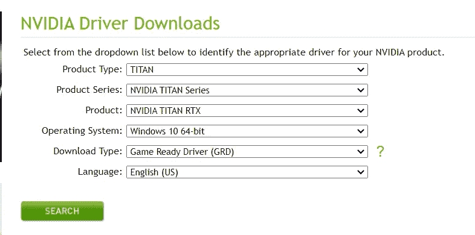
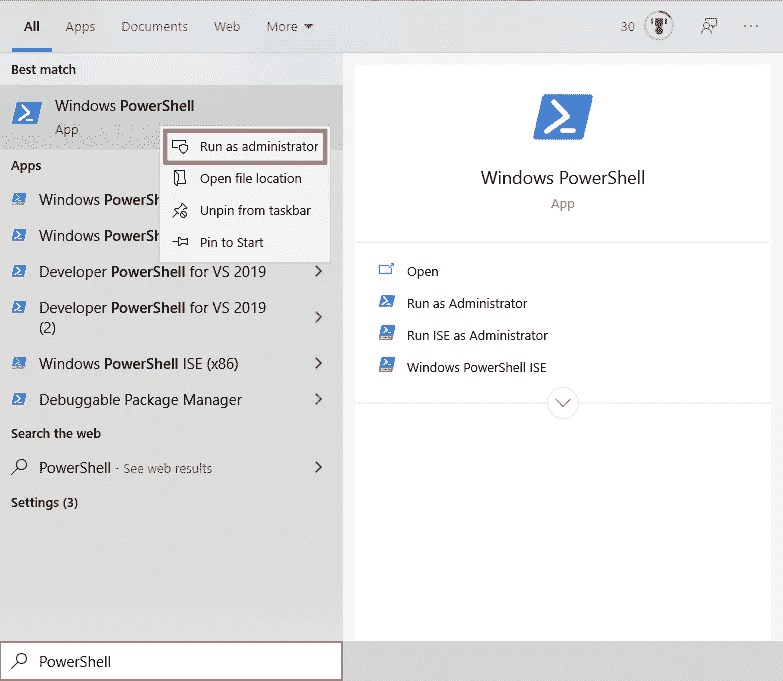
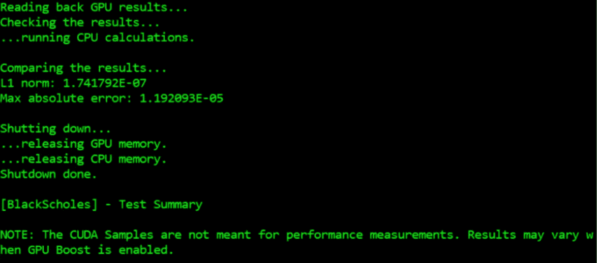

# 如何在 wsl 2-Ubuntu 20.04 LTS 中安装支持 Anaconda 的用于 TensorFlow 的 NVIDIA CUDA Toolkit 11.2 和 cuDNN 8.1

> 原文：<https://medium.com/mlearning-ai/how-to-install-the-nvidia-cuda-toolkit-11-2-a94d86a45d38?source=collection_archive---------0----------------------->


Photo by [Nana Dua](https://unsplash.com/@nanadua11?utm_source=medium&utm_medium=referral) on [Unsplash](https://unsplash.com?utm_source=medium&utm_medium=referral)

因此，在这篇文章中，我将快速解释如何通过 Linux 的 Windows 子系统访问 GPU 加速。我个人需要 Tensorflow 将它用作 Open3D 的后端:一个现代的 3D 数据处理库。

当您有一台 Windows 机器，但需要使用专为 Linux 构建的东西时，问题就出现了。您的选择非常有限，要么设置双重引导，要么尝试使用 WSL2。截至 2021 年 11 月，随着 Windows 10(非内部人员)2021H2 的发布，增加了对 CUDA 的支持，您现在可以在 WSL2 中访问主机上的 GPU。这在 Windows 11 上同样适用。

然而，安装所需的软件有些棘手，因为你需要在主机和你正在使用的 WSL2 发行版上做一些步骤。康达渠道的标准 [cudatoolkit](https://anaconda.org/anaconda/cudatoolkit) 和 [cudnn](https://anaconda.org/conda-forge/cudnn) 不工作。

# 1-仅在 Windows 机器上为您的 GPU 安装 CUDA 驱动程序:

*   从: [Nvidia 官网](https://www.nvidia.com/Download/index.aspx?lang=en-us)下载基于您的 GPU 所需的驱动程序



*   运行下载的驱动程序并继续安装。

# 2-安装 WSL2:

*   打开提升的 PowerShell(以管理员身份)



*   使用以下软件安装 WSL2 Ubuntu-20.04:

```
wsl --install -d Ubuntu-20.04
```

*   安装完成后，使用以下命令登录到 WSL2 内核:

```
wsl -d Ubuntu-20.04
```

# 3-安装 Anaconda

*   从 [Anaconda 官网](https://www.anaconda.com/products/individual#linux)下载 WSL2 机器中的 Anaconda(Linux 版)
*   安装 Anaconda(如果不知道如何安装，可以查看本[指南](https://docs.anaconda.com/anaconda/install/linux/))。
*   一旦安装了 Anaconda，并且处于基本环境中，就可以继续安装 CUDA Toolkit 和 CuDNN 了。

# 4-安装 CUDA 工具包和 CuDNN:

*   由于最近的 Tensorflow 版本需要 CUDA Toolkit 11.2 和 CuDNN 8.1，我们将安装这些版本。只需在 Ubuntu 机器上运行这个命令。

```
sudo apt-key adv --fetch-keys https://developer.download.nvidia.com/compute/cuda/repos/ubuntu2004/x86_64/7fa2af80.pub && sudo sh -c 'echo "deb http://developer.download.nvidia.com/compute/cuda/repos/ubuntu2004/x86_64 /" > /etc/apt/sources.list.d/cuda.list' && sudo apt-get update && sudo apt-get --yes install cuda-toolkit-11-2 && sudo sh -c 'echo "deb http://developer.download.nvidia.com/compute/machine-learning/repos/ubuntu2004/x86_64 /" > /etc/apt/sources.list.d/nvidia-machine-learning.list' && sudo apt-get update && sudo apt-get install --yes --no-install-recommends cuda-11-2 libcudnn8=8.1.0.77-1+cuda11.2 libcudnn8-dev=8.1.0.77-1+cuda11.2
```

为了提高可读性，可以将前面的命令分成单独的命令运行(如果已经运行了前面的块，就不要运行这个命令):

```
sudo apt-key adv --fetch-keys https://developer.download.nvidia.com/compute/cuda/repos/ubuntu2004/x86_64/7fa2af80.pubsudo sh -c 'echo "deb http://developer.download.nvidia.com/compute/cuda/repos/ubuntu2004/x86_64 /" > /etc/apt/sources.list.d/cuda.list'sudo apt-get updatesudo apt-get --yes install cuda-toolkit-11-2sudo sh -c 'echo "deb http://developer.download.nvidia.com/compute/machine-learning/repos/ubuntu2004/x86_64 /" > /etc/apt/sources.list.d/nvidia-machine-learning.list'sudo apt-get updatesudo apt-get install --yes --no-install-recommends cuda-11-2 libcudnn8=8.1.0.77-1+cuda11.2 libcudnn8-dev=8.1.0.77-1+cuda11.2
```

*   完成后，通过运行 *BlackScholes* 样本确认一切正常:

```
cd /usr/local/cuda-11.2/samples/4_Finance/BlackScholessudo make./BlackScholes
```

*   如果一切正常，您应该会看到类似这样的内容



# 创建一个新的 Anaconda 环境并开始开发

```
conda create -n tf2
conda activate tf2
conda install tensorflow
python -c "import tensorflow"
```

*   如果您看不出错过 CUDA 库有什么奇怪的，那么您就可以开始了！
*   您可以通过运行以下 python 脚本来进一步确认。它应该返回 Tensorflow 在 WSL2 上找到的 GPU。

```
import tensorflow as tf
print(tf.config.list_physical_devices('GPU'))
```

这就是本指南的全部内容。编码快乐！

[](/mlearning-ai/mlearning-ai-submission-suggestions-b51e2b130bfb) [## Mlearning.ai 提交建议

### 如何成为 Mlearning.ai 上的作家

medium.com](/mlearning-ai/mlearning-ai-submission-suggestions-b51e2b130bfb)