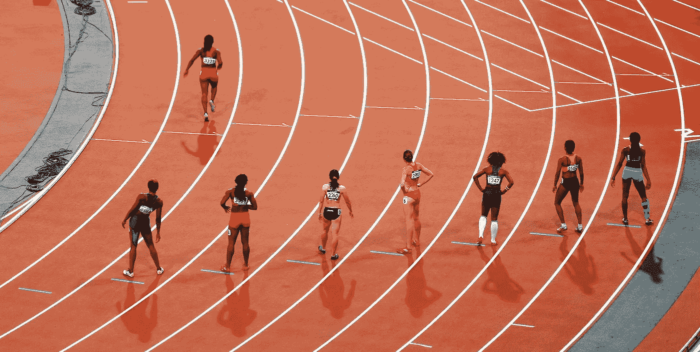

# 如何通过竞赛学习数据科学

> 原文：<https://medium.com/mlearning-ai/how-to-learn-data-science-through-competitions-c8997cc7395c?source=collection_archive---------2----------------------->

## 数据科学竞赛

## 初学者如何通过竞赛快速掌握数据科学学习路径的 9 种方法。

**首先要做的事情** —

竞赛不是黑客马拉松。黑客马拉松不是为初学者准备的——黑客马拉松是为以后准备的。另一方面，竞赛…