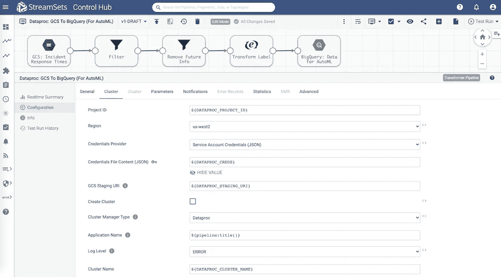
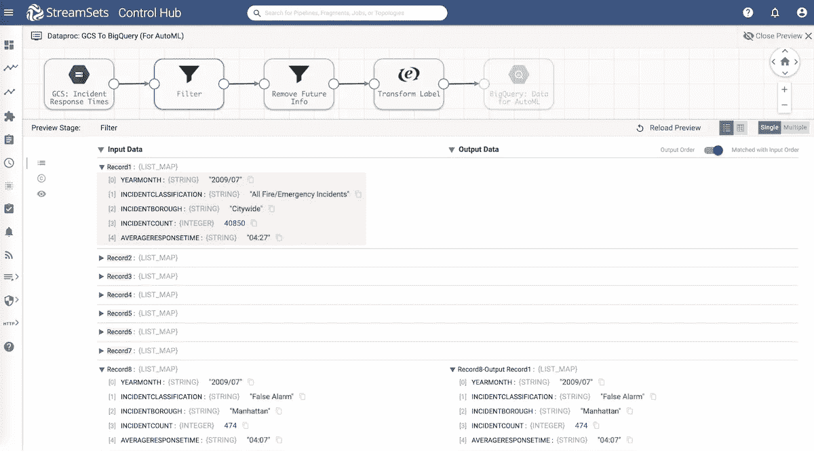
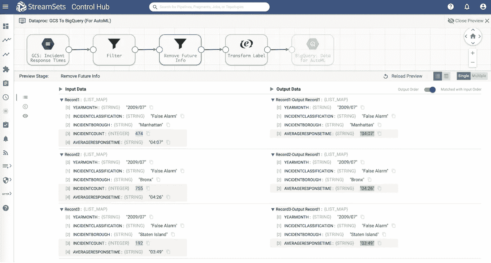
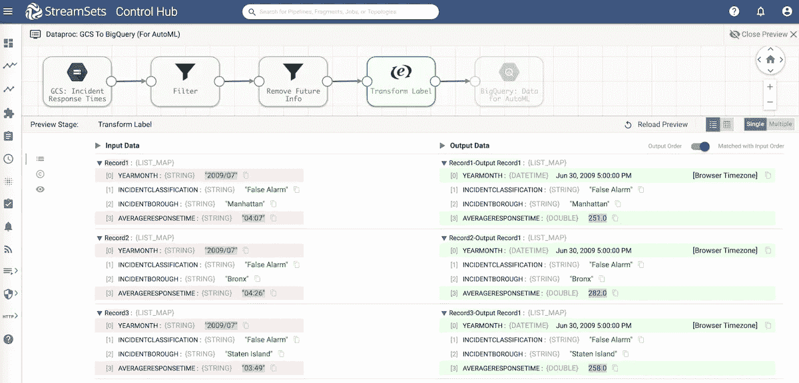
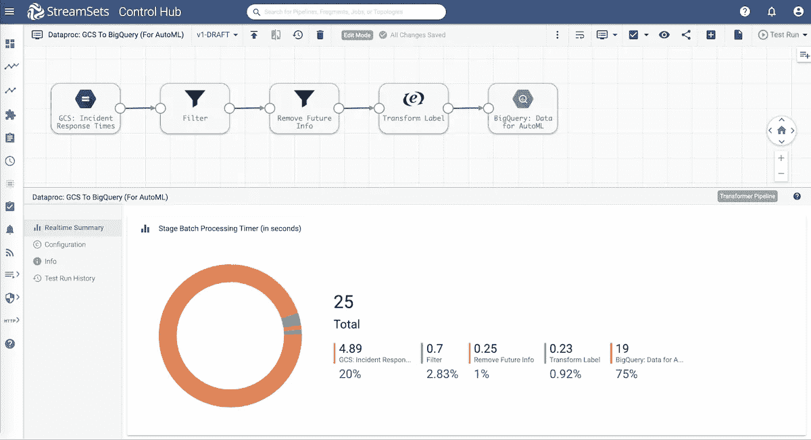
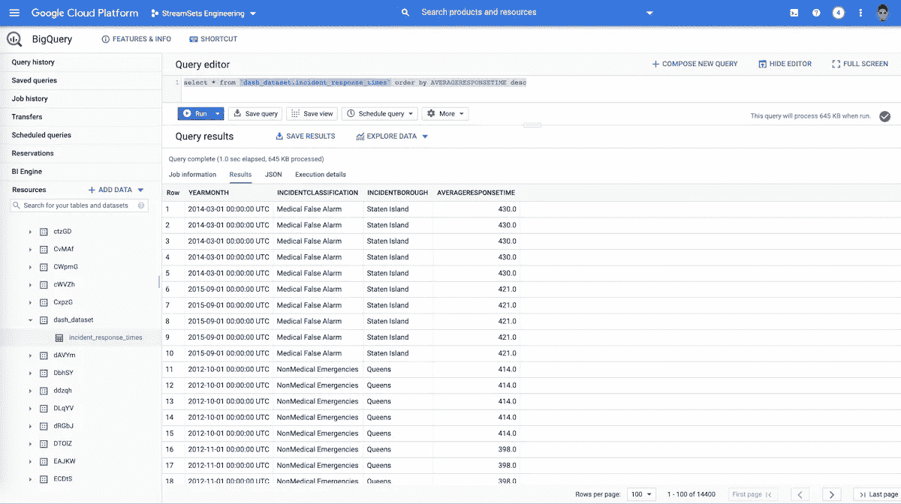
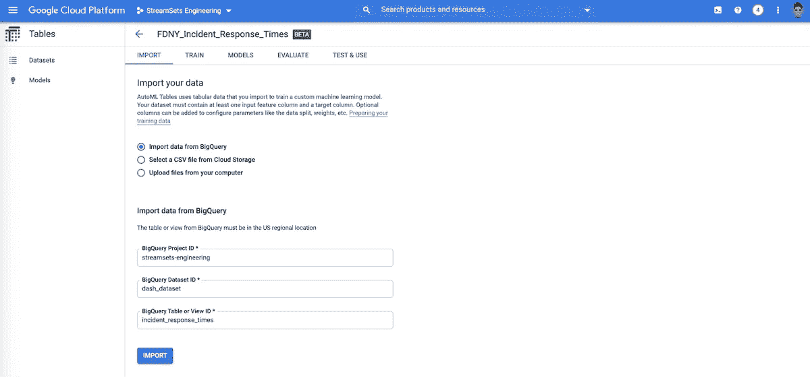
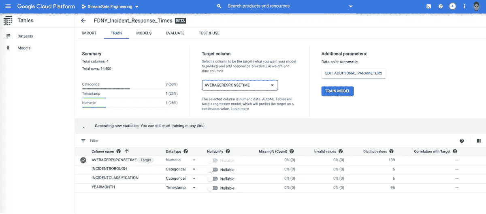
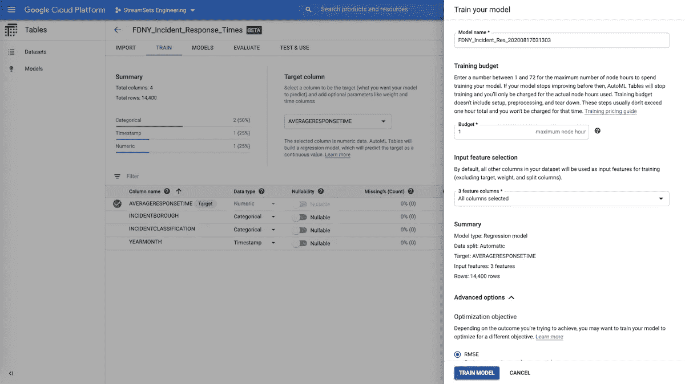
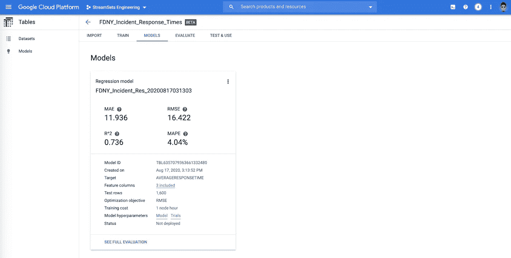

# 如何在 Dataproc 和 AutoML 上将数据加载到 Google BigQuery 中

> 原文：<https://medium.com/mlearning-ai/how-to-load-data-into-google-bigquery-on-dataproc-and-automl-9d29e7edcd5b?source=collection_archive---------3----------------------->

# Google Dataproc 是什么？

Dataproc 是一个低成本的 Google 云平台集成，易于使用的托管 Spark 和 Hadoop 服务，可用于批处理、流和机器学习用例。

# 什么是 Google BigQuery？

BigQuery 是一个企业级数据仓库，利用 Google 基础设施的处理能力实现高性能 SQL 查询。

# 将数据加载到 Google BigQuery 和 AutoML

在这篇博客中，我们将回顾 StreamSets Transformer 中的 ETL 数据管道，[一个 Spark ETL 引擎](https://streamsets.com/products/dataops-platform/transformer-etl/)，从纽约州(FDNY)消防局接收存储在 Google 云存储(GCS)中的真实世界数据，对其进行转换，并将精选的数据存储在 Google BigQuery 中。

一旦转换后的数据在 Google BigQuery 中可用，它将在 AutoML 中用于训练机器学习模型，以预测 FDNY 的平均事件响应时间。

# 抽样资料

该数据集可通过[纽约市开放数据](https://opendata.cityofnewyork.us/)网站获得。2009–2018 年的历史数据集包含 FDNY 的平均响应时间。数据按事故类型(假警报、医疗紧急情况等)、行政区以及特定月份的事故数量进行划分。

以下是示例 FDNY 数据的样子:

```
YEARMONTH,INCIDENTCLASSIFICATION,INCIDENTBOROUGH,INCIDENTCOUNT,AVERAGERESPONSETIME 2009/07,All Fire/Emergency Incidents,Citywide,40850,04:27 2009/07,False Alarm,Citywide,2655,04:07 2009/07,Medical Emergencies,Manhattan,4895,04:17 2009/07,Medical False Alarm,Citywide,408,04:13 2009/07,NonMedical Emergencies,Manhattan,4446,04:51 2009/07,NonStructural Fires,Citywide,1495,04:19 2009/08,All Fire/Emergency Incidents,Citywide,41723,04:30
```

# 数据管道概述



在 StreamSets Transformer 中运行管道之前，您可以根据配置的 Dataproc 集群预览管道，以检查数据结构、数据类型，并验证每个阶段的转换。这也是一个很好的方法。关于管线预览的更多信息，请参考[调试数据管线](https://streamsets.com/getting-started/download-install-transformer-etl/#1607012180138-5c9bcd0f-a9f2) [文档](https://streamsets.com/documentation/transformer/latest/help/transformer/Preview/Preview-Title.html#concept_zlk_byt_cmb)。



# 删除未来信息

因为这是一个历史数据集，我们用它来训练机器学习模型，所以我们需要删除月初未知的信息。在这种情况下，即 *INCIDENTCOUNT* 要从每条记录中移除该字段，我们将使用一个[字段移除器](https://streamsets.com/documentation/transformer/latest/help/transformer/Processors/FieldRemover.html#concept_svw_dxf_fhb)处理器。



# 数据转换

机器学习模型中的标签或目标变量是数字数据类型。在这种情况下， *AVERAGERESPONSETIME* 的字段值按以下步骤转换:

*   删除“:”使用表达式— ***替换(AVERAGERESPONSETIME，“:，”)***
*   使用 [Spark SQL](https://streamsets.com/documentation/transformer/latest/help/transformer/Processors/SparkSQLExp.html#concept_akj_gsz_mhb) 表达式—***round((average response time/100)* 60+(average response time % 100))***



# 数据管道执行

运行 [StreamSets Transformer](https://streamsets.com/products/dataops-platform/transformer-etl/) 数据管道可以实时显示各种指标。例如，每个阶段的批处理时间如下所示。这是开始研究微调处理和转换的好方法。



# 谷歌大查询

一旦管道成功运行，就会自动创建 Google BigQuery 表(如果尚不存在),并将转换后的数据插入到表中。如下所示，该数据集可随时用于查询。



存储的转换数据可以直接从 BigQuery 表导入，用于在 [AutoML](https://cloud.google.com/automl/docs) 中训练机器学习模型。

使用 AutoML，你可以建立在谷歌的机器学习能力之上，创建定制的机器学习模型。

# 输入数据



# 选择目标列



# 训练机器学习模型



就是这样！我们从将原始的真实世界的数据加载到 Google BigQuery，到在 AutoML 中创建一个机器学习模型，而无需任何编码或脚本！

# 构建您的 Spark ETL 和 ML 数据管道

不言而喻，训练模型、评估它们、模型版本化以及为模型的不同版本服务都是非常重要的任务，这不是本文的重点。尽管如此，StreamSets Transformer 使得将数据加载到 Google BigQuery 和 AutoML 变得非常容易。

查看这些有用的资源，快速开始运行您的 [Spark ETL 数据管道](https://streamsets.com/getting-started/download-install-transformer-etl/#1603730763837-927d0686-eb52)。这里有一些其他与机器学习相关的技术博客，你可能会有兴趣阅读:

了解关于谷歌云平台的[流集的更多信息。](https://streamsets.com/solutions/streamsets-for-google/)

*原载于 2021 年 2 月 23 日 https://streamsets.com**T21*[。](https://streamsets.com/blog/how-to-load-data-into-google-bigquery-on-dataproc-and-automl/)