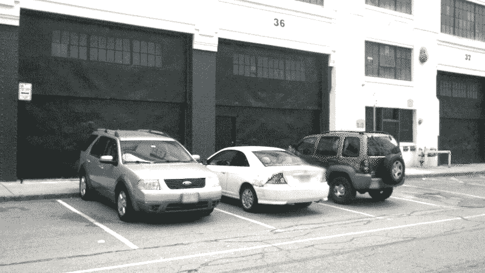

# 如何从单幅图像制作 3D 模型

> 原文：<https://medium.com/mlearning-ai/how-to-make-3d-models-from-a-single-image-d0eccc9209ba?source=collection_archive---------0----------------------->

## [机器学习艺术](https://mlearning.substack.com)

## 生成 AR/VR 场景的新人工智能方法

[AR/VR scene from a single image](https://mlearning.substack.com)

**从单幅图像中，可以生成三维物体**。近年来，术语“**逆图形**”得到了大量的报道。一些努力寻求重建每个图像的单个项目的形式，或形状和外观，而其他人的目标是提取大量的…