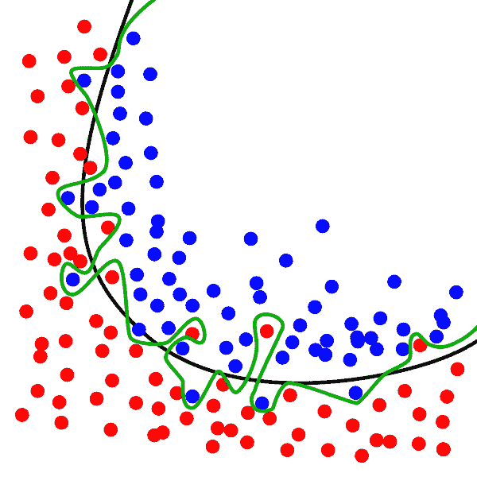

# 如何在 Python 中制作分类数据集并对其进行预测

> 原文：<https://medium.com/mlearning-ai/how-to-make-a-classification-dataset-and-predict-on-it-in-python-feaea3844052?source=collection_archive---------0----------------------->

在我以前的帖子中，我已经展示了如何使用 sklearn 的数据集来制作半月、水滴和圆圈。我上一篇关于创建圆数据集的文章的链接可以在这里找到:-[https://medium . com/mlearning-ai/how-to-create-two-circles-in-sk learn-and-make-predictions-on-it-691 a94 e64 f 81](/mlearning-ai/how-to-create-two-circles-in-sklearn-and-make-predictions-on-it-691a94e64f81)