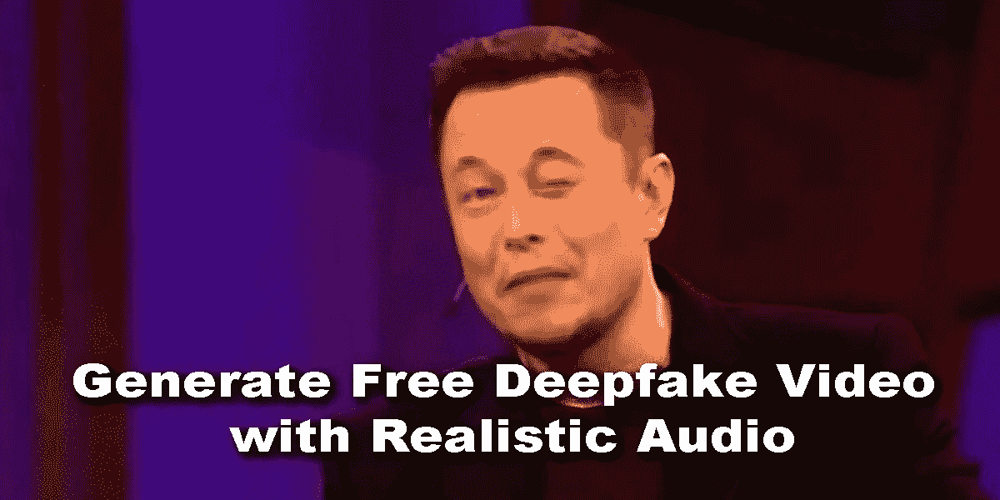

# 如何制作一个声控 deepfake？

> 原文：<https://medium.com/mlearning-ai/how-to-make-a-voice-activated-deepfake-b84cfba4dfbb?source=collection_archive---------1----------------------->

## [超逼真视频+音频深度伪造](https://open.substack.com/pub/evartology/p/quickly-make-a-deepfake-video-with?r=9hp4d&utm_campaign=post&utm_medium=web)

## [快速制作一个 Deepfake 视频](https://open.substack.com/pub/evartology/p/quickly-make-a-deepfake-video-with?r=9hp4d&utm_campaign=post&utm_medium=web)

[“I have already managed to kill the Twitter”](https://open.substack.com/pub/evartology/p/quickly-make-a-deepfake-video-with?r=9hp4d&utm_campaign=post&utm_medium=web)

这种新方法为视频会议、游戏和媒体合成的新用途打开了大门，因为它可以做什么。

## [免费快速制作带有超逼真音频的 Deepfake 视频](https://open.substack.com/pub/evartology/p/quickly-make-a-deepfake-video-with?r=9hp4d&utm_campaign=post&utm_medium=web)