# 如何让 DALL E 2 更懂你？第一部分

> 原文：<https://medium.com/mlearning-ai/how-to-make-dall-e-2-understand-you-better-part-1-f4776404a814?source=collection_archive---------0----------------------->

The image was generated by [DALL·E 2](https://openai.com/dall-e-2/)

几周前，我终于接触到了 DALL E 2，我非常激动。当我第一次尝试时，我并没有完全被打动，因为我的搜索结果有点令人失望。然而，由于其背后的技术，这似乎仍然令人难以置信，所以我继续测试它。一段时间后，我意识到我的错误，事情是这样的。仅仅提出一个随机的搜索请求是不够的，应该有更好的结构。所以今天我要给你一些建议，如何让你和 DALL E 2 的互动更有效。

让我给你一个 DALL E 2 架构的鸟瞰图，这将帮助你更深入地理解文本预处理。

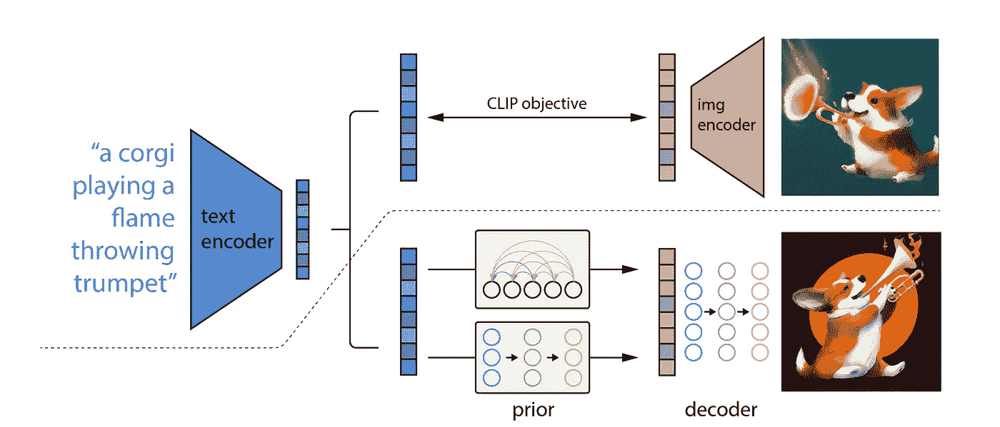

A high-level overview of unCLIP. Source: [arxiv.org](https://arxiv.org/pdf/2204.06125.pdf)

让我们深入虚线下方的培训流程，看看主要步骤:

1.  第一步，我们使用一个*文本编码器*来获得输入文本的剪辑嵌入；
2.  然后，在产生剪辑图像嵌入之前，将文本嵌入馈送到扩散；
3.  最后，我们设计了一个图像解码器，在嵌入剪辑图像的条件下产生图像。

简单说一下*剪辑*(对比语言-图像预训练)。*剪辑*的主要任务是将图像与其对应的标题匹配:它学习同一抽象对象的文本和视觉表示之间的联系。

所以我们需要查看用于剪辑训练的数据。这个数据集是从互联网上各种公开来源收集的 4 亿个(图像、文本)对构建而成的。

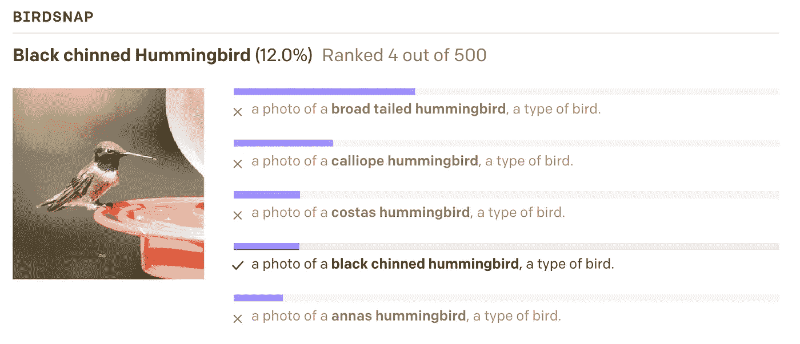

One random (non-cherry-picked) prediction of CLIP. Source: [openai.com](https://openai.com/blog/clip/)

在最初的回形针中，作者提到了一个问题，即[在训练数据集中，与图像配对的文本只有一个单词](https://arxiv.org/pdf/2103.00020.pdf)的情况相对较少。在这里，他们使用提示模板*“一张{标签}的照片”解决了这个问题。此外，他们强调有时在“快速工程”期间指定类别是有帮助的。*

> 例如在牛津-IIIT 宠物上，使用“一张{标签}的照片，一种宠物”帮助提供背景效果很好。

由于 CLIP 是使用来自互联网的数据预先训练的，所以许多文本提示具有诸如图像是以何种艺术风格创建/绘制/呈现的、图像是由哪家公司/组织创建/发布/发布的、创建者是谁等特征。这就是为什么训练数据集包括一堆提示的格式是这样的:*“{subject}、{camera angle}”、“{subject}、{style}”、“{ subject }、{time}”等等*。

在继续之前，我想给你看我的第一个提示，当时我不知道如何提出请求。下面你会看到我和 DALL E 2 关系的第一阶段(*我的要求用斜体显示*)。

***我*** :我想看看*最恐怖的怪物。*

***达尔 E 2*** :

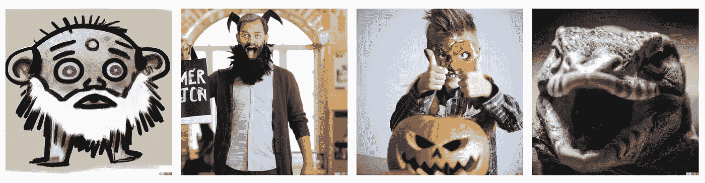

***我*** :你能给我看一下在海洋中央起飞的*巨型蓝猫吗？*

***DALL E 2*** :

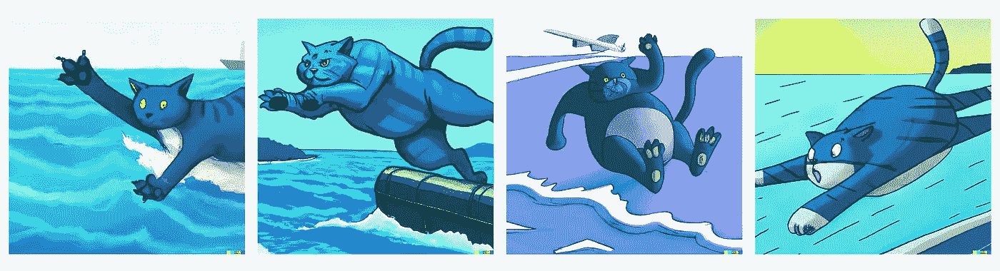

***我*** :那个*赛博朋克插画的机器人梦见电羊怎么样？*

***DALL E 2*** :

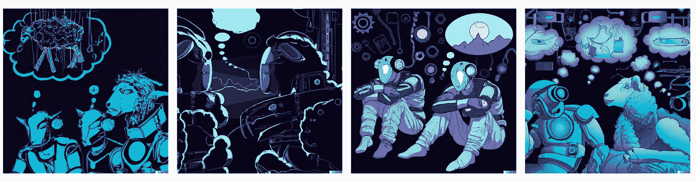

你是否期望得到这样的东西？坦率地说，我没有。即使《第二次尝试》中的第四只猫让我想起了宫崎骏和他的[龙猫](https://www.imdb.com/title/tt0096283/)，但在我看来这很简单。它绝对不像 DALL E 2 演示中的图片。我花了一段时间让我的艺术看起来更好，我向你保证这并不困难。你只需要记住一些时刻来关注我们将在下面介绍的内容。

# **6 要记住的主要提示**

当你要发送请求时，你需要回答一些问题，这可能有助于你提出更明确的请求:

1.  图像是由什么组成的？(构成)
2.  哪些元素更重要，哪些不重要？(比例尺)
3.  这些元素是如何相互联系的？(接近度)
4.  这张照片应该是从哪个角度拍摄的？(位置)
5.  元素应该怎么点亮？(照明)
6.  什么形象风格最合适？(风格)

在这里，我想讨论这个列表中的前 4 个步骤。我们将从它们开始，因为这些是制作图像的基本概念。至于其他两个，将在下一部分讨论。

## 作文

*照片构图*是画面内视觉元素的排列。

> “这是你矩形内令人愉快的物体组织”——摄影师亚当·朗

一般来说，关于构图有几个重要的规则。但是大部分只能用于创作照片。

然而，在使用 DALL E 2 创建图像的过程中，您将能够遵循一些概念。这些措施如下:

1.  构成要素(线条、形状和形式、价值、空间、色彩、纹理)。
2.  构图原则(平衡、比例、和谐)

您可以在文本提示中改变所有这些。让我们看看它在实践中是如何工作的。

***我*** :我想看到*一个骑摩托车的人在太空边缘，数码艺术*

***DALL E 2*** :

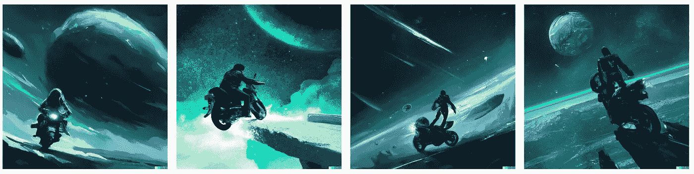

***我*** :好了，我们来补充一些细节*。*展示给我看*一个人在太空边缘骑着摩托车，奔向一个星球，数字艺术*

***DALL E 2*** :

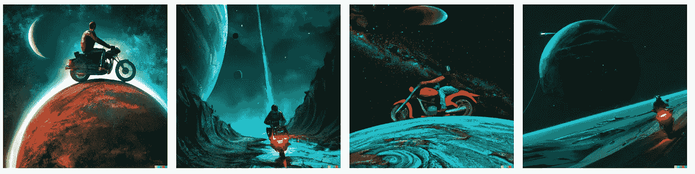

***我*** :如果我们在同一个画面加一条龙，你觉得怎么样？所以我想拍*一个在太空边缘骑摩托车的人，试图远离白龙，走向一个星球，阴影，数字艺术。*

***DALL E 2*** :

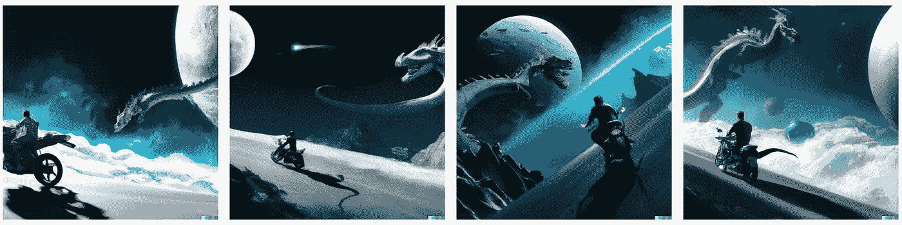

这里我们的构图更全面，不像第一张图。我们可以继续努力使我们的作文更复杂。因此，我想继续讨论下一部分，讨论*比例、*接近度和*位置。*

## **标尺&接近度&位置**

这三个概念密切相关，因为它们负责空间中物体之间的联系。然而，让我们试着定义每一个概念，然后将它们视为一个整体。

*音阶*是和构图一起的重要元素。它有助于增加照片、绘画或绘图中的 3D 空间。您可以使用一些尺寸字来调整您的*刻度*。

至于*接近度*，通常看着一张照片，我们就能明白这些物体之间的关系，以及与其他物体相比，哪一个更重要。您可能还想关注某个对象的某个特殊部分。事实上,*接近度*是帮助我们做到这一点的东西。可以使用以下值:

*   (极端)特写镜头
*   中景
*   (极端)广角镜头
*   (极端)长镜头
*   全景

*位置*(角度和相机视角)也是相当重要的概念，因为它有助于你展示物体之间的比例。您可以将角度值添加到提示的末尾，例如:

*   高角
*   低角度
*   鸟瞰图
*   错误的观点
*   面对面
*   过肩射击
*   或者可以指定度数值(25 度角)

现在是时候来看看了。让我们假设我们想要节省[食物造型师](https://www.careerexplorer.com/careers/food-stylist/)并且从[这个菜单](https://thebigsalad.com/menu/)中为鸡肉凯撒产生一个新的图像。对于我们的提示，我们将使用菜单中的原始描述。

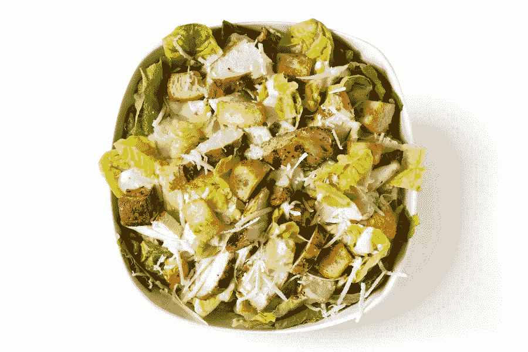

Chicken Caesar. Source: [thebigsalad.com](https://thebigsalad.com/menu/)

*****DALL E 2*** :**

**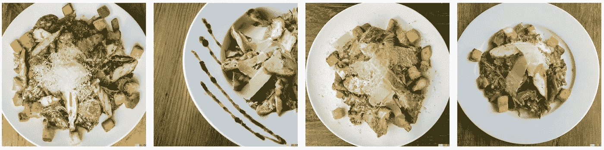**

*******DALL E 2*** :****

****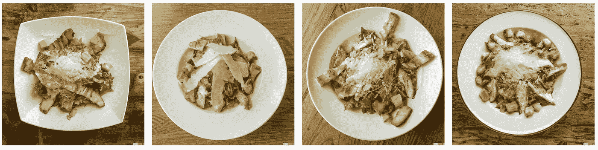****

*********达尔 E 2:*********

****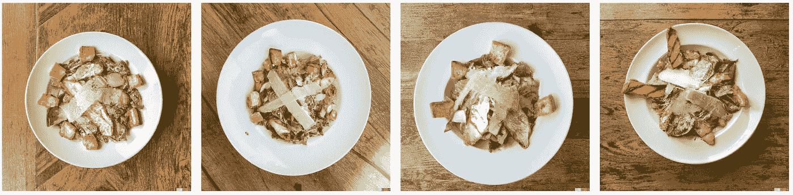****

*******我*** :角度呢？*高质量的沙拉照片，配有长叶莴苣、帕尔马干酪、美味的烤鸡胸肉、丰盛的面包块、凯撒酱，放在白色盘子里，放在橡木桌上，超长镜头，广角镜头，25 度角*****

*******DALL E 2:*******

****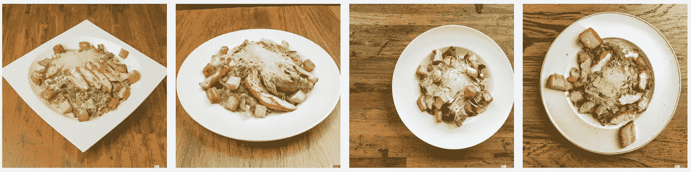****

*******我*** :还有相机视角？一张*高质量的沙拉照片，配有长叶莴苣、帕尔马干酪、香喷喷的烤鸡胸肉、丰盛的面包丁、凯撒酱，放在白色的圆形盘子里，放在橡木桌上，超长镜头，广角镜头，25 度角，左侧视角*****

*******DALL E 2:*******

****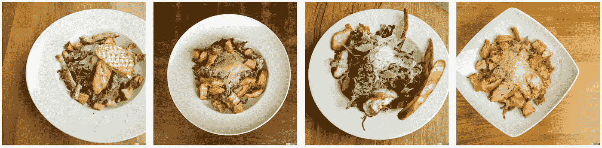****

****对我来说，它看起来比原来的图像更花哨。同样，我们有几乎无穷无尽的机会来改善我们的形象。我们将在下一部分继续我们的实验。****

## ****有可能让一个人在土星环上骑行/奔跑/行走吗？****

****简单的回答是我不知道。真的。我不知道为什么我一直在徒劳地试图得到它，但我的大脑产生了一个非常惊人的图像，所以我想看看它。****

****我做了很多请求，但我仍然没有得到想要的输出。这里你也可以看到结果。****

*******I*** : *宇航员骑着摩托车在土星环上，数码艺术*。****

*******DALL E 2:*******

****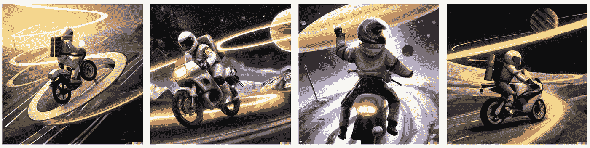****

*******I*** : *宇航员在土星环上奔跑，数字艺术*。****

*******DALL E 2:*******

****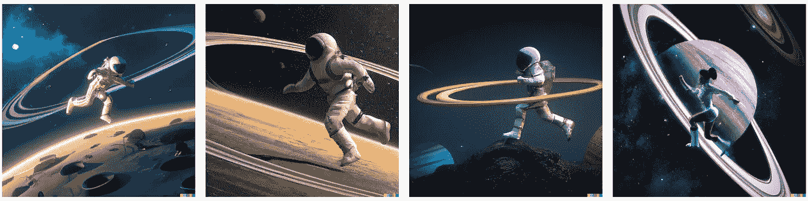****

*******I*** : *宇航员在土星环上行走，数字艺术*。****

*******DALL E 2:*******

****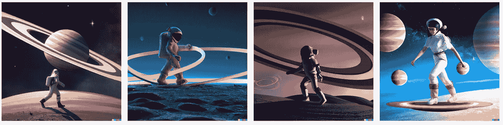****

****你可以看到，如何设计一个提示把一个人放在土星环上的任务仍然是开放的:)****

****这里我们已经考虑了图像生成的基本概念，如构图、比例、接近度和位置。我们已经得到了非常有趣的图像，我们可以尝试使用*灯光*和*风格来改善这些图像。*****

****此外，尽管有所有这些建议，你需要记住，你不应该害怕被模糊。你只需要尝试不同的方法，看看会发生什么。好吧，最后，你会遇到 DALL E 2 的方法，也许有一天你会在艺术比赛中获得第一名****

## ****文学****

1.  ****https://openai.com/dall-e-2/的达尔 E 2 —****
2.  ****具有剪辑潜在性的分层文本条件图像生成—【https://arxiv.org/pdf/2204.06125.pdf ****
3.  ****从自然语言监督中学习可转移的视觉模型—[https://arxiv.org/pdf/2103.00020.pdf](https://arxiv.org/pdf/2103.00020.pdf)****
4.  ****DALL E 2 解绑—[https://bakztfuture.substack.com/p/dall-e-2-unbundling](https://bakztfuture.substack.com/p/dall-e-2-unbundling)****
5.  ****DALL E 2 提示书—[https://pitch.com/v/DALL-E-prompt-book-v1-tmd33y](https://pitch.com/v/DALL-E-prompt-book-v1-tmd33y)****

**** [## Mlearning.ai 提交建议

### 如何成为 Mlearning.ai 上的作家

medium.com](/mlearning-ai/mlearning-ai-submission-suggestions-b51e2b130bfb)****