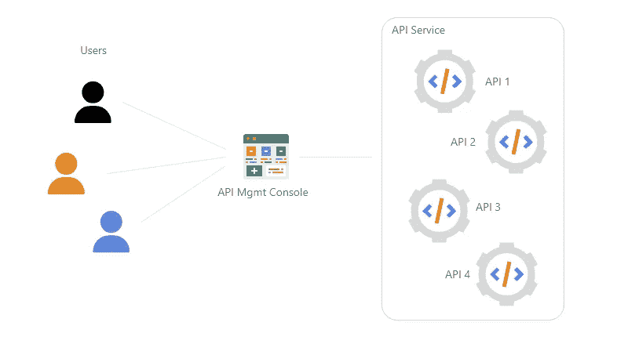
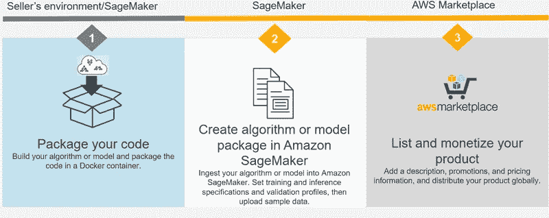

# 如何从你的机器学习模型中赚钱？

> 原文：<https://medium.com/mlearning-ai/how-to-make-money-from-your-machine-learning-models-5500c4438e09?source=collection_archive---------6----------------------->

Photo by [Carlos Muza](https://unsplash.com/@kmuza?utm_source=unsplash&utm_medium=referral&utm_content=creditCopyText) on [Unsplash](https://unsplash.com/s/photos/business?utm_source=unsplash&utm_medium=referral&utm_content=creditCopyText)

# 介绍

所以，现在你知道了所有关于机器学习的知识，并思考如何通过创建一些真正有用的模型来赚钱，其他人可以利用这些模型，你可以通过使用这些模型获得报酬。

这篇文章将向你介绍一些方法，通过这些方法你可以开始将你的 ML 模型货币化。让我们来理解操作一个 ML 模型的基本过程。

要将模型投入生产，下面列出了一些先决条件:

1.  需求文件:执行程序所需的包的列表
2.  序列化的训练模型管道:通常它是一个 pickle 文件，在训练模型之后保存。
3.  API 服务:使用所需输入执行模型并返回结果的端点。

这个 API 服务可以部署到一个服务器中，其他用户可以访问这个模型。

但是，我们如何从这项服务中赚钱呢？

答案是计量 API。用户使用 API 服务将被收费。

让我向您介绍一些可以让您为 API 创建账单的平台。

# RapidAPI 集线器

RapidAPI Hub 包含 40，000 多个 API 可供选择。每个 API 都是为特定任务定义的。它允许你发布各种 API 服务，比如 REST，SOAP，GraphQL & Kafka。WebSocket 和 gRPC 支持将于 2022 年 9 月推出。

在发布 API 之前，您需要用平台中提供的简单 UI 定义 API 规范。添加身份验证，以便只有订阅了服务的有效用户才能访问。

此外，在设置中，您可以配置服务的货币化，让用户从免费、免费增值、每月或按使用付费计划中进行选择。

由于该服务将处理用户数据，您还可以创建特定的数据保留和数据控制策略，并使用 DocuSign 与用户强制执行合同。

# AWS 市场

AWS Marketplace 拥有大量预构建的解决方案，用户可以利用它们来构建自己的应用程序。它由多个领域的解决方案组成，如业务应用、数据和分析、开发运维、物联网、机器学习等。

用户可以从一系列预先构建的模型中进行选择，这些模型涵盖了由愿意在平台上销售其解决方案的其他开发人员构建的各种用例。ML 开发人员/数据科学家可以通过根据他们的用例搜索数据来从 AWS 数据交换中获取数据，并在 Amazon Sagemaker 上根据该数据训练 ML 模型。

由于亚马逊 SageMaker 和 AWS Marketplace 之间的集成，程序员可以向其他 SageMaker 用户收取使用他们的算法和模型包的费用。

第一步是在 AWS Marketplace 上注册成为卖家。然后你需要在 Amazon SageMaker 上开发你的模型，在 SageMaker 上创建一个算法或者模型包资源，最后你可以在市场上列出这些模型。

Selling ML model on AWS Marketplace

在 AWS Marketplace 上列出您的 SageMaker 车型所要遵循的步骤的更多信息参见[此处的](https://docs.aws.amazon.com/pdfs/sagemaker/latest/dg/sagemaker-dg.pdf#sagemaker-marketplace)。

# 结论

“如何从机器学习模型中赚钱？”的介绍到此结束。希望您能看看这个，并尝试在这些平台上列出您的型号。

如果您认为它有帮助，请鼓掌欢迎这篇文章，并继续阅读更多类似的信息性文章。

 [## Mlearning.ai 提交建议

### 如何成为移动人工智能的作者

medium.com](/mlearning-ai/mlearning-ai-submission-suggestions-b51e2b130bfb)