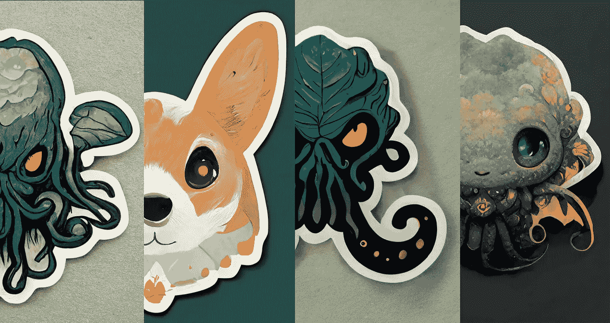

# 如何用 AI 在 2 分钟之内做出超可爱的贴纸

> 原文：<https://medium.com/mlearning-ai/how-to-make-super-cute-stickers-with-ai-in-under-2-minutes-782892641ba7?source=collection_archive---------0----------------------->

Image by [Jim Clyde Monge](https://medium.com/u/819323b399ac?source=post_page-----782892641ba7--------------------------------)

当谈到制作贴纸设计时，手绘总是一个费力的过程，需要熟练的艺术家花费数小时的工作。

现在，有一款名为[midway](https://www.midjourney.com/)的人工智能软件可以在几秒钟内制作出令人惊叹的贴纸设计，几乎不需要人工干预。