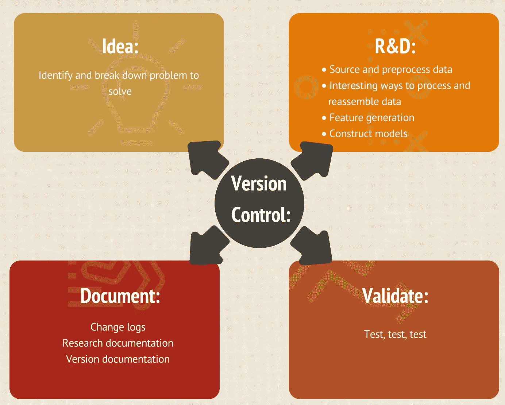

# 如何组织金融机器学习项目

> 原文：<https://medium.com/mlearning-ai/how-to-organize-financial-machine-learning-projects-6cab973b1a8e?source=collection_archive---------3----------------------->

Image by Jenny Hung

机器学习(ML)是人工智能的一个子领域，而金融 ML 是机器学习技术应用于金融领域的一个专门领域。ML 的目标是让你的程序从提供的数据中学习，而不需要程序应该做什么的明确指示。该程序必须基于其先前的学习来学习和适应。

金融 ML 的用例可以概括为 5 大类:流程自动化、安全、评分、机器人顾问和算法交易。在这篇文章中，我们关注在**算法交易**领域应用机器学习的项目。

## 金融机器学习项目失败率很高

投资和交易是试图从金融市场获取利润的两种截然不同的方法。市场投资者通过买入并持有的策略寻求更大的长期回报。另一方面，交易者更灵活，可以在更短的时间范围内利用上涨和下跌的市场，获得更少但更频繁的利润。

**在理想世界**，机器学习算法有助于做出更好的交易决策——一个工作模型实时监控和检测市场情绪和条件的模式。该模型不仅提取嵌入在数据中的信号，还随着时间的推移提高其模式读取能力。

**在理想世界**，机器学习算法胜过人类交易员，产生更高的回报，导致更低的提款。

然而，在现实中，开发一个有利可图的、一致的、安全的机器学习交易算法是一项艰巨的任务。大多数交易者专注于开发“个人”策略，希望他们的搜索能产生一个能产生好结果的策略。相比之下，专业人士开发的系统能够大规模生产策略。

> 要着手一个金融 ML 项目，你应该像科学家一样思考。你的目标是开发你的算法，类似于一个研究实验室是如何运行的:有条不紊地。盈利的交易算法不是来自灵感，而是来自有方法的努力。

## 金融洗钱需要大量的系统研究

考虑到 algo 交易项目的挑战，你真的需要养成良好的学习和工作习惯，学习如何组织你的研发工作。这是 ML 开发人员的基本原则。

Image by Jenny Hung

以下是财务 ML 项目的高级结构:

我确定并分解要解决的 ML 问题

V 版本控制和文档(包括问题分解、目标、要探索的概念、实验方法和研究论文/研究笔记)

*   获取和准备数据:使用有趣的方法处理和转换数据，并开发特征空间
*   开发和训练您的模型
*   评估模型准确性
*   调整超参数
*   部署训练好的模型:持续监控预测
*   管理您的持续模型版本

更改日志以跟踪版本

**这些阶段是反复的。您可能需要重新评估，并在流程中的任何时候返回到上一步**。